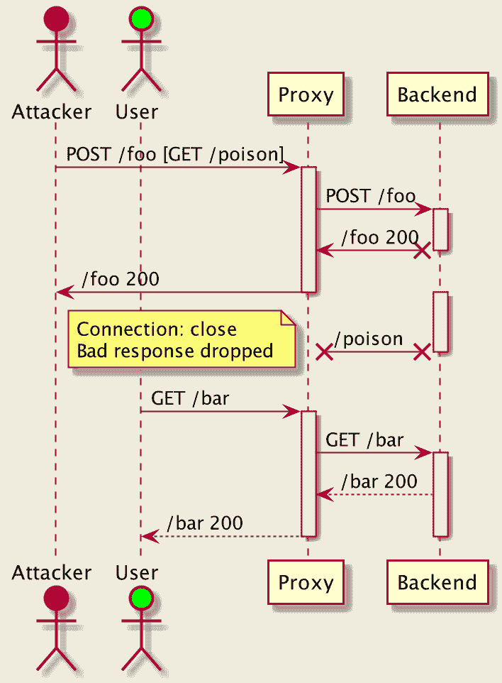
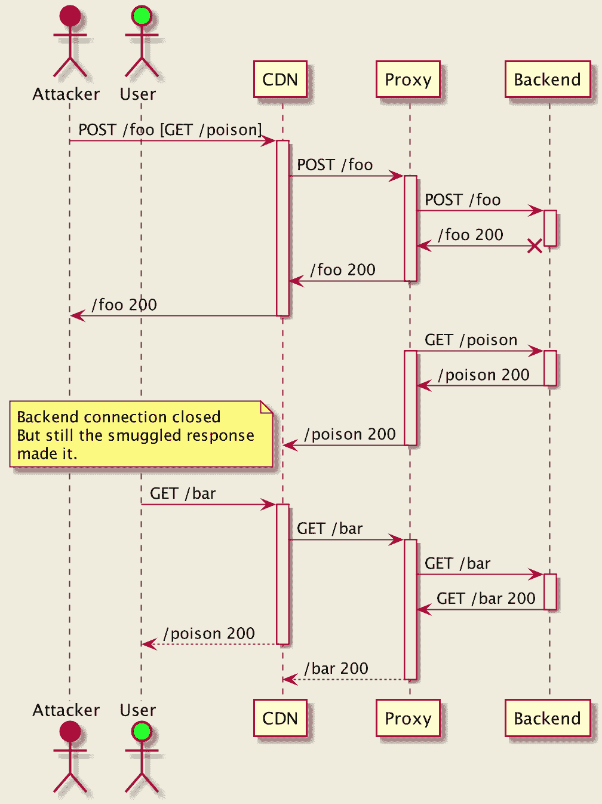
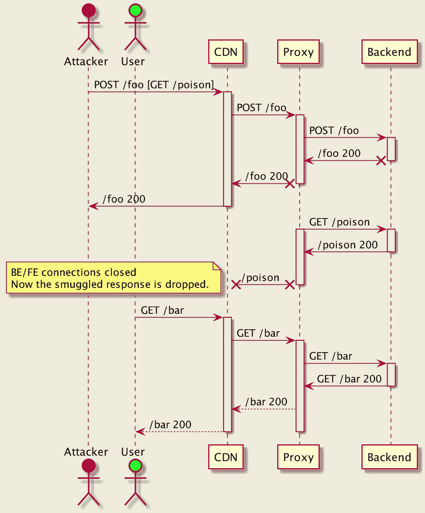

# Http-Desync-Guardian-分析 HTTP 请求，以最大限度地降低 HTTP Desync 攻击的风险

> 原文：<https://kalilinuxtutorials.com/http-desync-guardian/>

**Http-Desync-Guardian** 用于分析 Http 请求，以最大限度地降低 HTTP Desync 攻击的风险。

`**HTTP**/1.1`从 1991 年到 2014 年经历了漫长的演变:

*   HTTP/0.9–1991
*   HTTP/1.0–1996
*   HTTP/1.1
    *   RFC 2068–1997
    *   RFC 2616–1999
    *   RFC 7230–2014

这意味着有各种各样的服务器和客户端，它们可能对请求边界有不同的看法，这为去同步攻击创造了机会(也称为 HTTP Desync)。

遵循最新的 RFC 建议似乎很简单。然而，对于已经存在一段时间的大规模系统，它可能会带来不可接受的可用性影响。

`**http_desync_guardian**`库旨在分析 HTTP 请求以防止 HTTP Desync 攻击，平衡安全性和可用性。它将请求分为不同的类别，并就如何处理每一层提供建议。

它既可以用于原始 HTTP 请求头，也可以由 HTTP 引擎解析。消费者可以配置日志记录和指标收集。日志记录是有速率限制的，所有用户数据都是模糊的。

如果您认为您可能发现了影响安全的问题，请遵循我们的安全通知流程。

**轻重缓急**

*   跨服务的一致性是关键。这意味着请求分类、日志记录和指标必须在最低可用设置(如日志文件目的地)下进行。
*   关注可评审性。测试套件必须不需要库/编程语言的知识，只需要 HTTP 协议的知识。因此很容易审查、贡献和重用。
*   对用户而言，安全是高效的。我们的目标是尽可能简化库的集成。
*   **超轻。**开销必须最小，并且不会给请求处理带来任何有形的负担(参见基准测试)。

**支持的 HTTP 版本**

这个库的主要焦点是`**HTTP/1.1**`。查看所有承保病例的测试。`**HTTP/1.1**`的前身不支持连接重用，这限制了 HTTP Desync 的机会，但是一些代理可能会将此类请求升级到`**HTTP/1.1**`并重用后端连接，这可能会允许手工创建恶意的`**HTTP/1.0**`请求。这就是为什么他们使用与`**HTTP/1.1**`相同的标准进行分析。对于其他协议版本有以下例外:

*   `**HTTP/0.9**`请求从不被认为是`**Compliant**`，而是被归类为`**Acceptable**`。如果`Content-` **`Length` / `Transfer-Encoding`** 中的任何一个出现，那么就是 **`Ambiguous`。**
*   `**HTTP/1.0**`—`**Transfer-Encoding**`的出现发出请求`**Ambiguous**`。
*   `**HTTP/2+**`超出范围。但是如果您的代理将`**HTTP/2**`降级为`**HTTP/1.1**`，请确保传出的请求得到了分析。

请参阅文档以了解更多信息。

**概述**

此页面包含请求分类层和原因以及缓解措施，并对一些重要情况进行了解释。

**请求分类**

`**http_desync_guardian**`是一个用于分析和分类 HTTP/1.x 请求的库，为客户提供安全性，同时兼顾为遗留或专有系统(并非总是符合 RFC)提供流量的必要性。

*   `**Compliant**`–符合 RFC 的请求(*)
*   `**Acceptable**`–不符合 RFC 的请求，但不代表安全风险
*   `**Ambiguous**`–不同的 HTTP 服务器可能会以不同的方式处理请求，因此可能会导致 HTTP 去同步问题(以及可能导致的请求拆分/走私)
*   `**Severe**`–格式错误或极有可能是精心制作的，以欺骗 HTTP 解析器并导致 HTTP 不同步。

**推荐`http_desync_guardian`模式**

| 分类 | 防御模式 | 最严格模式 |
| --- | --- | --- |
| 顺从的 | 允许 | 允许 |
| 可接受的 | 允许 | 堵塞的 |
| 引起歧义的 | 允许 | 堵塞的 |
| 严峻的 | 堵塞的 | 堵塞的 |

路由请求，但关闭客户端和目标连接。

对于`**Blocked**`请求，客户端连接必须关闭。

如果您担心潜在的影响，*监控模式*提供了一种在切换之前只评估指标的方法。

### 分类原因

*   `**Compliant**`
    *   `**Compliant**`–符合要求的请求
*   `**Acceptable**`
    *   `**NonCompliantHeader**`–包含非 ASCII 或控制字符(CTL)的非必要标题–即特殊的不可见字符。
    *   `**SpaceInUri**`–URI 的未被发现的空间
    *   `**NonCompliantVersion**`–包含额外空格、缺失(即 HTTP/0.9)或匹配 HTTP/1 的版本。[2-9]
    *   `**GetHeadZeroContentLength**`–带有“内容长度:0”标题的 GET/HEAD 请求
*   `**Ambiguous**`
    *   `**EmptyHeader**`–如果请求中有一个空标题或只有空格的行
    *   `**AmbiguousUri**`–包含 CTL 字符的 URI
    *   `**UndefinedContentLengthSemantics**`–GET/HEAD 请求的内容长度
    *   `**UndefinedTransferEncodingSemantics**`–GET/HEAD 请求的传输编码
    *   `**DuplicateContentLength**`–重复的内容长度头(相同值)
    *   `**BothTeClPresent**`–传输编码和内容长度都出现在请求中
    *   `**SuspiciousHeader**`–可以使用通用文本规范化技术(清理、大小写规范化、分隔符规范化)规范化为`**Transfer-Encoding**`或`**Content-Length**`的标题。
*   `**Sever**e`
    *   `**BadHeader**`–包含空字符或 CR 的标题
    *   `**BadUri**`–包含空字符或 CR 的 URI
    *   `**BadVersion**`–格式错误的版本
    *   `**MultipleContentLength**`–不同内容长度的标题
    *   `**BadContentLength**`–不可解析的值或无效数字
    *   `**MultipleTransferEncodingChunked**`–多重传输编码:分块标题
    *   `**BadTransferEncoding**`–未知的传输编码值
    *   `**BadMethod**`–错误的方法
*   `**Parsing**`原始请求
    *   `**NonCrLfLineTermination**`(可接受)–允许“\n”线端接(类似 Nginx)。
    *   `**MultilineHeader**`(不明确)–多行标题不符合 RFC(内容类型除外)
    *   `**PartialHeaderLine**`(不明确)–如果标题行没有终止
    *   `**MissingLastEmptyLine**`(不明确)–请求末尾没有空行
    *   `**MissingHeaderColon**`(不明确)–标题行没有冒号分隔符
    *   `**MissingUri**`(不明确)–请求行中没有 URI

**某些分类的细节**

#### 未定义的内容长度/传输编码语义(undefinedtranferencodingsemantics，undefinedcontentlength Semantics)

GET/HEAD 请求消息中的有效负载没有定义的语义。https://tools.ietf.org/html/rfc7231#section-4.3

https://medium . com/@ knownsec 404 team/protocol-layer-attack-http-Request-走私-cc654535b6f 3.1 用 CL 获取请求！= 0

https://ports wigger . net/we b-security/request-straighting/exploining 参见“捕获其他用户的请求”https://www.cgisecurity.com/lib/HTTP-Request-Smuggling.pdf 参见“示例 3”

**内容长度和传输编码都存在(两者都存在**

如果收到包含内容长度和传输编码的请求，这意味着发送方没有遵循 RFC，因此请求边界有可能与发送方不同步。

如果收到的消息同时具有传输编码和内容长度头字段，传输编码将覆盖内容长度。这种消息可能表示试图执行请求走私(9.5 节)或响应分割(9.4 节)，应该作为错误处理。发送者必须在向下游转发这样的消息之前移除接收内容长度字段。

https://tools.ietf.org/html/rfc7230#section-3.3.2

**【多行标题(MultilineHeader)**

RFC 7230 中不赞成使用多行头，不同的引擎可能支持也可能不支持，这为恶意行为者提供了一个工具包来欺骗解析器“看到”不存在的头，反之亦然。这就是为什么我们将包含多行标题的请求标记为不明确的(除了 Content-Type 标题)。

从历史上看，HTTP 头字段值可以扩展到多行，方法是在每一行之前至少添加一个空格或水平制表符(obs-fold)。除了在消息/http 媒体类型中(第 8.3.1 节)，本规范不赞成这样的行折叠。发送方不得生成包含行折叠的消息(即，具有包含与 obs-fold 规则匹配的任何字段值)，除非该消息旨在打包在消息/http 媒体类型中。

https://tools.ietf.org/html/rfc7230#section-3.2.4

**多重传输编码 Chunked(MultipleTransferEncodingChunked)**

 **发件人不得对邮件正文多次应用分块

https://tools.ietf.org/html/rfc7230#section-3.3.1

 **如果有多个不同的内容长度标头(不同的值),请求将被标记为严重。如果有多个相同的值，则属于 DuplicateContentLength 类别(标记为 Ambiguous)。

如果接收到的消息具有多个字段值由相同十进制值组成的内容长度报头字段，或者具有包含一列相同十进制值的字段值的单个内容长度报头字段(例如，“内容长度:42，42”)，指示重复的内容长度报头字段已经由上游消息处理器生成或组合，则接收方必须在确定消息正文长度或转发消息之前，将该消息作为无效消息拒绝，或者用包含该十进制值的单个有效内容长度字段替换重复的字段值。

https://tools.ietf.org/html/rfc7230#section-3.3.2

**【可疑标头(SuspiciousHeader)**

有一系列的攻击来伪装传输编码和内容长度头，所以链中的一些引擎会看到它们，而其他的不会。例如:

**传输-编码:分块
内容-长度:100**

在这种情况下，一些引擎可能会拒绝这个请求，因为它不符合 RFC。有些人可能会清理冒号前的空格，并将其视为“Transfer-Encoding: chunked”，而有些人可能会看到“Transfer-Encoding[space]”并忽略它。这是最简单的例子来说明这个想法，但还有许多其他的例子。例如:

**传输编码:分块**

小写无点 I 在大写转换时变成 ASCII“I ”,这可能会欺骗一些引擎。或者有一个 CTL 字符:

**传输编码:分块
\ x01 传输编码:分块
传输编码\b:分块**

一些引擎可以规范化分隔符或非字母，例如，使用正则表达式等。(尤其是使用标准的字符串修整例程，这些例程在不同的平台上可能有不同的行为)。

为了降低这些风险，我们确定标题与`**Transfer-Encoding**`和内容长度的相似性，如果检测到任何偏差，就将请求标记为不明确。

**缓和**

有两种类型的缓解:

*   用 400 拒绝请求并关闭连接
*   为请求提供服务，但在前端和后端都禁用连接重用。

为什么在发出`**Severe**`请求后连接被关闭

在这种情况下，我们无法建立请求边界并判断下一个请求何时开始。

为什么在一个不明确的请求后，两个 FE/BE 连接都关闭了？

让我们从不重用后端连接的例子开始:

1.  攻击者发送请求，例如代理只看到 POST /foo，而后端也看到 GET /poison
2.  但是，代理将请求标记为不明确
3.  响应后，代理关闭连接
4.  /poison 响应被丢弃，因为该连接将不被重用。

这看起来是有效的，但是如果在代理前面有一层的话，这是不够的:

1.  在这种情况下，我们假设去同步发生在 CDN 和代理之间，代理将请求标记为不明确
2.  虽然代理关闭了 BE 连接，但这并没有什么帮助
3.  /poison 响应仍然通过重用的前端连接提供

但是，如果两个 FE/BE 连接都关闭，则 HTTP Desync 被阻止:

1.  和前面的例子一样，我们假设在 CDN 和代理之间发生了同步，代理将请求标记为不明确
2.  现在，代理关闭了两个 FE/BE 连接。
3.  /poison 响应被删除。

**源自 C 的用法**

这个库主要用于用`**C/C++**`编写的 HTTP 引擎。

1.  安装 cbindgen: `**cargo install --force cbindgen**`
2.  生成头文件:
    *   运行`**cbindgen --output http_desync_guardian.h --lang c**`为 c。
    *   针对 C++运行`**cbindgen --output http_desync_guardian.h --lang c++**`。
3.  运行`**cargo build --release**`。二进制文件在`**./target/release/libhttp_desync_guardian.***`文件中。

了解更多:泛型和 Nginx 示例。

**包含“http _ desync _ guardian . h”
HTTP _ engine _ request _ t——已经被 HTTP 引擎解析过
*/
static int check _ request(HTTP _ engine _ request _ t * req){
HTTP _ desync _ guardian _ request _ t guardian _ request = construct _ HTTP _ desync _ guardian _ from(req)；
http _ desync _ guardian _ verdict _ t verdict = { 0 }；
http _ desync _ guardian _ analyze _ request(&guardian _ request，&decision)；
switch(verdict . TIER){ case REQUEST _ SAFETY _ TIER _ COMPLIANT:
//请求是好的。绿灯
断；
case REQUEST _ SAFETY _ TIER _ ACCEPTABLE:
//Reject，if mode == STRICTEST
//否则 OK
break；
case REQUEST _ SAFETY _ TIER _ ambiguity:
//请求不明确。
// Reject，if mode == STRICTEST
//否则发送，但不要复用两个 FE/BE 连接。
破；
case REQUEST _ SAFETY _ TIER _ SEVERE:
//发送 400，关闭 FE 连接。
突围；
默认:
//不可达代码
abort()；
}
}**

[**Download**](https://github.com/aws/http-desync-guardian)****