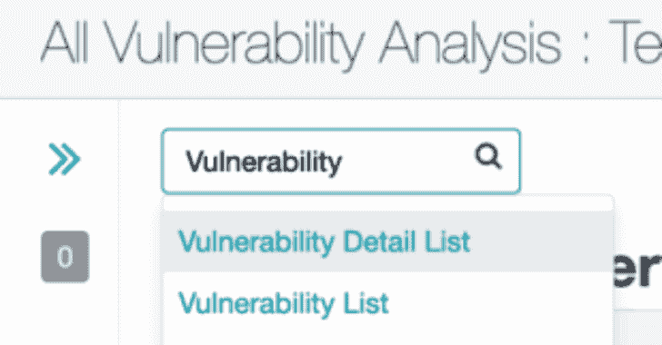
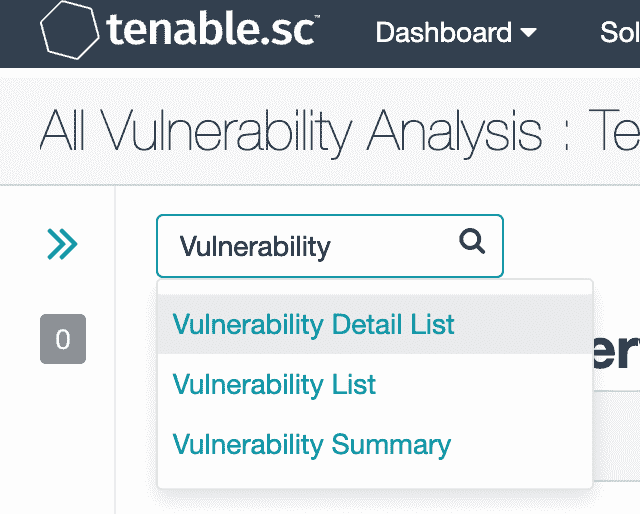
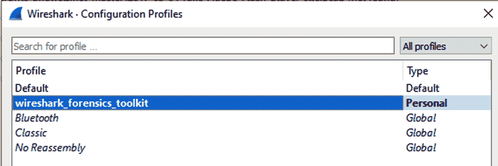

# Wireshark-Forensics-Plugin:一个跨平台的 Wireshark 插件，用于关联网络流量数据

> 原文：<https://kalilinuxtutorials.com/wireshark-forensics-plugin/>

**Wireshark-Forensics-Plugin**是使用最广泛的网络流量分析器。这是一个重要的实时流量分析工具&法医/恶意软件分析师的法医分析。尽管 Wireshark 为协议解析&过滤提供了极其强大的功能，但它不提供任何有关网络端点的上下文信息。对于一个典型的分析师来说，他必须梳理数 GB 的 PCAP 文件来识别恶意活动，这就像大海捞针一样。

Wireshark Forensics Toolkit 是一个跨平台的 Wireshark 插件，它将网络流量数据与威胁情报、资产分类和漏洞数据相关联，以加速网络取证分析。它通过扩展 Wireshark 本机搜索过滤器功能来实现这一点，从而允许基于这些附加的上下文属性进行过滤。它适用于 PCAP 文件和实时交通捕捉。

该工具包提供了以下功能

*   加载从威胁情报平台(如 MISP)导出的恶意指标 CSV，并将其与网络流量中的每个来源/目标 IP 相关联
*   根据 IP 范围到资产类型的映射加载资产分类信息，从而能够过滤特定类型资产的传入/传出流量(例如，过滤“数据库服务器”、“员工笔记本电脑”等)
*   将导出的漏洞扫描信息从 Qualys/Nessus 映射 IP 加载到 CVEs。
*   扩展了本机 Wireshark 过滤功能，允许过滤网络日志中每个源或目标 IP 地址的严重性、来源、资产类型和 CVE 信息

**如何使用**

*   下载源 Zip 文件或检查代码
*   文件夹数据/格式化报告有 3 个文件

*   asset_tags.csv:关于资产 ip/domain/cidr 和相关标签的信息。默认文件中没有关于内部网 IPs 和 DNS 服务器的示例
*   asset _ vulnerabilities.csv:每个资产的 CVE id 和最高 CVSS 分值的详细信息
*   indicators.csv:带有属性类型、值、严重性和威胁类型的 IOC 数据

*   可以手动编辑步骤(2)中提到的所有 3 个文件，也可以使用导出的 MISP 和 Tenable Nessus 扫描报告生成漏洞和指示器文件。需要将导出的文件放在以下指定了确切名称的文件夹下

*   data/raw_reports/misp.csv:该文件可以从以下位置从 misp 导出，导出->CSV_Sig->生成然后下载
*   data/raw_reports/nessus.csv:该文件可以从 tenable nessus 接口导出。转到扫描->扫描结果->选择最新的完全扫描条目。从下拉列表中选择漏洞详细信息列表。

然后转到选项->导出为 CSV->全选->提交。将下载的文件重命名为 nessus.csv，并将其复制到 raw_reports/nessus.csv

*   如果您计划从 ThreatStream 下载数据，而不是使用 MISP，请在 config.json 文件中提供用户名、api_key 和过滤器。每次运行 python 脚本时，它都会尝试从 threatstream 中获取最新的 IOC，并将它们存储在 data/formatted _ reports/indicators . CSV 文件中。
*   如果您在 windows 上运行 wft.exe，否则在 Mac 或 Ubuntu 上运行“python wft.py”来安装和/或替换更新的报告文件。脚本将自动选择 Wireshark 安装位置。如果您已经在自定义路径上安装了 wireshark 或使用 Wireshark Portable App，那么您可以提供位置作为命令行参数。例如，当使用便携式应用程序时，位置看起来像这样“C:\ Downloads \ WiresharkPortable \ Data”
*   安装后，打开 Wireshark &进入编辑->配置文件，并选择 Wireshark 取证工具包配置文件。这将启用所有附加列

**可用过滤器列表**

请注意，所有这些选项也可用于目标，只需将“wft.src”替换为“wft.dst”

*   wft.src.domain(使用以前 DNS 流量的源域解析)
*   wft.src.detection(使用 IOC 数据的源 IP/域检测)
*   wft.src.severity(使用 IOC 数据的源 IP/域检测严重性)
*   wft.src.threat_type(使用 IOC 数据的源 IP/域威胁类型严重性)
*   wft.src.tags(源 IP/域资产标签)
*   wft.src.os(漏洞报告中指定的源 IP/域操作系统)
*   wft.src.cve_ids(源 IP/域的 CVE id 的逗号分隔列表)
*   wft.src.top_cvss_score(给定主机的所有 CVE id 中最高的 cvss 分数)

[**Download**](https://github.com/rjbhide/wireshark-forensics-plugin)