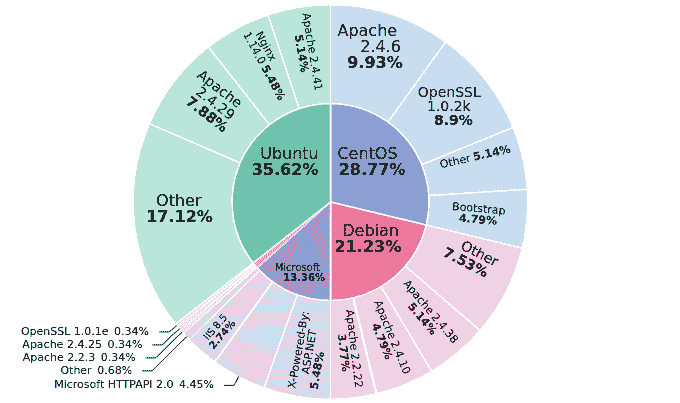

# Pwndora:海量 IPv4 扫描仪，在几分钟内找到并分析连接互联网的设备

> 原文：<https://kalilinuxtutorials.com/pwndora/>

Pwndora 是一个大规模的快速 IPv4 地址范围扫描器，集成了多线程。使用套接字，它分析哪些端口是打开的，并收集关于目标的更多信息。

该项目允许用户在家中以简单的步骤创建自己的物联网搜索引擎，用于教育目的。

**特色**

*   不同选项的端口扫描和检索软件横幅信息。
*   使用 Webtech integration 检测服务器上运行的一些 web 技术和操作系统。
*   从 Maxmind 免费数据库文件中检索 IP 地理位置，定期更新。
*   FTP 服务器上的匿名登录检测。
*   使用 Slack API 发送带有结果的通知。
*   存储数据的不同方式:MongoDB 和 JSON 文件。
*   多线程模式，限制为 400 个线程

**入门**

**手动安装**

确保您有$HOME/。本地/共享目录，以避免 Webtech 出现问题。

要使用 slack 参数，您应该在 config.py 中配置传入的 Webhooks URL

*   克隆此存储库
*   使用 Python PIP 安装需求
*   最后启动扫描仪

**【使用 Docker 图像(推荐)】**

**docker pull alechilczenko/pwn Dora:3.1**

**用途**

**选项**

**选项:
-h，–帮助显示此帮助信息并退出
-s START，–START START
START IPv4 地址
-e END，–END END END IP v4 地址
-t 线程，–THREADS 线程数
线程数【默认值:50】
-m 文件，–海量扫描文件
文件路径带 IP v4 范围
-ti 超时，–超时超时
套接字超时【默认值:0.5】
-p，–s –所有端口扫描 1000 个最常用的端口
-c CUSTOM [CUSTOM …]，–CUSTOM-ports CUSTOM[CUSTOM…]
直接从终端扫描自定义端口
-sl，–slack 通过 Slack 发送通知并显示结果
-sv {json，mongodb}，–save { JSON，mongodb}
数据存储方法
-l，–logs 添加日志文件，在调试中很有用**

**例题**

仅扫描单个 IPv4 地址范围:

**python 3 CLI . py-s**1**92 . 168 . 0 . 0-e 192 . 168 . 0 . 255-t 150–top-ports-SV JSON**

使用自定义端口和日志选项扫描:

**python 3 CLI . py-m ranges . CSV-t 350–自定义端口 80 21 22-SV JSON–日志**

**使用 MongoDB**

要将结果插入数据库，必须设置以下环境变量:

提示:可以使用 docker-compose 创建 MongoDB 和 Mongo Express 的实例。

**导出 MONGODB _ URI = " MONGODB://localhost:27017"
导出 MONGODB_USER="user"
导出 MONGODB_PASS="password"**

**正确的方式(Elasticsearch 和 Kibana)**

**如何创建自己的物联网搜索引擎？**

在我们的数据库中存储结果后，我们可以集成 Elasticsearch 来执行快速搜索。您可以使用工具来同步 MongoDB 和 elastic search:Mongo-to-elastic-dump。

最后，我们添加了 Kibana 来可视化数据并创建带有统计数据的图表。

**图表示例**

[**Download**](https://github.com/alechilczenko/pwndora)