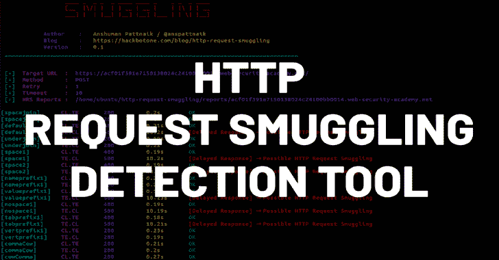

# Http2Smugl:检测和利用 Http 请求走私的工具

> 原文：<https://kalilinuxtutorials.com/http2smugl/>

**Http2Smugl** 工具有助于检测和利用 Http 请求走私，前提是它可以通过前端服务器的 HTTP/2 - > HTTP/1.1 转换来实现。

该方案如下:

*   攻击者向目标服务器发送一个精心编制的 HTTP/2 请求，我们称之为*前端*。
*   该请求(大概)被转换成 HTTP/1.1 并被传输到另一个*后端*服务器。

攻击者希望找到这样一个请求，它将被后端服务器视为两个独立的请求。

如果前端后端 HTTP/1.1 连接使用 keep-alive，前端可能会将其他用户的请求发送到同一连接。如果我们能够通过合法请求之后的部分请求“毒化”连接，我们就可以从另一个用户那里检索请求。

其他可能的情况包括绕过前端服务器保护和重写、缓存中毒或缓存欺骗。

有关 HTTP 请求走私的更多信息，请参考 Portswigger Web Security Academy。

**为什么专注于 HTTP/2？**

在 HTTP/2 中，所有 HTTP 头的名称和值都是二进制的。这意味着从技术上来说，它们可以包含额外的空格甚至换行符。

RFC7540#10.3 指出，将 HTTP/2 请求转换为 HTTP/1 的实现必须注意这种转换对字符集的限制；大多数实现确实拒绝它们。尽管如此，我们希望找到允许这种标题的。它们会将转换后的 HTTP/1.1 请求破坏到后端。

另一点是，最近一些与 HTTP 请求走私相关的修复可能只适用于 HTTP/1.1 解析器。

总的来说，我们希望有一些 HTTP/2 的实现不太了解 HTTP/1.1 中 HTTP 请求走私的最新研究，并且不包括相应的缓解措施。

**你用这个找到单个漏洞了吗？**

令人惊讶的是，是的！

我发现了一种通过 Cloudflare 走私带有空格字符的头的可能性，从而为 Cloudflare 客户端走私打开了大门(如果 Cloudflare 客户端的软件接受& trims 头名称)。这是博文。

还有另外一个 bug 赏金报告还没有公开。它利用了自定义软件不会过滤掉 HTTP2 头中的换行符，走私 100%发生(我可以看到其他用户的请求)。

然而，我明白这种类型的漏洞肯定少得令人沮丧:与 HTTP/1.1 不同，HTTP/2 实现没有那么多，而且大多数实现都考虑到了安全性，因此拒绝了可疑或无效的头。

**检测算法**

该工具有一个子命令，试图自动检测易受 HTTP 请求走私攻击的目标。本节将介绍该功能背后的算法。

为了执行 HTTP 请求走私攻击，我们实际上需要首先“走私”一个单独的头(或者是`**Content-Length**`或者是`**Transfer-Encoding**`)。这意味着我们需要发送一个报头，该报头 a)控制请求体的结束位置，b)不是由前端处理，而是由后端处理。

这通常是通过以某种方式修改标题来实现的:在其名称末尾添加空格或制表符，用半等价的值替换该值等。

漏洞检测算法的基本思想是检测服务器是否真的像处理`**Content-Length**`或`**Transfer-Encoding**`一样处理一个走私的报头。我们通过发送多个请求来做到这一点:一些请求的头值有效，另一些请求的头值无效。然后尝试检测是否有办法*区分*这两组的反应。

这就是为什么工具输出不包含“易受攻击/无懈可击”的词语:它只是说它是否能够区分来自这两个组的请求的响应。

如果满足以下两个条件中的至少一个，则该工具认为两组 HTTP 响应是可区分的:

*   它们的响应代码集不相交
*   回复的长度组是彼此可分的(例如，所有“有效”的回复都长于 1000 字节，而所有“无效”的回复都短于 1000 字节)。

超时被视为不等于任何其他值的唯一状态代码值；因此，该工具取代了传统的“定时检测”方案。

让我们考虑一个例子。假设我们试图通过用下划线替换破折号来隐藏`**transfer-encoding**`头。

如果每次我们发送`**transfer_encoding:zalupa**`时，服务器都以状态 400 响应，而到了`**transfer_encoding:chunked**`时就挂起，我们可以说服务器可能会将报头作为传输编码的值进行处理。理论上，它可以是前端或后端服务器。

第一种情况并不有趣，因为我们可以发送非走私版本的头，第二种是我们正在寻找的。由于一切都发生在 HTTP/2 上，第一种情况在大多数情况下是可以避免的:HTTP/2 服务器以另一种与请求头无关的方式确定请求体的结尾，并且从不期望请求体采用 HTTP/1.1 chunked 格式(具有十六进制块长度的格式)。

检测技术的具体变化有:

*   我们送的是走私版的`**Transfer-Encoding: chunked**`(比如`**transfer_encoding:chunked**`)和不同的身体:有效的是`**0\r\n\r\n**`，无效的是`**999\r\n**`。如果响应不同，我们可以确定后端服务器接收并处理走私的报头。前端没有理由这样做:HTTP/2 不使用我们发送的分块格式，所以它是无效的。我们预计后端会因为无效请求而挂起(即请求超时),因为它会等待更多的数据到达。这是最可靠的检测变体:如果服务器在读取主体时挂起，可能是出了问题，因为在 HTTP/2 请求中没有使用 HTTP/1.1 传输编码。
*   我们再次发送走私版本的`**Transfer-Encoding**`和不同的身体:`**0\r\n\r\n**`为有效身体，`**X\r\n\r\n**`为无效身体。情况和上面一样，但是我们希望后端至少验证它，而不是读取正文。
*   我们发送一个带有值`**1**`和`**-1**`的走私版本的`**Content-Length**`报头。从前端的角度来看，这两个值都是无效的:HTTP/2 中有另一种确定主体长度的机制，在这两种情况下实际上都没有发送请求主体。如果响应不同，我们假设是后端服务器解析了头。这种方法是最不可靠的:当 Content-Length 的值无效时，以及当它与实际长度不匹配时，前端可能会发出不同的错误。

通过发送多对有效/无效请求，我们可以减少随机误报的机会。另一方面，如果我们发现无法将对“有效”请求的响应与对“无效”请求的响应分开，我们可以尽早停止。

**走私技术**

该工具试图通过以各种方式修改报头来采用多种走私技术。没有一个是新的，同时也不明显。

**空格**

为了隐藏一个标题，我们在它后面添加了一个空格。这是最常见和最经典的方法。我们希望报头不被前端处理，而是被原样发送到后端，这样就去掉了空间。

该工具尝试使用各种字符作为空格:包括， **`\t`，`\v`，`\x00`** 和 Unicode 字符。

**下划线**

为了隐藏标题，我们用下划线(`**_**`)代替破折号(`**-**`)。如果后端在某种程度上受 CGI 启发，它可能会将像`**Header-Name**`这样的标题转换成`**HEADER_NAME**`格式；因此，破折号将变成下划线。在决定如何解析主体时，这样的后端应该从它的 headers 字典中请求`**CONTENT_LENGTH**` / `**TRANSFER_ENCODING**`的值，并且它会在那里。

**换行符**

这个是 HTTP/2 特有的。由于 HTTP/2 是一个二进制协议，我们可以尝试在头名称或值中发送换行符。标准禁止这样做，但是我们希望找到一个仍然接受这一点的实现。

在 HTTP/2 -> HTTP/1.1 转换过程中，报头分裂成两个不同的报头，这意味着后端的请求看起来会有所不同。

为了走私一个头，我们将其名称和值放在换行符之后:名为“Transfer-Encoding”且值为“chunked”的头变成名为“fake”且值为“fake \ r \ ntransfer-Encoding:chunked”的头。

**UTF 人物**

假设后端使用某种高级语言，并且没有执行足够的头验证。在这种情况下，它可能会在执行任何操作之前将名称转换为大写，并使用支持 Unicode 的函数来完成。幸运的是，`**TRANSFER-ENCODING**`包含字母`**S**`，是 **`ſ` ( `\u017f`** )大写。

类似地，我们可以搜索一个将`**Transfer-Encoding**`的值转换成小写的后端:我们发送`**chunKed**`而不是`**chunked**`，用`**\u212a**`而不是`**K**`。

当然，要求前端将 UTF-8 报头名称/值传递给后端。

**用法**

要安装该工具，运行`**go get github.com/neex/http2smugl**`。

该工具包含两个子命令:`**request**`和`**detect**`。第一个只是用于制作 HTTP/2 请求:大多数客户端工具不接受无效的头，所以有一个这样的工具将用户输入发送到服务器是很方便的。

另一个它`**detect**`。它尝试各种 HTTP 请求走私技术来检测目标是否易受攻击。检测算法复杂；如果您通读并给我发送您的评论，我将不胜感激。在下面的相应章节中对其进行了描述。

### `http2smugl request`

使用这个子命令发送一个(可能有点格式错误的)http2 请求。第一个参数是 URL，其他的只是`**name:value**`格式的头(注意冒号后面没有空格)。支持反斜杠转义:可以使用 **`\r`、`\n`** 、`**\xXX**`转义码。例如，要发送包含冒号的标题名称，请使用`**\x3a**`(例如`**name\x3awith\x3acolons:value**`)。

### `http2smugl detect`

这个子命令试图使用各种技术来检测 HTTP 请求走私。要使用它，只需运行 **`http2smugl detect [HTTPS URL]`。**

只有当该命令检测到服务器解析了一个走私的报头时，它才会输出一些内容。要理解它的含义，请阅读相应的章节。

**HTTP/3 支持**

已经实现了对 HTTP/3 (quic)的实验性支持。但是，我不建议使用它，因为我没有发现一个与 HTTP/3 相关的错误。

要使用带有`**request**`子命令的 HTTP/3，请在 URL 中提供`**https**+h3://` proto，而不仅仅是`**https**`。在`**detect**`命令中也支持同样的功能。

对于`**requ**est`子命令还有一个`**--try-http3**`标志，它在 URL 中没有指定协议(只有主机名)的情况下改变行为。如果该标志存在，该命令将在命令行或目标文件(以及 HTTP/2)中尝试使用`**https+h3**` proto 来查找这些条目。例如，`**http2smugl detect --try-http3 www.example.com**`将尝试 HTTP/3 和 HTTP/2，但`**http2smugl detect --try-http3 https://www.example.com/**`仍将仅尝试 HTTP/2。

**已知误报**

在这一节中，我描述了一些情况，当工具说响应是“可区分的”，但是不存在漏洞。

**ELB**

Amazon 的弹性负载平衡器实现了对 HTTP 请求走私的多种缓解。虽然默认情况下并不是所有人都会拒绝请求，但 ELB 不会在发送带有“可疑”报头的请求后重用连接。因此，实际攻击是不可能的。

为了检测您正在处理 ELB，您可以使用`**Server**`响应头。如果被过滤掉了，可以发送一个带有`**content__length**`头(注意两个下划线)和值-1 的请求:如果是 400，很可能是 ELB 或其他 WAF(见下文)。

**阿帕奇流量服务器**

Apache 流量服务器主要用于雅虎。它以一种不寻常的方式处理 HTTP/2:在内存中将其转换为 HTTP/1.1，然后重新解析结果请求。因此，虽然从技术上来说，一个报头可以被“走私”，但它不可能导致漏洞:您可以向 HTTP/1.1 连接发送相同的字节。

检测你正在处理 ATS(除了`**Server**`头)的最简单的方法是发送一个`**TRACE**`请求。如果请求中出现了`**Max-Forwards: 0**`报头，ATS 将默认返回对`**TRACE**`请求的回答，而不会转发给后端。

**Microsoft IIS**

似乎微软 IIS 支持解码 HTTP/2 主体中的分块编码。这是奇怪的行为；但是，从安全角度来说，它是无辜的。

为了检测您正在处理 IIS，您可以发送一个带有“transfer-encoding:chunked”报头和不正确的 chunked 正文的请求。如果你在 **`Server`** 表头看到 **`Microsoft-HTTPAPI`** 或者类似这样的，就是它了。

**其他 WAFs**

WAFs 试图检测可疑的头-这是他们的工作。有时它会导致工具显示“可区分的”:WAF 可以阻止类似于`**content_length:-1**`的事情，而允许`**content_length:1**`只是因为它的过滤器碰巧做出了这些决定。

如果您在`**Server**`标题中看到 WAF，可能是误报。

[**Download**](https://github.com/neex/http2smugl)