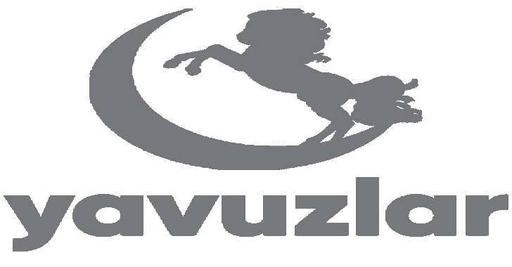

# VulnLab:一个 Web 漏洞实验室项目

> 原文：<https://kalilinuxtutorials.com/vulnlab/>

**VulnLab** 是由 Yavuzlar 开发的 web 漏洞实验室项目。

**漏洞**

*   SQL 注入
*   跨站点脚本(XSS)
*   命令注入
*   不安全直接对象引用(IDOR)
*   跨站点请求伪造(CSRF)
*   XML 外部实体(XXE)
*   不安全的反序列化
*   文件上传
*   文件包含
*   身份验证被破坏

**安装**

**用 DockerHub** 安装

*   如果您想在 DockerHub 上安装，只需键入以下命令

**码头运行–名称 vulnab-d-p 1337:80 yavuzlar/vulnab:最新**

*   请转到 http://localhost:1337

**曼努埃尔安装**

*   克隆回购

**git 克隆 https://github.com/Yavuzlar/VulnLab**

*   构建 docker 映像

**码头建造-t yavuzlar/vulnerab**。

[Download](https://github.com/Yavuzlar/VulnLab)