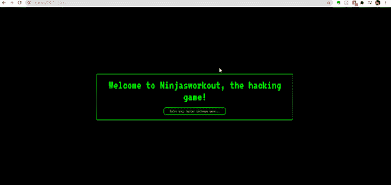

# 忍者训练漏洞 node.js web 应用程序

> 原文：<https://kalilinuxtutorials.com/ninjas-workout/>

**忍者训练**是一个易受攻击的 NodeJS Web 应用程序。

**快速启动**

**下载回购= >
运行 npm i**

安装完所有依赖项后，只需运行应用程序

**node app.js 或 nodemon app.js**

**新增 bug**

*   原型污染
*   没有 SQL 注入
*   跨站点脚本
*   中断的访问控制
*   中断的会话管理
*   弱正则表达式实现
*   竞态条件
*   CSRF-跨站点请求伪造
*   弱暴力保护
*   用户枚举
*   重置引用站点中泄漏的密码令牌
*   重置密码错误
*   敏感数据暴露
*   Unicode 大小写映射冲突
*   文件上传
*   SSRF
*   XXE
*   打开重定向
*   目录遍历
*   不安全的反序列化= >远程代码执行
*   服务器端模板注入
*   定时攻击

[**Download**](https://github.com/effortlessdevsec/ninjasworkout)