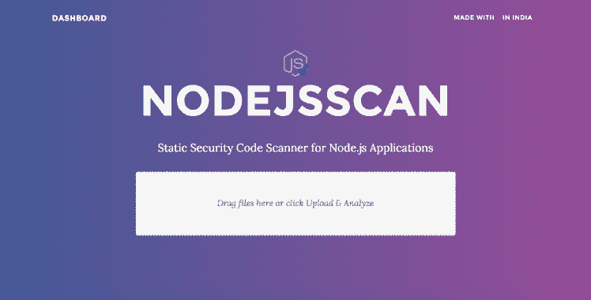

# Mininode:一个 CLI 工具，通过使用静态分析来减少 Node.js 应用程序的攻击面

> 原文：<https://kalilinuxtutorials.com/mininode/>

**Mininode** 是一个 CLI 工具，通过使用源代码的静态分析来减少 Node.js 应用程序的攻击面。它支持两种减少模式(1)粗略，(2)精细。

Mininode 从主文件开始构建应用的依赖图(使用的模块和函数)，即应用的*入口点。如果存在的话，Mininode 将入口点初始化为文件的字段。否则默认为 **`index.js`。***

用法举例:`**node index.js <path to Node application root folder> --mode=(coarse|fine)**`。下面是可以传递给 Mininode 的选项列表。

**选项**

可以传递给 mininode 的命令行选项列表。

*   `**--destination, -d**`:mininode 保存缩减后 Node.js 应用的路径。默认值:`**mininode**`。
*   `**--dry-run**`:只生成 mininode.json，不修改初始应用。
*   `**--mode, -m**`:缩小模式。该值可以是`**coarse**`或`**fine**`。在`**coarse**`模式下，mininode 将仅执行粗粒度缩减。而在`**fine**`模式下，mininode 将执行细粒度归约。一般来说，粗粒度缩减更可靠，因为 mininode 不会尝试缩减模块内部未使用的函数。默认值: **`coarse`。**
*   `**--silent**`:控制台输出被禁用。这将提高微型节点的性能。
*   `**--verbose**`:向控制台输出附加信息。默认值:`**false**`
*   `**--log**`:min node 内部会生成日志文件，包含 json 格式的应用程序依赖图。默认值:`**true**`。
*   `**--log-output**`:min node 生成的日志文件的名称。默认值:`**mininode.json**`。
*   `**--compress-log**`:压缩最终日志文件。默认情况下，它会将所有内容转储到日志文件中。在生产中，建议传递`**--compress-log**`标志以节省空间。
*   `**--seeds**`:种子文件，mininode 将从该文件开始构建依赖关系图。您可以通过用冒号分隔来提供许多种子文件。
*   `**--skip-stat**`:跳过统计计算
*   `**--skip-reduction**`:如果通过了 mininode 不会减少 JavaScript 文件。默认值:`**false**`。
*   `**--skip-remove**`:如果通过，mininode 不会删除未使用的 JavaScript 文件。默认值:`**false**`。

## 限制

*   Mininode 使用静态分析，这意味着它不能减少使用动态行为的 Node.js 应用程序的攻击面，例如`**eval**`。如果 Mininode 检测到应用程序中的动态行为，它将退出，并显示错误`**DYNAMIC_BEHAVOUR_DETECTED**`。

[**Download**](https://github.com/wspr-ncsu/mininode)