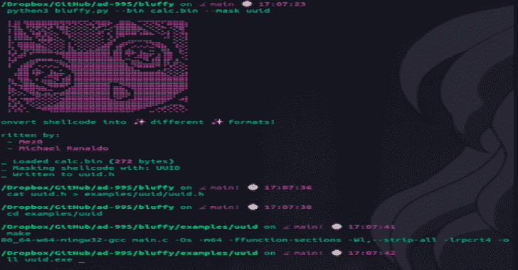

# Bluffy:将外壳代码转换成不同的格式

> 原文：<https://kalilinuxtutorials.com/bluffy/>

Bluffy 是一个在实验中使用的工具，通过将外壳代码格式化成逼真的数据格式来绕过反病毒产品(静态)。

概念验证工具，如 0xBoku 的 Ninja_UUID_Runner 和 ChoiSG 的 UuidShellcodeExec，激发了 Bluffy 的最初概念。

到目前为止，我们实施了:

1.  UUID
2.  CLSID
3.  挽救（saving 的简写）
4.  半铸钢ˌ钢性铸铁(Cast Semi-Steel)
5.  战斗支援车

## 救命

**$ python 3 bluffy . py-h
⣇⣿⠘⣿⣿⣿⡿⡿⣟⣟⢟⢟⢝⠵⡝⣿⡿⢂⣼⣿⣷⣌⠩⡫⡻⣝⠹⢿⣿⣷
⡆⣿⣆⠱⣝⡵⣝⢅⠙⣿⢕⢕⢕⢕⢝⣥⢒⠅⣿⣿⣿⡿⣳⣌⠪⡪⣡⢑⢝⣇
⡆⣿⣿⣦⠹⣳⣳⣕⢅⠈⢗⢕⢕⢕⢕⢕⢈⢆⠟⠋⠉⠁⠉⠉⠁⠈⠼⢐⢕⢽
⡗⢰⣶⣶⣦⣝⢝⢕⢕⠅⡆⢕⢕⢕⢕⢕⣴⠏⣠⡶⠛⡉⡉⡛⢶⣦⡀⠐⣕⢕
⡝⡄⢻⢟⣿⣿⣷⣕⣕⣅⣿⣔⣕⣵⣵⣿⣿⢠⣿⢠⣮⡈⣌⠨⠅⠹⣷⡀⢱⢕
⡝⡵⠟⠈⢀⣀⣀⡀⠉⢿⣿⣿⣿⣿⣿⣿⣿⣼⣿⢈⡋⠴⢿⡟⣡⡇⣿⡇⡀⢕
⡝⠁⣠⣾⠟⡉⡉⡉⠻⣦⣻⣿⣿⣿⣿⣿⣿⣿⣿⣧⠸⣿⣦⣥⣿⡇⡿⣰⢗⢄
⠁⢰⣿⡏⣴⣌⠈⣌⠡⠈⢻⣿⣿⣿⣿⣿⣿⣿⣿⣿⣿⣬⣉⣉⣁⣄⢖⢕⢕⢕

编写人:
~ Mez0
~ Michael Ranaldo
用法:Bluffy [-h] -b -o -m
可选参数:
-h，–help 显示此帮助信息并退出
-b，–bin 指定要加载的 bin 文件
-m，–mask 指定 shellcode 的掩码
-x，–XOR XOR 有效载荷
-p，–Preview 预览创建的格式
-pp，–**

作者:

*   迈克尔·罗纳尔多
*   Mez0

## 要求和安装

使用虚张声势之前，必须安装以下项目:

### python3.9 或更高版本

**sudo 安装 python3.9**

**有钱**

**sudo pip3 install rich**

### pcre2.8

根据是否要在 Kali、Ubuntu 18、19、20 等等上运行，用`**pcre2.8**`获取和构建的过程可能会有所不同。

对于 Ubuntu 上的我们来说，它是在

**$ lsb_release -a
没有 lsb 模块可用。
发行商 ID: Ubuntu
描述:Ubuntu 21.04
发布:21.04
代号:hirsute**

为了链接`**libpcre2-8.a**`，`**.a**`文件必须包含在:

**/usr/lib/gcc/x86 _ 64-w64-Ming W32/10-win32**

至于获得头文件和 lib 文件，使用了 MSYS2。但是如果你比我们聪明，那么就从 mingw 64:https://pcre.org/.的源代码开始做吧

因此，获取和安装的最简单方法是运行以下命令(在仔细检查您的架构等之后)。):

**sudo apt install mingw-64
sudo wget https://packages . msys 2 . org/package/mingw-w64-x86 _ 64-pcre 2？repo = mingw 64-p/usr/lib/gcc/x86 _ 64-w64-mingw 32/10-win32**

## 使用 Bluffy

要构建有效负载，请获取您的二进制文件。对于这个例子，我们使用 calc.bin，它只是加载 calc.bin 作为概念验证。由于 Bluffy 只是试图通过隐写术来逃避静态分析，通过将二进制文件隐藏在一个无害的文件中，你需要做进一步的研究，以确保你的有效载荷也能逃避 T2 的动态检测。

运行`**bluffy**`，选择您选择的遮罩并提供您的。bin 文件:

**python。/bluffy.py -b calc.bin -m css -x**

检查你的有效载荷，然后建造它。要构建有效负载，请复制。bluffy 创建 h 文件，将其重命名为 css.c，运行 make 将其构建为可执行文件，然后使用包含的示例目录进行测试:

**mv css.h 示例/css/css.h
cd 示例/css
制作**

这将使用包含的“main.c”来构建一个 Windows 可执行文件。测试这个来确认。如果你也使用了 calc.bin，你应该会看到一个新的 calc 窗口。如果有，恭喜你！

[**Download**](https://github.com/ad-995/bluffy)