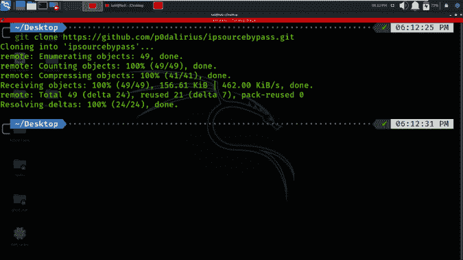
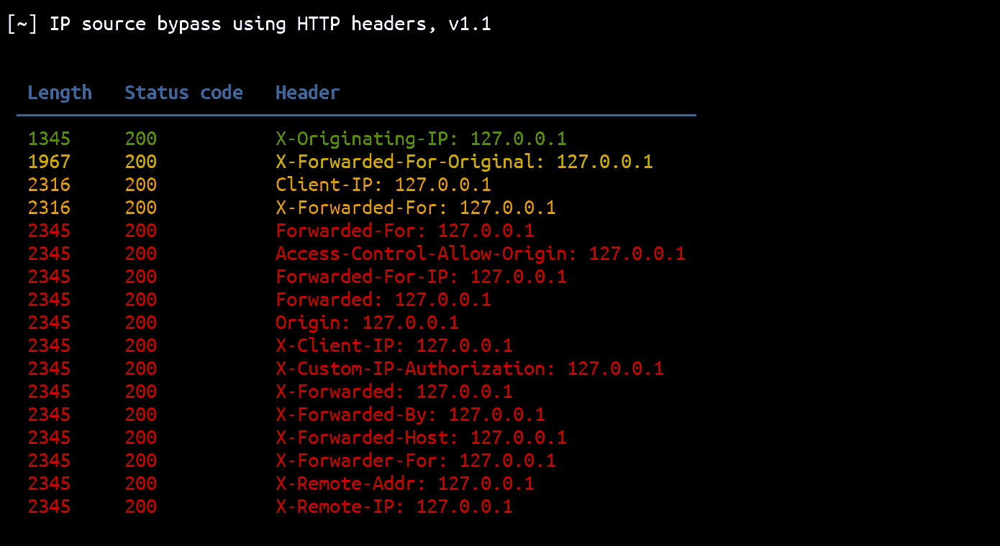

# Ipsourcebypass:这个 Python 脚本可以用来绕过使用 HTTP 头的 IP 源限制

> 原文：<https://kalilinuxtutorials.com/ipsourcebypass/>

**Ipsourcebypass** 是一个 Python 脚本，可以使用 HTTP 头绕过 IP 源限制。

## 特征

*   17 个 HTTP 头。
*   多线程。
*   用`**--json outputfile.json**`进行 JSON 导出。
*   自动检测最成功的旁路。

## 用法

**$。/ipsourcebypass.py -h
[~]使用 HTTP 头的 IP 源旁路，v1.2
用法:ipsourcebypass . py[-H][-v]-I IP[-t THREADS][-x PROXY][-k][-L][-j JSONFILE][-C][-H HEADERS][-S]URL
此 Python 脚本可用于测试使用 HTTP 头的 IP 源旁路
位置参数:
url 例如 https://example
-t THREADS，–THREADS THREADS
线程数(默认值:5)
-x PROXY，–PROXY PROXY
指定用于请求的代理(例如 http://localhost:8080)
-k，–不安全使用 SSL 时允许不安全的服务器连接(默认值:False)
-L，–位置跟随重定向(默认值:False)
-j JSONFILE，–JSONFILE JSON file
将结果保存到指定的 JSON file
-C，–curl 为每个请求生成 curl 命令。
-H HEADERS，–header HEADERS
arg 1 帮助消息
-S，–Save 保存所有 HTML 响应。**

## 自动检测突出的响应

结果按其响应长度的唯一性排序。这意味着具有唯一响应长度的结果将位于顶部，具有多次出现的响应长度的结果位于底部:

[**Download**](https://github.com/p0dalirius/ipsourcebypass)