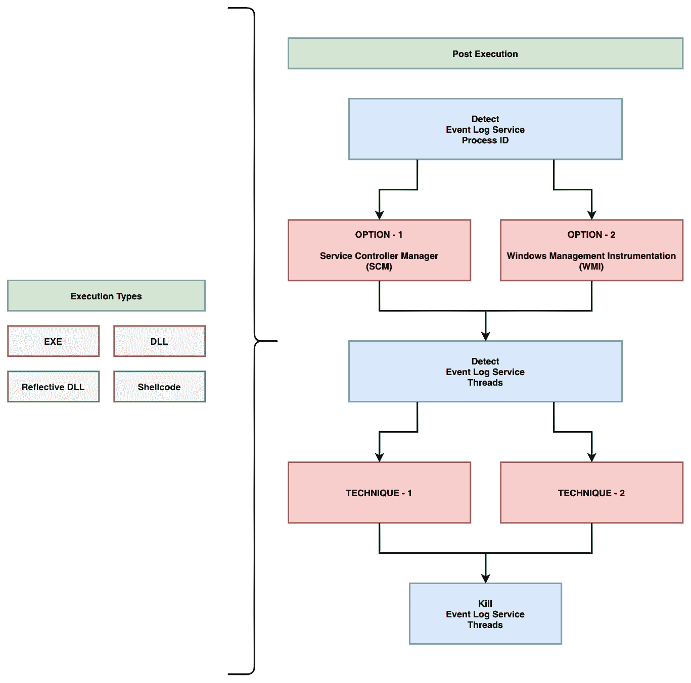
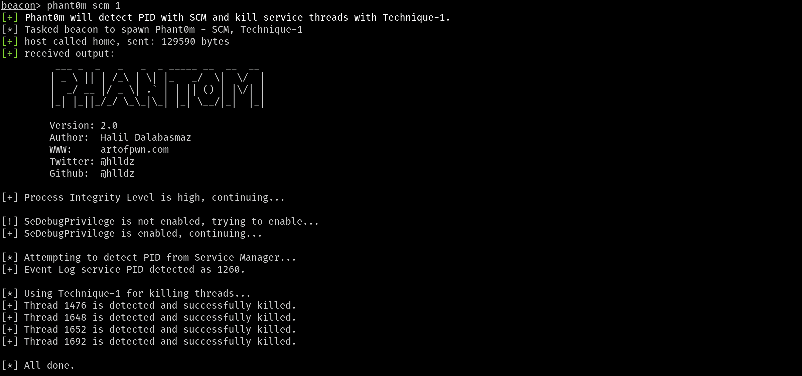

# Phant0m : Windows 事件日志黑仔

> 原文：<https://kalilinuxtutorials.com/phant0m/>

**Phant0m** 是一个 Windows 事件日志黑仔。Svchost 在实现所谓的共享服务进程中是必不可少的，在这种情况下，许多服务可以共享一个进程，以减少资源消耗。将多个服务组合成一个进程可以节省计算资源，这是 NT 设计者特别关心的问题，因为创建 Windows 进程比在其他操作系统(如 Unix 系列)中花费更多的时间和消耗更多的内存。 ^([1](https://en.wikipedia.org/wiki/Svchost.exe))

这简单地意味着:在 Windows 操作系统上，svchost.exe 管理服务，而服务实际上是作为线程在 svchost . exe 下运行的。Phant0m 以事件日志服务为目标，并找到负责事件日志服务的进程，它检测并杀死负责事件日志服务的线程。因此，虽然事件日志服务看起来在系统中运行(因为 Phant0m 没有终止进程)，但它实际上并没有运行(因为 Phant0m 终止了线程)，并且系统不收集日志。

# 工作原理&如何使用

## 检测事件日志服务

Phant0m 使用两个不同的选项来检测事件日志服务的进程 ID。第一种是通过 SCM(服务控制管理器)进行检测，第二种是通过 WMI(Windows Management Instrumentation)进行检测。您希望 Phant0m 使用哪种方法来检测事件日志服务的进程 ID，请在 main.cpp 文件中更改以下行。

例如，如果您希望通过 SCM 检测进程 ID，您应该按如下方式编辑它。(不要同时设置所有值，只设置您想要的一种技术。

**// PID 检测技术配置部分。
定义 PID_FROM_SCM 1 //如果设置为 1，则从服务管理器获取事件日志服务的 PID。
定义 PID_FROM_WMI 0 //如果设置为 1，事件日志服务的 PID 从 WMI 获取。**

例如，如果您希望使用 Technique-1 终止线程，您应该按如下方式编辑它。(不要同时设置所有值，只设置您想要的一种技术。

**TID 探测与杀伤技术配置部分。
定义 KILL_WITH_T1 1 //如果将它设置为 1，将使用 Technique-1。了解更多信息；https://github.com/hlldz/Phant0m
定义 KILL_WITH_T2 0 //如果你设置它为 1，技术-2 将被使用。了解更多信息；https://github.com/hlldz/Phant0m**

## 检测和终止线程

Phant0m 使用两种不同的选项来检测和终止事件日志服务的线程。

### 技巧-1

当每个服务在运行 Windows Vista 或更高版本的计算机上注册时，服务控制管理器(SCM)会为该服务分配一个唯一的数字标记(按升序)。然后，在服务创建时，该标签被分配给主服务线程的 TEB。然后，这个标签将被传播到由主服务线程创建的每个线程。例如，如果 Foo 服务线程创建了一个 RPC 工作线程(注意:RPC 工作线程在后面不会更多地使用线程池机制)，该线程将拥有 Foo 服务的服务标签。 ^([2](http://www.alex-ionescu.com/?p=52))

因此，在这项技术中，Phant0m 将使用 NtQueryInformationThread API 检测事件日志服务的线程，以获取线程的 TEB 地址，并从 TEB 中读取 SubProcessTag。然后，它会终止与事件日志服务相关的线程。该技术的代码在`**the technique_1.h**`文件中。

### 技巧二

在这种技术中，Phant0m 检测与线程相关联的 dll 的名称。Windows 事件日志服务使用`**wevtsvc.dll**`。完整路径是`**%WinDir%\System32\wevtsvc.dll**`。如果线程正在使用该 DLL，则它是 Windows 事件日志服务的线程，然后 Phant0m 杀死该线程。这项技术的代码在`**the** **technique_2.h**`文件中。

## 用法

您可以将 Phant0m 用作独立的 EXE 和反射 DLL。在 Microsoft Visual Studio 中打开项目，进行设置(选择检测和删除技术)并编译。你也可以使用 Cobalt Strike 的反射 DLL 版本，因为在资源库中有一个攻击者脚本文件(phant0m.cna)。

对于 Cobalt Strike，Fork 和 inject 方法与攻击者脚本(phant0m.cna)的执行类型中的`**bdllspawn**`一起使用。如果你想将 Phant0m 注入到你现有的流程中并运行它，你可以查看这个项目(https://github.com/rxwx/cs-rdll-ipc-example)，你可以很容易地做到这一点。您也可以将代码转换为 DLL，然后用 Donut 转换为 Shellcode。

**注**:该项目仅支持 x64 架构。

[**Download**](https://github.com/hlldz/Phant0m)