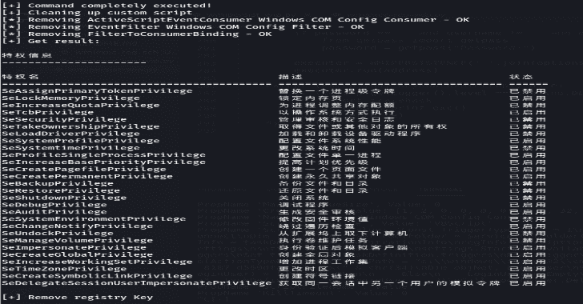

# wmiexec-RegOut:修改 Impacket Wmiexec 的版本。Py，从注册表获取输出(数据，响应)

> 原文：<https://kalilinuxtutorials.com/wmiexec-regout/>

**wmiexec-RegOut** 是 impacket wmiexec.py，wmipersist.py 的修改版，从注册表得到输出(数据，响应)，不需要 SMB 连接，但是我在坏代码里。

## 概观

在原始 wmiexec.py 中，它从 smb 连接(端口 445，139)获得响应。不幸的是，一些防病毒软件将这些端口监控为高风险。在这种情况下，我放弃 smb 连接功能，并使用其他方法来执行命令。

*   wmiexec-reg-sch-under nt6-WIP . py:使用 win32-scheduledjob 类执行的命令。据香山介绍，win32-scheduledjob 类只在 windows NT6 (windows-server 2003)下工作。
    顺便说一句，win32_scheduledjob 在 windows NT6 之后已经默认禁用。下面是启用它的方法。

**Key:HKEY _ LOCAL _ MACHINE \ SOFTWARE \ Microsoft \ Windows NT \ current version \ Schedule \ Configuration
Name:enable at
Type:REG _ DWORD
Value:1**

*   wmi persist-WIP . py**`(Highly recommend, !!!only works on impacket v0.9.24!!!)`:**wmi hacker 的一个 Python 版本，我从里面摘了 vbs 模板。攻击者可以利用它来做横向移动的安全下，反病毒软件运行。
*   wmiexec-regOut.py:只是一个简单的 Win32_Process.create 方法示例。

## 它是如何工作的？

*   wmiexec-wip.py 工作流程:第一步:第二步:第三步:第四步:第五步:
    *   WMIC 远程认证Step 2:
    *   使用 win32process 类并调用 create 方法来执行命令。然后，将结果写入名为[uuid]的 C:\windows\temp 目录。文本文件（textfile）Step 3:
    *   将文件内容编码为 base64 字符串(需要等待几秒钟)Step 4:
    *   将转换后的 base64 字符串添加到注册表中，并调用键名[uuid]Step 5:
    *   远程获取 base64 字符串并在本地解码。
*   wmipersist-wip.py 工作流程:第一步:第二步:第三步:
    *   将自定义 vbs 脚本添加到 ActiveScriptEventConsumer 类中。Step 2:
    *   创建事件过滤器。Step 3:
    *   将 FilterToConsumerBinding 类触发为 PWNED！

## 要求

一般只需要安装官方 impacket 即可。

*   入口

## 用法

*   wmiexec-wip.py 用法:带明文密码

**python3 wmiexec-reg.py 管理员:111 qqq…@ 192 . 168 . 10 . 90 ' whoami '**

### wmipersist-wip.py 用法(默认为无输出):

带明文密码(无输出)

**python3 wmipersist-wip.py 管理员:111qqq…@192.168.10.20 '命令'**

[**Download**](https://github.com/XiaoliChan/wmiexec-RegOut)