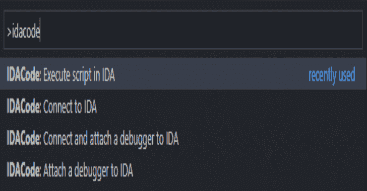

# IDA Code:IDA 和 VS 代码的集成，连接两者以便于执行和调试

> 原文：<https://kalilinuxtutorials.com/idacode/>

**IDACode** 使在 IDA 环境中执行和调试 Python 脚本变得容易，而无需离开 Visual Studio 代码。VS 代码扩展可以在市场上找到。
IDACode 仍处于非常早期的状态，可能会出现一些错误。如果您遇到任何问题，请打开一个新问题。

## 特性

*   **速度**:快速创建并执行脚本。
*   **调试**:随时附加 Python 调试器。
*   兼容性:IDACode 不要求你以特定的方式修改你的脚本。所有脚本都可以在 IDA 中执行，无需修改。
*   模块化:IDACode 没有大量使用安全包装器来实现线程同步，这允许你在任何时候从任何路径导入任何模块。相反，IDACode 将脚本执行线程与 IDAs 主线程同步，以避免性能和意外问题。
*   **同步**:由于 IDACode 使用`**debugpy**`进行通信，它自然地将输出窗口与 VS Code 的输出面板同步。

IDACode 同时支持 Python 2 和 Python 3！

## 设置

要设置 IDA 插件运行的依赖关系，请执行以下操作:

**确保使用正确的 Python 版本
IDACode 支持 3.0.0 版本的最新 debugpy，确保升级！
python -m pip 安装–用户调试 tornado**

要么克隆这个库，要么从这里下载一个发布包。`**ida.zip**`反映了该存储库中`**ida**`文件夹的内容。将所有文件复制到 IDAs 插件目录。

下一步是配置您的设置以匹配您的环境。相应地编辑`**idacode_utils/settings.py**`:

*   `**HOST**`:这是主机地址。除非您希望从远程位置访问它，否则它始终是`**127.0.0.1**`。**请记住，这个插件不使用认证。**
*   这是你想让 IDA 监听的端口。这用于 IDA 和 VS 代码之间的 websocket 通信。
*   `**DEBUG_PORT**`:这是您想要监听传入调试会话的端口。
*   `**PYTHON**`:这是 IDA 设置使用的 Python 发行版的绝对路径。
*   `**LOGGING**`:决定调试器是否应该登录文件。当您遇到 IDACode 问题时，这尤其有用。如果你发现什么，请提交新的一期。这些文件总是位于您的临时目录中(例如 Windows: `**%TEMP%**`)。这些文件叫做`**debugpy.*.log**`。

您现在可以通过点击插件菜单中的`**IDACode**`来启动插件。

VS 代码扩展可以在市场上买到。要配置扩展，请参考扩展的自述文件。

## 用法

### IDA

在插件菜单中点击`**IDACode**`。您应该会看到以下文本:

**IDACode 监听 127.0.0.1:7065**

### VS 代码

从 0.2.0 版本开始，IDACode 支持默认启用的“保存时执行”。一旦保存了当前文档，VS 代码就会自动执行 IDA 中的脚本(例如用 CTRL+S)。可以在设置中禁用此行为。

有 4 个命令供您使用:

一旦您打开了一个想要放入脚本的文件夹，就可以连接 IDA 了。您可以通过执行`**Connect to IDA**`或`**Connect and attach a debugger to IDA**`来实现。请记住，在重启 IDA 之前，调试会话是永久的。一旦调试器启动，就不能更改工作区文件夹。
确保工作区文件夹是您的主脚本所在的文件夹。
连接后，您可以选择`**Execute script in IDA**`。

## 调试

IDACode 使用 VS Code 的远程调试器来连接 IDA。支持所有 VS 代码功能。但是，您必须通过使用 Python 内置功能来指定脚本入口点:`**breakpoint**`。这个指令告诉调试器暂停执行，如果没有调试器，它将忽略这个函数。IDACode 导入了一个名为`**dbg**`的助手包，它实现了一个名为`**bp**`的`**breakpoint**`重载。该函数支持日志记录和条件:

**name = IDC . get _ segm _ name(segment)
dbg . BP(name = ="。text "，f"found {name} at {segment}")**

还请注意，`**breakpoint()**`调用永远不应该出现在文件的末尾，它必须总是在任何其他代码行之前，因为它在代码中的*下一个*指令处中断。还要注意，如果你决定使用`**dbg**`包，你必须删除所有的引用，或者在作为一个普通的 IDA 脚本执行之前使用变量`**__idacode__**`作为条件。
同样重要的是，附加一个调试器将创建一个新的调试器实例。在大多数情况下，这不是你想要的。如果您从调试器断开连接，请使用 VS 代码的远程调试器重新连接。

[**Download**](https://github.com/ioncodes/idacode)