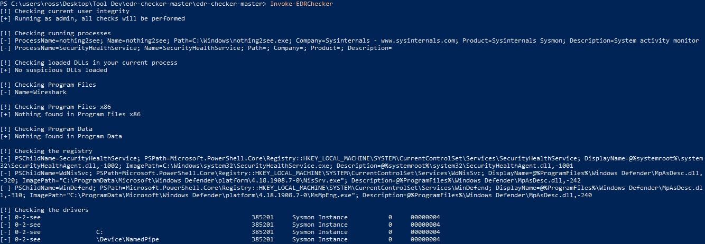
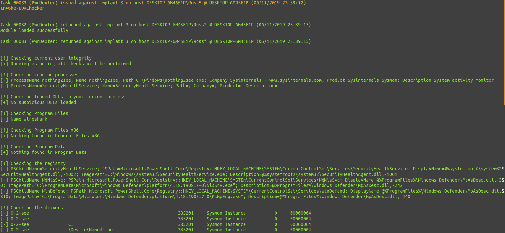

# Invoke-EDRChecker:检查正在运行的进程、进程元数据、加载到当前进程中的 dll

> 原文：<https://kalilinuxtutorials.com/invoke-edrchecker/>

**Invoke-EDRChecker** 是该脚本将检查正在运行的进程、进程元数据、加载到您当前进程中的 dll 和每个 dll 元数据、公共安装目录、已安装的服务、注册表和正在运行的驱动程序是否存在已知的防御产品，如反病毒软件、EDR 和日志工具。

这个脚本也可以加载到您的 C2 服务器中，例如在 PoshC2 中，将脚本放在您的模块目录中，加载模块，然后运行它。注意:这个脚本现在包含在 PoshC2 中，所以不需要手动添加它。

如果您有权限，该脚本还可以对远程目标执行检查，但是这些检查目前仅限于进程检查、公共安装目录和已安装的服务。

在时间允许的情况下，我会继续添加和改进这个列表。完整的路线图可以在下面找到。

该工具的 C#版本比 PowerShell 版本有了很大的改进，可以在以下位置找到:

https://github.com/PwnDexter/SharpEDRChecker

如有任何问题或疑问，请在 twitter @PwnDexter 上找到我！

## 安装

**git 克隆 https://github.com/PwnDexter/Invoke-EDRChecker.git**

## 使用

一旦将脚本加载到您选择的主机或 C2 中，您就可以使用以下命令:

针对本地主机运行脚本，并根据当前用户完整性执行检查:

**调用-EDRChecker**

运行脚本并强制执行注册表检查(当您不以管理员身份运行时使用):

**调用-EDRChecker -Force**

要绕过远程主机的预检查，请使用-Ignore 标志来绕过连接检查

**调用-edr checker-远程-忽略**

## 示例输出–注意:这些截图需要更新，并且这仅在 Windows 10 上进行了测试，更多测试即将到来。

如果进程和驱动程序被隐藏但仍被发现:

将 EDR 检查器与 PoshC2 配合使用:

[**Download**](https://github.com/PwnDexter/Invoke-EDRChecker)