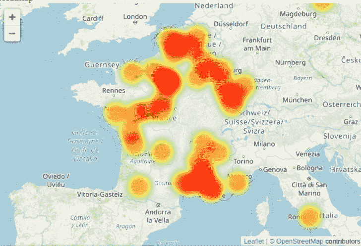
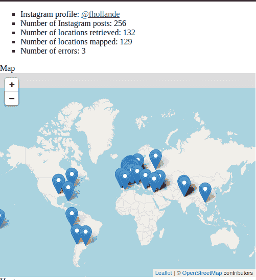

# Instaloctrack:一个收集所有地理标记位置的 Instagram 工具

> 原文：<https://kalilinuxtutorials.com/instaloctrack/>

**Instaloctrack** ，一个在 Instagram 个人资料上抓取地理标记位置的工具。在 JSON &交互地图中输出。

**要求**

安装 chromium-chrome 驱动程序&T3 chmod a+x/usr/bin/chrome 驱动程序

**安装**

git 克隆 https://github.com/bernsteining/instaloctrack
CD instaloctrack
pip 3 安装。

或者使用 Docker:

**sudo dock build-t instaloctrack-f docerfile**。

**用途**

**instaloctrack -h
用法:instaloctrack[-h][-t TARGET _ ACCOUNT][-l log in][-p PASSWORD][-v]
insta gram 位置数据采集工具。用法:python3 instaloctrack.py -t
可选参数:
-h，–help 显示此帮助消息并退出
-t TARGET_ACCOUNT，–TARGET _ ACCOUNT
Instagram 个人资料调查
-l 登录，–log in
insta gram 个人资料连接，以便访问
目标帐户的 insta gram 帖子
-p PASSWORD，–PASSWORD
insta gram 个人资料的密码连接到
-v，–visual spawn**

例如

**instaloctrack -t**

如果目标配置文件是私有的，并且您有一个遵循该目标配置文件的帐户，则您可以通过连接的会话抓取数据:

**instaloctrack -t -l -p**

## 它是如何工作的

首先，我们通过滚动整个 Instagram 个人资料来检索帐户的所有图片链接，这要感谢 selenium 的 webdriver。

然后，我们异步检索(asyncio)每个图片链接，检查它是否包含图片描述中的位置，如果有，检索位置数据和时间戳。

*   **NB:** 自 2018 年 Instagram 弃用其位置 API 以来，再也不可能获得照片的 GPS 坐标，我们只能检索位置的名称。(如果你能证明我在这件事上是错的，请告诉我！)

因为 Instagram 不提供 GPS 坐标，而我们只得到地名，所以我们必须对这些进行地理编码(即从地名的位置获得 GPS 坐标)。

为此，我使用了 nomist 的 awesome API，它使用 OpenStreetMap。对于我们的使用，不需要 API 键，我们尊重 nomim 的使用策略，每秒请求一次 GPS 坐标。

最终，一旦我们有了所有的 GPS 坐标，我们就生成了一个嵌入了 Javascript 的 HTML(多亏了 jinja2 模板),它绘制了一个公开的街道地图(多亏了传单库),上面标注了我们所有的位置。同样，这个步骤不需要 API 键。

此外，脚本收集的数据(位置名称、时间戳、GPS 坐标、错误)被转储到一个 JSON 文件中，以便重用。

## 举例

作为一个例子，这位法国前总统的 Instagram 个人资料@fhollande 上的输出如下:

JSON 数据转储(只是其中的一部分，用于显示给定位置的格式):

 **【链接】:【https://www . insta gram . com/p/-q _ 9evr 9 eu】，
【地点】:
【id】:【290297】，
【名称】:【码头博物馆-雅克·希拉克】，
【slug】:【博物馆-码头-雅克·希拉克】**

[**Download**](https://github.com/bernsteining/instaloctrack)