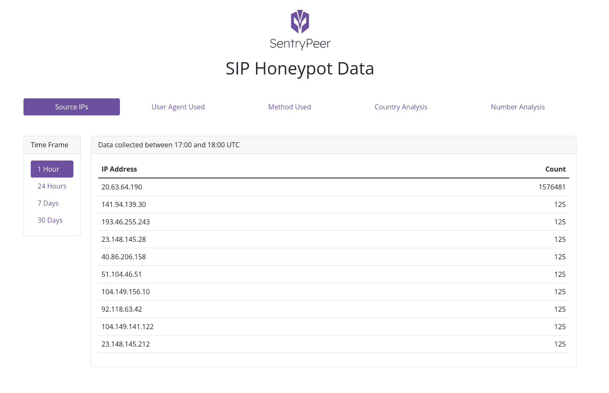

# SentryPeer:收集的不良行为者 IP 地址和电话号码的分布式对等列表

> 原文： [https://kalilinuxtutorials.com/sentrypeer/](https://kalilinuxtutorials.com/sentrypeer/)

**SentryPeer** 基本上是一个欺诈检测工具。它让坏人试图打电话，并保存他们来自的 IP 地址和他们试图呼叫的号码。这些详细信息随后被用于在服务提供商的网络上阻止他们，下次用户/客户试图呼叫对方付费号码时，该号码就会被阻止。

传统上，这些数据被运送到一个中心位置，所以你不拥有你收集的数据。这个项目是所有关于点对点的数据共享。对我来说，拥有数据和各种服务提供商/网络提供商相关数据的用户是关键。我厌倦了所有那些保存和出售它的服务。如果您已经收集了它，您应该可以选择保留它和/或选择通过 p2p 方式与其他 SentryPeer 社区成员分享它。

分享的部分…只有当你分享你的数据时，你才能得到其他用户的数据。这是关键。如果我做对了，它也可以用在许多项目中(数据逻辑/特性的共享)。

### 截屏

这是一个可能会改变的网络用户界面的模型。

### 目标

*   所有代码自由/自由和开源软件
*   快的
*   用户*拥有他们的*数据
*   如果用户愿意，他们可以提交自己的数据—*选择退出*(默认为提交数据)
*   用户获取其他用户的数据(针锋相对？)**只有当**他们选择将他们的数据提交到池(DHT？–需要进行概念验证)
*   使用 OpenDHT 的嵌入式分布式哈希表(DHT)节点(`**-p**` cli 选项)
*   使用 OpenDHT 对等共享收集的 bad_actors 的(默认开启)
*   使用 OpenDHT 将对等数据复制到**接收**收集的 bad_actors(默认开启)
*   多线程
*   UDP 传输
*   TCP 传输
*   TLS 传输
*   JSON 日志记录到文件
*   数据最大 7(？)天旧为无用否则
*   可以禁用 SIP 模式。这允许您仅在 API 模式或 DHT 模式下运行 SentryPeer 等。即，不是作为蜜罐，而是作为 SentryPeer 社区中的一个节点，或者只是提供复制的数据
*   可以启用 SIP 响应模式来收集数据–CLI/env 标志
*   **本地**数据拷贝用于**快速访问**–CLI/env db 位置标志
*   **用于**快速访问的本地**API**–CLI/env 标志
*   **用于**快速访问的本地**Web GUI**–CLI/env 标志
*   查询 API 以获取不良参与者的 IP 地址
*   不良参与者的 IPSET 的查询 API
*   针对不良参与者的特定 IP 地址查询 API
*   查询 API 以查找不良行为者尝试拨打的电话号码
*   查询 API 以查找恶意用户尝试拨打的电话号码
*   根据功能要求，通过`**syslo**g`提供故障 2 禁止支持
*   本地 sqlite 数据库–功能/ cli 标志
*   分析–选择加入
*   用于外部访问的 SDK/libs–从 CGRateS 开始，或者我们自己的带有 nftables 的防火墙
*   物联网使用的小型二进制文件
*   跨平台
*   实时使用分布式数据的防火墙选项–DHT？
*   最新版本的 Docker Hub 上的容器
*   与 BGP 代理对等，用于黑取收集的 IP 地址(类似于团队 Cymru Bogon 路由器服务器项目)
*   SIP 代理返回 404 或 SIP 重定向的默认目的地

### 设计

TBD🙂

我这样做是因为我想做 C 网络编程，因为我每天使用的项目都是用 C 语言编写的，比如 PostgreSQL、OpenLDAP、FreeSWITCH、OpenSIPS、星号等等。参见《第 414 集:现代 C 上的延斯·古斯特》了解为什么 C 是一个好的选择。对于那些感兴趣的人，请看我的软件工程电台播客节目列表(https://www.se-radio.net/team/gavin-henry/)

### 会谈

*   tad summit 2021–https://blog.tadsummit.com/2021/11/17/sentrypeer/
*   CommCon 2021–https://2021 . CommCon . XYZ/talks/sentry peer-a-distributed-peer-to-peer-list-of-bad-IP-addresses-and-phone-numbers-collected-via-a-sip-honey pot

### 码头工人

可以用 Docker 运行最新版本的 SentryPeer。最新版本可从 Docker Hub 获得。或者打造自己:

**须藤坞建设-t sentrypeer。
sudo 坞站运行-d-p 5060:5060-p 8082:8082 sentry peer:latest**

然后你可以在`**http://localhost:8082/ip-addresses**`和`**http://localhost:5060/health-check**`查看它是否在运行。

#### 环境变量

**env sentry peer _ db _ file =/my/location/sentry peer . db
env sentry peer _ API = 1
env sentry peer _ web _ GUI = 1
env sentry peer _ sip _ response = 1
env sentry peer _ sip _ disable = 1
env sentry peer _ syslog = 1** 

在 docker 文件或您的`**Dockerfile.env**`文件或 docker 运行命令中设置这些。

### 安装

Debian 或 Fedora 包总是可以从当前版本的 SentryPeer 的发布页面获得:

https://github.com/SentryPeer/SentryPeer/releases

#### Ubuntu 包

你可以从我们的 Ubuntu PPD 安装 SentryPeer，它目前适用于 Ubuntu 20 LTS (Focal Fossa):

**sudo add-apt-repository PPA:gavinhenry/sentrypeer
sudo apt-get 更新**

通过复制以下代码行并将其添加到您系统的软件源中，可以手动将此 PPA 添加到您的系统中:

**deb https://PPA . launch pad content . net/Gavin Henry/sentry peer/Ubuntu focal main
deb-src https://PPA . launch pad content . net/Gavin Henry/sentry peer/Ubuntu focal main**

#### 从源构建

从源代码安装有两种选择。CMake 或自动工具。目前推荐使用自动工具。一个版本是一个自动工具构建。

如果您是 Fedora 用户，您可以通过 Fedora copr 安装它:

https://copr.fedorainfracloud.org/coprs/ghenry/SentryPeer/

如果您要从该存储库进行构建，您需要安装以下软件:

*   **`git``autoconf``automake`**`**autoconf-archive**`(Debian/Ubuntu)
*   `**libosip2-dev**` (Debian/Ubuntu)或者`**libosip2-devel**` (Fedora)
*   `**libsqlite3-dev**` (Debian/Ubuntu)或者`**sqlite-devel**` (Fedora)
*   `**uuid-dev**` (Debian/Ubuntu)或者`**libuuid-devel**` (Fedora)
*   `**libmicrohttpd-dev**` (Debian/Ubuntu)或者`**libmicrohttpd-devel**` (Fedora)
*   `**libjansson-dev**` (Debian/Ubuntu)或者`**jansson-devel**` (Fedora)
*   `**libpcre2-dev**` (Debian/Ubuntu)或者`**pcre2-devel**` (Fedora)
*   `**libcurl-dev**` (Debian/Ubuntu)或者`**libcurl-devel**` (Fedora)
*   **`libcmocka-dev`** (Debian/Ubuntu)或`**libcmocka-devel**`(Fedora)——用于单元测试

Debian/Ubuntu:

**sudo apt-get install git build-essential autoconf-archive autoconf automake lib osip 2-dev libsqlite 3-dev \
libcmocka-dev uuid-dev libcurl-dev libpcre 2-dev libjansson-dev libmicrohttpd-dev**

软呢帽:

**sudo dnf install git auto conf auto confke libosip 2-devel libsqlite 3-devel libcmocka-devel \
libuuid-devel libmicrohttpd-devel jansson-devel libcurl-devel pcre 2-devel**

[**Download**](https://github.com/SentryPeer/SentryPeer)