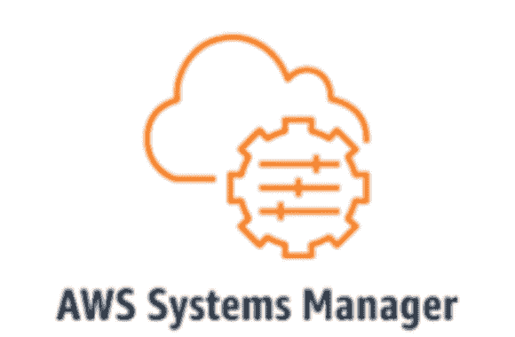

# AWS-Loot:从 AWS 环境中获取秘密

> 原文：<https://kalilinuxtutorials.com/aws-loot/>

AWS-Loot 工具允许快速枚举大量的 AWS 实例和服务。

**安装**

**pip install-r requirements . txt**

AWS 凭据文件(。AWS/凭据)是向目标环境进行身份验证所必需的

*   存取关键字
*   访问密钥机密

## 它是如何工作的

Awsloot 通过遍历 EC2、Lambda、CodeBuilder 实例并搜索高熵字符串来工作。EC2 Looter 的工作方式是查询所有区域中所有可用的实例 ID，并请求开发人员经常留下秘密的实例的用户数据。Lambda looter 也可以跨区域运行。Lambada looter 可以搜索找到的函数的所有可用版本。它首先搜索函数环境变量，然后下载源代码并扫描源代码寻找秘密。Codebuilder Looter 的工作方式是搜索构建实例，并在这些构建中搜索可能包含秘密的环境变量。

## 用法

**Python3 awsloot.py**

## 下一个功能

*   允许用户指定要扫描的 ARN
*   附加服务的掠夺者

[**Download**](https://github.com/sebastian-mora/AWS-Loot)