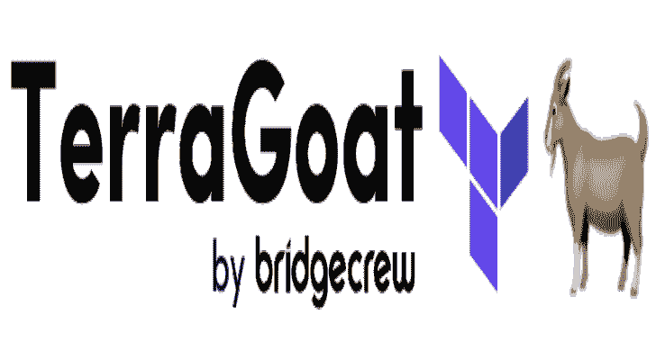

# TerraGoat:脆弱的地形基础设施

> 原文：<https://kalilinuxtutorials.com/terragoat/>

**TerraGoat** 是 Bridgecrew 的“设计脆弱”Terraform 存储库。TerraGoat 是一个学习和培训项目，演示常见的配置错误如何进入生产云环境。

## **简介**

TerraGoat 旨在帮助 DevSecOps 设计和实施可持续的错误配置预防策略。它可以用来测试一个策略即代码框架，如 Bridgecrew & Checkov、inline-linters、预提交钩子或其他代码扫描方法。

TerraGoat 沿袭了现有*Goat 项目的传统，这些项目提供了一个基准培训平台，用于实践为云基础设施实施安全开发最佳实践。

## **重要提示**

*   **哪里可以得到帮助:**舰桥船员社区 Slack

在您继续之前，请注意以下警告:

Terra Goat 故意在您的帐户中创建易受攻击的 AWS 资源。不要在生产环境中或任何敏感的 AWS 资源旁边部署 TerraGoat。

## **要求**

*   地形 0.12
*   aws cli
*   azure cli

要防止易受攻击的基础设施进入生产环境，请参阅:Bridgecrew & checkov，将基础设施作为代码的开源静态分析工具。

## 开始使用

### AWS 设置

#### 安装(AWS)

您可以使用参数`**TF_VAR_environment**`在单个 AWS 帐户中部署多个 TerraGoat 堆栈。

#### 创建 S3 存储桶后端以保持地形状态

**导出 terra goat _ STATE _ BUCKET = " mydevsecops-BUCKET "
导出 TF_VAR_company_name=acme
导出 TF _ VAR _ environment = mydevsecops
导出 TF _ VAR _ region = " us-west-2"
AWS s3api create-BUCKET–BUCKET $ terra goat _ STATE _ BUCKET \
–region $ TF _ VAR _ region–create-BUCKET-configuration location constraint = $ TF _ VAR _ region
启用版本控制
aws**

**涂抹 TerraGoat (AWS)**

**CD terra form/AWS/
terra form init \
-back end-config = " BUCKET = $ terra goat _ STATE _ BUCKET "
-back end-config = " key = $ TF _ VAR _ company _ name-$ TF _ VAR _ environment . TF STATE "
-back end-config = " region = $ TF _ VAR _ region "
terra form 应用**

**移除 TerraGoat (AWS)**

**地形破坏**

### Azure 设置

#### 安装(Azure)

您可以使用参数`**TF_VAR_environment**`在单个 Azure 订阅中部署多个 TerraGoat 堆栈。

#### 创建 Azure 存储帐户后端以保持 Terraform 状态

**导出 terra goat _ RESOURCE _ GROUP = " TerraGoatRG "
导出 terra goat _ STATE _ STORAGE _ ACCOUNT = " mydevsecopssa "
导出 terra goat _ STATE _ CONTAINER = " mydevsecops "
导出 TF_VAR_environment="dev"
导出 TF_VAR_region="westus"
创建资源组
az 组创建–location＄TF _ VAR _ region–name＄terra goat _ RESOURCE _ GROUP
创建存储帐户
az 存储帐户创建 value -o tsv)
创建 blob 容器
az 存储容器 Create–name $ terra goat _ STATE _ CONTAINER–ACCOUNT-name $ terra goat _ STATE _ STORAGE _ ACCOUNT**–ACCOUNT-KEY $ ACCOUNT _ KEY

### GCP 设置

#### 安装(GCP)

您可以使用参数`**TF_VAR_environment**`在单个 GCP 项目中部署多个 TerraGoat 堆栈。

#### 创建一个 GCS 后端来保持地形状态

要使用 terraform，需要一个服务帐户和一组匹配的凭据。如果它们不存在，则必须为相关项目手动创建。要创建服务帐户:

*   登录您的 GCP 项目，进入 **`IAM` > `Service Accounts`** 。
*   点击 **`CREATE SERVICE ACCOUNT`。**
*   为您的服务帐户命名(例如-`**terragoat**`)并点击`**CREATE**`。
*   授予服务帐户`**Project**` > `**Editor**`角色，点击`**CONTINUE**`。
*   点击`**DONE**`。

要创建凭据，请执行以下操作:

*   登录您的 GCP 项目，进入`**IAM**` > `**Service Accounts**`，点击相关服务账户。
*   点击 **`ADD KEY` > `Create new key` > `JSON`** ，点击`**CREATE**`。这将创建一个`**.json**`文件，并将其下载到您的计算机上。

我们建议用一个比自动生成的名称更好的名称保存密钥(即`**terragoat_credentials.json**`)，并将生成的 JSON 文件存储在 terragoat 的`**terraform/gcp**`目录中。设置好凭据后，按如下方式创建 BE 配置:

**export TF _ VAR _ environment = " dev "
export TF _ terra goat _ STATE _ BUCKET = remote-STATE-BUCKET-terra goat
export TF _ VAR _ credentials _ path = # example:export TF _ VAR _ credentials _ path = terra goat _ credentials . JSON
export TF _ VAR _ project =
创建存储桶
gsutil MB GS://＄{ TF _ terra goat _ STATE _ BUCKET }**

**涂抹 TerraGoat (GCP)**

**CD terra form/GCP/
terra form init-reconfigure-back end-config = " BUCKET = $ TF _ terra goat _ STATE _ BUCKET " \
-back end-config " credentials = $ TF _ VAR _ credentials _ path " \
-back end-config " prefix = terra goat/$ { TF _ VAR _ environment } "
terra form apply**

**移除土山羊(GCP)**

**地形破坏**

[**Download**](https://github.com/bridgecrewio/terragoat)