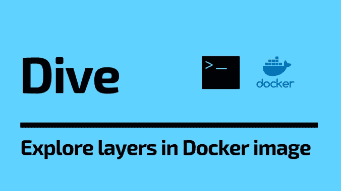

# Dive:探索 Docker 图像中每一层的工具

> 原文：<https://kalilinuxtutorials.com/dive/>

**Dive** 是一个工具，用于探索 docker 图像，图层内容，并发现缩小 Docker/OCI 图像大小的方法。

要分析 Docker 图像，只需使用图像标签/id/摘要运行 dive:

**潜水<your-image-tag>**

或者，如果你想建立自己的形象，就直接分析它:

**潜水建造-t <一些-标记>**

基于 Macbook 构建(仅支持 Docker 容器引擎)

**docker run–RM-it \
-v/var/run/docker . sock:/var/run/docker . sock \
-v " $(pwd)":" $(pwd)" \
-w " $(pwd)" \
-v " $ HOME/. dive . YAML ":" $ HOME/. dive . YAML "
wagoodman/dive:最新 build -t .**

此外，您可以在 CI 管道中运行此命令，以确保将浪费的空间降至最低(这跳过了 UI):

**CI =真潜<your-image>**

## 基本特征

**显示按层分解的 Docker 图像内容**

当您在左侧选择一个层时，您会看到该层的内容与右侧所有先前层的内容相结合。此外，您可以使用箭头键完全浏览文件树。

**表示每层的变化**

已更改、修改、添加或删除的文件显示在文件树中。可以对其进行调整，以显示特定层的更改，或该层的汇总更改。

**估算“图像效率”**

左下方的窗格显示了基本的图层信息和一个实验性的度量，该度量将猜测您的图像包含了多少浪费的空间。这可能是由于跨层复制文件、跨层移动文件或没有完全删除文件。提供了百分比“分数”和总的浪费文件空间。

**快速构建/分析周期**

您可以使用一个命令:`**dive build -t some-tag** .`构建 Docker 映像并进行即时分析

你只需要用相同的`**dive build**`命令替换你的`**docker build**`命令。

**CI 整合**

分析图像，并根据图像效率和浪费的空间获得通过/失败的结果。当调用任何有效的 dive 命令时，只需在环境中设置`**CI=true**`。

**支持多个图像源和容器引擎**

使用 **`--source`** 选项，您可以选择从哪里获取容器图像:

**潜水<你的-图像>-来源<来源>**

有效的`**source**`选项如下:

*   `**docker**` : Docker 引擎(默认选项)
*   `**docker-archive**`:来自磁盘的 Docker Tar 存档
*   `**podman**`:波德曼引擎(仅限 linux)

## 安装

**Ubuntu/Debian**

**wget https://github . com/wagoodman/dive/releases/download/v 0 . 9 . 2/dive _ 0 . 9 . 2 _ Linux _ amd64 . deb
sudo apt 安装。/dive_0.9.2_linux_amd64.deb**

**RHEL/森特斯**

**curl-OL https://github . com/wagoodman/dive/releases/download/v 0 . 9 . 2/dive _ 0 . 9 . 2 _ Linux _ amd64 . rpm
rpm-I dive _ 0 . 9 . 2 _ Linux _ amd64 . rpm**

**Arch Linux**

在 Arch 用户信息库(AUR)中作为 dive 提供。

**yay -S 潜水**

上面的例子假设`**yay**`是安装 AUR 软件包的工具。

**Mac**

如果您使用自制软件:

**酿造安装潜水**

如果您使用 MacPorts:

**须藤港安装潜水**

或者从发布页面下载最新的 Darwin 版本。

**窗户**

下载最新版本。

Go 工具需要 Go 版本 1.10 或更高版本。

## CI 集成

当使用环境变量`**CI=true**`运行 dive 时，dive UI 将被绕过，转而分析你的 docker 图像，通过返回代码给出一个通过/失败指示。目前有三个指标通过一个 **`.dive-ci`** 文件支持，您可以将它放在您的回购根中:

**规则:
#如果效率测量值低于 X%，则标记为失败。
#表示为 0-1 之间的比值。
lower efficiency:0.95
#如果浪费的空间量至少为 X 或大于 X，则标记为失败。
#用 B、KB、MB、GB 表示。
highestWastedBytes:20MB
#如果浪费的空间量占图像的 X%或更多，则标记为失败。
#注意:基本图像层不包括在总图像尺寸中。
#表示为 0-1 之间的比值；如果达到或超过阈值，则失败。
最高用户浪费百分比:0.20**

## 按键

| 按键绑定 | 描述 |
| --- | --- |
| `Ctrl + C` | 出口 |
| `Tab` | 在层视图和过滤视图之间切换 |
| `Ctrl + F` | 过滤文件 |
| `PageUp` | 向上滚动一页 |
| `PageDown` | 向下滚动一页 |
| `Ctrl + A` | 层视图:请参见聚合图像修改 |
| `Ctrl + L` | 层视图:请参见当前层修改 |
| `Space` | 文件树视图:折叠/取消折叠目录 |
| `Ctrl + Space` | 文件树视图:折叠/取消折叠所有目录 |
| `Ctrl + A` | 文件树视图:显示/隐藏添加的文件 |
| `Ctrl + R` | 文件树视图:显示/隐藏删除的文件 |
| `Ctrl + M` | 文件树视图:显示/隐藏修改的文件 |
| `Ctrl + U` | 文件树视图:显示/隐藏未修改的文件 |
| `Ctrl + B` | 文件树视图:显示/隐藏文件属性 |
| `PageUp` | 文件树视图:向上滚动一页 |
| `PageDown` | 文件树视图:向下滚动一页 |

## 用户界面配置

不需要配置，但是，您可以创建一个配置文件并覆盖值:

# 支持的选项有“码头工人”和“搬运工”

集装箱引擎:码头工人

# 即使解析图像档案时出现错误，也要继续分析

忽略-错误:假
日志:
启用:真
路径:。/dive.log
级别:信息

# 注意:您可以通过用逗号分隔值来指定多个绑定。

# 注意:UI 提示来自第一个绑定

**keybinding:
#全局绑定
quit:ctrl+c
toggle-view:tab
filter-files:ctrl+f，ctrl+斜杠
#层视图特定绑定
compare-all:ctrl+a
compare-Layer:ctrl+l
#文件视图特定绑定
toggle-collapse-dir:space
toggle-collapse-all-dir:ctrl+space
toggle-added-files:ctrl+a
默认情况下，会显示所有差异类型。
隐藏:
–添加
–删除
–修改
–未修改
文件树:
#默认目录-折叠状态
折叠-dir: false
#文件树应占屏幕宽度的百分比(必须是> 0 和< 1)
窗格-宽度:0.5
#显示文件树旁边的文件属性
显示-属性:true 【T32**

dive 将在以下位置搜索配置:

*   `**$XDG_CONFIG_HOME/dive/*.yaml**`
*   `**$XDG_CONFIG_DIRS/dive/*.yaml**`
*   `**~/.config/dive/*.yaml**`
*   `**~/.dive.yaml**`

[Download](https://github.com/wagoodman/dive)