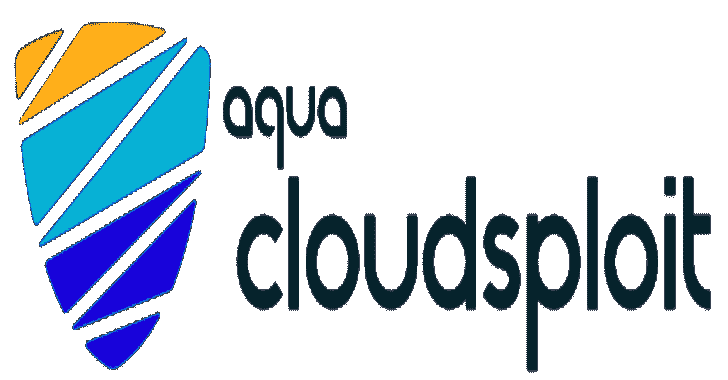

# 云安全态势管理(CSPM)

> 原文：<https://kalilinuxtutorials.com/cloudsploit/>

Aqua 的 CloudSploit 是一个开源项目，旨在检测云基础设施账户中的安全风险，包括:亚马逊网络服务(AWS)、微软 Azure、谷歌云平台(GCP)、甲骨文云基础设施(OCI)和 GitHub。这些脚本旨在返回一系列潜在的错误配置和安全风险。

## 部署选项

CloudSploit 有两种部署选项:

### 自主持

按照下面的说明，只需几个简单的步骤，就可以在您的机器上部署 CloudSploit 的开源版本。

### 在阿卡波举办

Aqua Wave 托管的商业版 CloudSploit。今天就试试 Aqua Wave 吧！

## 安装

确保安装了 NodeJS。如果没有，请从这里安装。

**$ git 克隆 git @ github . com:clouds loit/scans . git
$ NPM 安装**

## 配置

CloudSploit 需要您的云帐户的只读权限。请遵循以下指南来设置此访问权限:

*   亚马逊网络服务
*   微软 Azure
*   谷歌云平台
*   Oracle 云基础设施

对于 AWS，您可以直接运行 CloudSploit，它将使用默认的 AWS 凭证链来检测凭证。

### clouds loit 配置文件

CloudSploit 配置文件允许您通过以下方式传递云提供商凭据:

1.  文件系统中的 JSON 文件
2.  环境变量
3.  硬编码(不推荐)

首先复制示例配置文件:

**$ CP config _ example . js config . js**

通过取消注释您正在测试的云提供商的相关部分来编辑配置文件。每个云既有一个`**credential_file**`选项，也有内嵌选项。例如:

**azure: {
//选项一:如果使用凭证 JSON 文件，在下面输入路径
//credential _ file:'/path/to/file . JSON '，
//选项二:如果使用硬编码凭证，在下面输入
//APPLICATION _ ID:process . env . azure _ APPLICATION _ ID | | "，
//KEY _ VALUE:process . env . azure _ KEY _ VALUE | | "，
//DIRECTORY _ ID:process . env . azure _ DIRECTORY _ ID | | "**

### 凭据文件

如果您使用`**credential_file**`选项，指向您的文件系统中的一个文件，该文件遵循您正在使用的云的正确格式。

#### AWS

**{
" access keyid ":" your access key "，
" secret access key ":" your secret key "
}**

## 蔚蓝的

**{
" application id ":" yourazuresapplationid "，
" key value ":" YOURAZUREKEYVALUE "，
" DirectoryID ":" YOURAZUREDIRECTORYID "，
" subscription id ":" yourazuresubscription id "
}**

#### GCP

注意:对于 GCP，您直接从 GCP 控制台生成一个 JSON 文件，您不应该编辑它。

**{
" type ":" service _ account "、
"project": "GCPPROJECTNAME "、
" client _ email ":" GCPCLIENTEMAIL "、
" private _ key ":" GCPPRIVATEKEY "
}**

## 甲骨文 OCI 公司

**{
" tenancyId ":" youoracletenancyid "、
" compartment id ":" youoraclecompartmentid "、
" userId ":" youoracleuserid "、
" key fingerprint ":" youoraclekey fingerprint "、
" key value ":" youoraclekey value "、
}**

### 环境变量

CloudSploit 支持传递环境变量，但是您必须首先取消对与被扫描的云提供者相关的`**config.js**`文件部分的注释。

然后，您可以传递每个部分中列出的变量。例如，对于 AWS:

**{
ACCESS _ KEY:process . env . AWS _ ACCESS _ KEY _ ID | | "，
SECRET _ ACCESS _ KEY:process . env . AWS _ SECRET _ ACCESS _ KEY | | "，
SESSION _ TOKEN:process . env . AWS _ SESSION _ TOKEN | | "，
}**

# **运行中**

要运行标准扫描，显示所有输出和结果，只需运行:

**$。/index.js**

## CLI 选项

CloudSploit 支持许多选项来定制运行时间。一些受欢迎的选项包括:

*   AWS GovCloud 支持:`**--govcloud**`
*   AWS 中国支持:`**--china**`
*   保存原始云提供商响应数据:`**--collection=file.json**`
*   忽略通过(合格)的结果:`**--ignore-ok**`
*   如果发现未通过结果，用非零代码退出:`**--exit-code**`
    *   这是 CI/CD 系统的一个好选择
*   将表格输出更改为原始文本:`**--console=text**`

有关更多输出选项，请参见下面的输出格式。单击查看选项的完整列表

## 合规

CloudSploit 支持将其插件映射到特定的合规性策略。要运行符合性扫描，请使用 **`--`** `**compliance**`标志。例如:

**$。/index . js–compliance = hipaa
$。/index . js–compliance = PCI**

可以同时运行多种合规模式:

**$。/index . js–compliance = cis1–compliance = cis2**

## 信息输出公式

CloudSploit 支持多种格式的输出，供其他工具使用。如果没有另外指定，CloudSploit 会将输出作为表格写入标准输出(控制台)。

注意:您可以传递多种输出格式，并结合选项进行进一步定制。例如:

**#打印一张表格到控制台并保存一个 CSV 文件
$。/index . js–CSV = file . CSV–console = table
#将文本打印到控制台并保存一个 JSON 和 JUnit 文件，同时忽略传递的结果
$。/index . js–JSON = file . JSON–JUnit = file . XML–console = text–ignore-ok**

### 控制台输出

默认情况下，CloudSploit 结果以表格格式(带颜色)打印到控制台。您可以通过运行以下命令来覆盖它并使用纯文本:

**$。/index . js–console = text**

或者，您可以通过运行以下命令来完全禁止控制台输出:

**$。/index . js–console = none**

### 忽略通过的结果

您可以通过传递一个`**--ignore-ok**`命令行参数来忽略返回 OK 状态的输出结果。

### CSV

**$。/index . js–CSV = file . CSV**

## 抑制

可以通过使用以下格式传递`**--suppress**`标志(支持多个选项)来隐藏结果:

**–抑制插件 Id:区域:资源 Id**

例如:

**#抑制 ACM 验证插件
$的所有结果。/index . js–抑制 ACM validation:*:*
#抑制所有 us-east-1 地区结果
$。/index . js–Suppress*:us-east-1:*
#在所有插件
的所有区域中，隐藏与 regex“certificate/*”匹配的所有结果。/index . js–suppress *:*:certificate/***

## 体系结构

CloudSploit 分两个阶段工作。首先，它向云基础设施 API 查询关于你的账户的各种元数据，即“收集”阶段。一旦收集了所有必要的数据，结果就被传递到“扫描”阶段。该扫描使用收集的数据来搜索潜在的错误配置、风险和其他安全问题，并作为结果输出。

[**Download**](https://github.com/aquasecurity/cloudsploit)