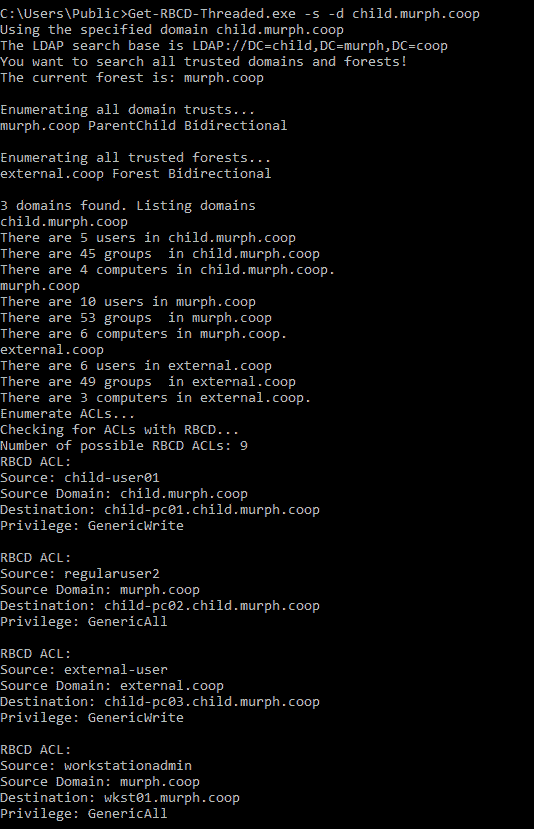

# Get-RBCD 线程:发现基于资源的受限委托攻击路径的工具

> 原文：<https://kalilinuxtutorials.com/get-rbcd-threaded/>

**Get-RBCD 线程化**是一种工具，用于发现活动目录环境中基于资源的受限授权攻击路径

几乎完全基于 Elad Shamir 的精彩博客文章“摇摆狗:滥用基于资源的受限委托攻击 Active Directory”和 harmj0y 的“摇摆狗的案例研究:计算机接管”。如果你真的想了解这里发生了什么，请阅读这两篇博文。老实说，我自己也只理解了一半(这是慷慨的表现)。

我不知道如何很好地使用 C#所以我通过阅读 SharpSploit 和 SharpView 的源代码，找到了如何在 C#中与域进行通信的方法。

**工作原理**

Get-RBCD-Thread 将查询当前域中的所有活动目录用户、组(不包括“域管理员”和“内置\管理员”等特权组)和计算机对象，并编译它们的 sid 列表。然后，Get-RBCD 线程将在 AD 中查询域中计算机对象上的所有 DACLs。将检查 Dacl 中的每个 ACE，以查看用户/组/计算机 sid 之一是否在计算机对象上具有“GenericAll”、“GenericWrite”、“WriteOwner”或“WriteDacl”权限，或者 sid 是否在 ms-DS-Allowed-To-Act-On-represent-Of-represent-Of-Other-Identity 属性(GUID:3f 78 c3e 5-f79a-46bd-a0b 8-9d 18116 DDC 79)上具有“WriteProp”权限。如果是的话，那么，好吧，我的朋友，你正在走向一个基于资源的约束委托攻击！

## 用法

在 Visual Studio 中编译。这个用并行。为了加快搜索 DACL 对象的速度，所以。网络 v4 是最低要求。

# 选项

-u |-用户名=，要验证的用户名

-p|-password=，用户的密码

-d|-domain=，要进行身份验证的完全限定的域名

-s|-searchforest，通过信任关系发现域和林。枚举所有域和林

-pwdlastset=，根据 pwdlastset 筛选计算机以删除过时的计算机对象。如果将此项设置为 90，它将过滤出 pwdLastSet 日期在 90 天之前的计算机对象

-I |-不安全，如果 LDAPS 导致连接问题，则强制不安全的 LDAP 连接。

-o|-outputfile=，输出到 CSV 文件。提供了文件的完整路径和文件名。

-h|-？|-帮助，显示帮助选项

现在，您可以指定要验证的用户名、密码和域。如果 u/p/d 选项为空，Get-RBCD-Threaded 将尝试在当前用户上下文中对域进行身份验证。

-o 将输出到一个 CSV 文件。提供保存输出的完整文件路径和文件名。

默认搜索指定使用端口 636 强制 LDAPS。这可能会导致问题。**如果您得到一个关于服务器不可用或类似的错误消息，请尝试使用“-i”标志从连接字符串中删除 636 端口。**

“pwdLastSet”已作为过滤选项添加。在更大的环境中，你可以得到许多陈旧的计算机对象，它们不再作为 ACL 中的“目的地”对象存在，并且不能真正用于 RBCD 攻击(至少据我所知没有)。将 pwdLastSet 设置为天数。示例:"-pwdlastset=90 "将从您的结果中筛选出 pwdlastset 日期从当前日期和时间算起大于或等于 90 天的任何计算机对象。

在有 20k 多个用户、组和计算机(总共超过 60k 个对象)的环境中进行了测试。Get-RBCD 线程用了大约 60 秒完成。相比之下，我在这个要点中拼凑了 PowerView 命令来执行类似的搜索，运行了几个小时，但从未完成。

该工具不会为您执行委托攻击。你需要阅读 Elad Shamir 和 harmj0y 的博客来找出如何做到这一点。这只会帮助你找到 RBCD 袭击的可能目标。

来自我的广告实验室的使用示例:

## 侦查

该工具只使用 LDAP 查询来查询 Active Directory，这可能不容易检测到。Netflow 可能用于检测一个系统的大量 LDAP 查询/流量。

另一种可能的检测方法是通过蜜罐账户。想法是创建一个计算机对象，一些用户/组对其具有写权限。RBCD 攻击依赖于修改计算机对象，然后将 kerberos 票据委托给它。蜜罐计算机对象的可能检测点可能是:

1.  监视对蜜罐计算机对象的修改，特别是对“MSDS-allowedtoactonbehalfotheridentity”属性的修改
2.  监控为蜜罐计算机对象上的服务请求的 kerberos 票证，特别是管理员用户的任何 kerberos 票证

我制作了这个工具来帮助我进行渗透测试。然而，防御者/蓝队/系统管理员可以很容易地利用这一点来帮助找到他们环境中的弱点，并(希望)采取行动来补救它们。

[**Download**](https://github.com/FatRodzianko/Get-RBCD-Threaded)