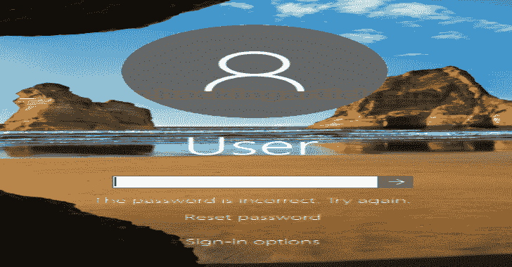
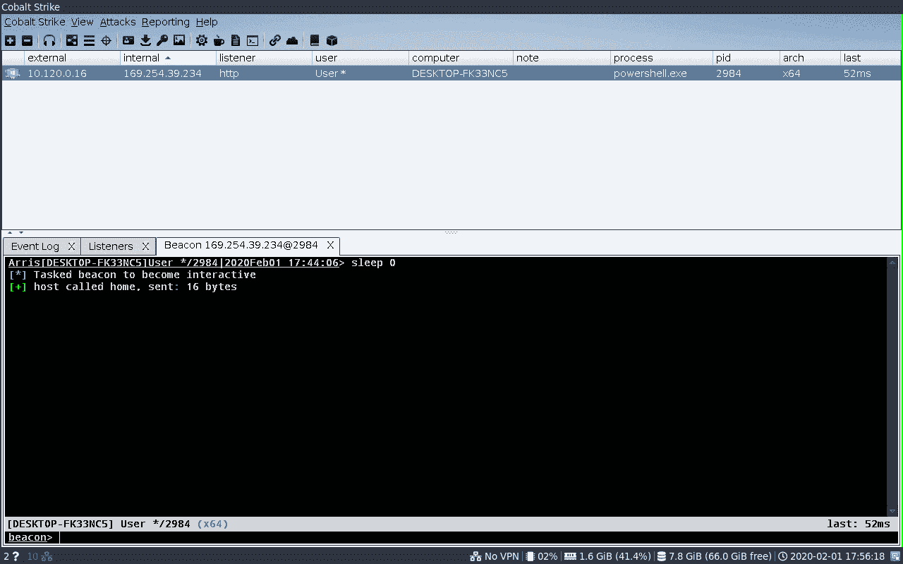

# FakeLogonScreen:伪造的 Windows 登录屏幕来窃取密码

> 原文：<https://kalilinuxtutorials.com/fakelogonscreen/>

.png)

**FakeLogonScreen** 是一个伪造 Windows 登录屏幕以获取用户密码的实用程序。根据活动目录或本地计算机验证输入的密码，以确保其正确，然后显示到控制台或保存到磁盘。

它可以通过简单地运行。exe 文件，或者使用例如 Cobalt Strike 的`**execute-assembly**`命令。

发布页面上提供的二进制文件。

*   FakeLogonScreen.exe:将输出写入控制台，例如与 Cobalt Strike 兼容的控制台
*   FakeLogonScreenToFile.exe:将输出写入控制台和`**%LOCALAPPDATA%\Microsoft\user.db**`

文件夹:

*   /(根):针对构建。默认安装在 Windows 8、8.1 和 10 中的. NET Framework 4.5
*   DOTNET35:针对。默认安装在 Windows 7 中的. NET Framework 3.5

# 特性

*   主显示屏显示 Windows 10 登录屏幕，而其他屏幕变黑
*   如果用户配置了自定义背景，则显示该背景而不是默认背景
*   在关闭屏幕前验证输入的密码
*   输入的用户名和密码被输出到控制台或存储在文件中
*   阻止许多快捷键，以防止绕过屏幕
*   最小化所有现有窗口，以避免其他窗口停留在顶部

# 截图

[**Download**](https://github.com/bitsadmin/fakelogonscreen)