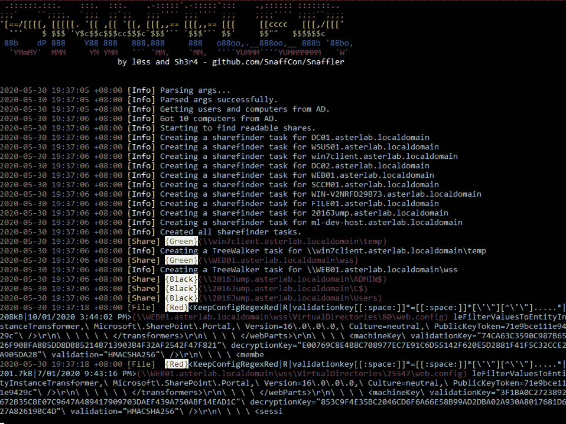

# snaffler:Pentesters 帮助寻找美味糖果的工具

> 原文：<https://kalilinuxtutorials.com/snaffler/>

Snaffler 是 pentesters 的一个工具，帮助他们在一堆可怕无聊的干草堆(一个大规模的 Windows/AD 环境)中找到美味的糖果针(大多是 creds，但它很灵活)。

对于做其他事情的人来说，它可能也是有用的，但是它显然不是一个“审计”工具。

# 它是做什么的？

*广义地说*——它从 Active Directory 中获得一个 Windows 电脑列表，然后将它的小附件分散到所有电脑中，以确定哪些电脑有文件共享，以及你是否可以读取它们。

然后，更多笨拙的附件枚举这些共享中的所有文件，并使用 **L** 为**赢得的**RTI factual**I**I**M**计算机的智能来确定像你这样肮脏的小黑客可能想要哪些文件。

实际上，它不做任何 ML 的事情(还没有)，因为这样做需要训练数据，而这需要大量的时间，我们没有。

## 它看起来像什么？

像这样！(大部分情况下，这个截图是几个旧版本了)

## 我如何使用它？

如果您“只是在一个域用户的上下文中在一台加入域的机器上运行 EXE”(就像人们在运行 Grouper2 时被指示的那样，就在他们运行它之前，打开了所有的详细/调试开关，因此它向他们尖叫了几百兆的堆栈跟踪)，它基本上什么都不会做。这是我们对不读自述文件的人的恶作剧，因为我们是怪物。

然而，如果你添加了正确的咒语，它将会启动前面提到的 L.A.I.M .,并且糖果所在的文件路径将会消失。

关键咒语是:

`**-o**`将结果输出到文件。如果你没有使用 **`-s`，你可能需要这个。**如`**-o C:\users\thing\snaffler.log**`

`-**s**`一旦找到结果，就将结果输出到标准输出。如果你没有使用`**-o**`，你可能需要这个。

`**-v**`控制详细级别，选项有 Trace(最详细)、Degub(不太详细、不太 gubs)、Info(仍然不太详细，默认)和 Data(仅结果)。例如`**-v debug**`

启用并分配一个输出目录给 snaffler，让它自动复制(或者 Snaffle…如果你愿意的话)任何找到的文件。

`**-l**`Snaffle 的最大文件大小(以字节为单位)。默认为 10000000，也就是*大约* 10MB。

`**-i**`禁用计算机和共享发现，需要执行文件发现的目录路径。

`**-n**`禁用计算机发现，采用逗号分隔的主机列表进行共享和文件发现。

TSV-格式化输出。

跳过会发现不太有趣的东西的 LAIM 规则，用一个 0 到 3 之间的数字来调整它。

将 Snaffler 限制为通过 DFS(分布式文件系统)来查找文件共享——这应该比默认方式稍微隐蔽一些，但仍然涵盖了许多组织中最大的文件共享。

跳过文件枚举，只给出目标主机上可列出的共享列表。

让 Snaffler 从 AD 中提取一个帐户名称列表，选择看起来最有趣的，然后在搜索规则中使用它们。

`**-d**`要搜索的计算机要搜索的共享要搜索的文件所在的域。简单。

`**-c**`域控制器查询域计算机列表。

`**-r**`在其中搜索感兴趣的字符串的最大文件大小(以字节为单位)。默认为 500k。

`**-**j`在文件中找到的字符串的任意一边有多少字节的上下文要显示，例如`**-j 200**`

一个配置文件的路径，该文件定义了以上所有内容，以及更多内容！更多详情见下文。给它`**-z**` **`generate`** 生成一个名为 **`.\default.toml`的样例配置文件。**

## 这些日志输出意味着什么？

该日志条目应该大致从左到右阅读如下:

*   大约 7 点 37 分
*   Snaffler 发现了一个它认为值得您关注的文件
*   它被评为“红色”，第二有趣的水平
*   它匹配名为“KeepConfigRegexRed”的规则
*   您可以阅读它，但不能修改它
*   匹配的正则表达式就是红框中的内容
*   208kB
*   最后一次修改是在 2020 年 1 月 10 日下午四点差一刻。
*   该文件可以在紫色的路径中找到

…这一行的其余部分(灰色)是匹配文件的一小段上下文。

在这种情况下，我们发现了 ASP.NET validation key 和 decryptionKey 值，这可能让我们通过一些反序列化黑客 RCE 的 web 应用程序。万岁！

## 它是如何决定哪些文件是好的，哪些文件是无聊的？

### 简单的回答:

每个洛杉矶国际信息管理公司的神奇文件查找方法都有这样的功能:

*   通过文件扩展名精确匹配进行搜索，这意味着将返回扩展名与相关单词列表匹配的任何文件。这是针对几乎总是包含糖果的**文件扩展名**，例如 **`.kdbx`、`.vmdk`、`.ppk`** 等。

*   通过(不区分大小写)完全匹配的文件名进行搜索。这是针对几乎总是包含糖果的**文件名**，例如 **`id_rsa`、`shadow`、`NTDS.DIT`** 等。
*   通过精确的文件扩展名匹配(又一个单词列表)进行搜索，然后“搜索”任何匹配文件的内容以查找某些关键词(又一个单词列表)。这意味着文件扩展名**有时**包含糖果，但你知道可能有一堆糠筛过。例如，`**web.config**`有时会包含数据库凭证，但也会经常包含无聊的 IIS 配置废话和没有密码。这将(例如)找到以`**.config**`结尾的任何内容，然后在其中搜索字符串，包括但不限于: **`connectionString`、`password`、`PRIVATE KEY`** 等。
*   通过部分文件名匹配搜索(哦，上帝更多的单词表)。这主要是为了找到`**Jeff's Password File 2019**` **`(Copy).docx`或`Privileged Access Management System Design - As-Built.docx`** 或其他什么，通过匹配任何文件名包含子字符串 **`passw`、`handover`、`secret`、`secure`、`as-built`、**等的文件。
*   还有几个跳过列表，可以跳过所有带有某些扩展名的文件，或者路径包含给定字符串的任何文件。

### 真实答案:

Snaffler 使用一个“分类器”系统，它允许最终用户(你)定义(相对)简单的规则，这些规则可以被组合、串在一起，并按照你认为合适的方式进行修改。它附带了一组默认的分类器，你可以通过查看代码或者查看由`**-z generate**`创建的配置文件来看到，所以开始创建你自己的分类器的最好地方是编辑它们。

默认情况下没有任何规则可以查看 Office 文档和 pdf，但是您可以在 SnaffCore/default rules/filecontentrules . cs 中看到一些被注释掉的示例。在编译和编辑正则表达式以满足您的需求之前，只需取消注释即可。*注意，这比在老式文本文件中查找要慢得多，而且典型的环境中会有大量的低价值办公文档和 pdf。*

这里有一些带注释的例子，希望有助于更好地解释事情。如果这看起来很难，你可以使用我们的规则，他们可能会给你找到一些好东西。

这是一个让 Snaffler 忽略具有特定名称的目录下的所有文件和子目录的规则示例。

**[[Classifiers]]
enumeration scope = " directory enumeration " #这定义了我们将在发现过程的哪个阶段应用规则。
#在这种情况下，我们在看目录。
#有效值包括 ShareEnumeration、DirectoryEnumeration、FileEnumeration、contents enumeration
rule name = " discardfilepath contains " #这可以是你想要的任何值。我们一直遵循一个粗略的“MatchAction，MatchLocation，
# MatchType”命名方案，但如果你愿意，你可以称它为“Stinky”。_(ツ)_/
match action = " discard " #如何处理符合规则的东西。在这种情况下，我们想要丢弃任何符合这个规则的东西。
#有效选项包括:Snaffle(保留)、Discard、Relay(下面的例子)和 CheckForKeys(下面的例子)。
MatchLocation = "FilePath" #查看文件/目录/共享的哪个部分来检查匹配。在这种情况下，我们看到的是整个路径。
#有效选项包括:ShareName、FilePath、FileName、FileExtension、FileContentAsString、FileContentAsBytes、
#虽然显然不是所有这些都适用于所有的 EnumerationScopes。
WordListType = "Contains" #要应用什么匹配逻辑，有效选项有:Exact、Contains、EndsWith、StartsWith 或 Regex。
WordList = ["winsxs "，" syswow64"] #用于匹配的字符串或正则表达式模式的列表。如果使用 regex matterns，WordListType 必须是 regex。
Triage = "Green" #如果我们找到匹配，我们应该给它什么严重等级。有效值为黑色、红色、黄色、绿色。因为丢弃而被忽略。**

另一方面，该规则会查看文件扩展名，并立即丢弃任何我们不喜欢的文件。

在这种情况下，我主要是扔掉字体、图像、CSS 等。

**[[Classifiers]]
enumeration scope = " file enumeration " #我们正在查看实际的文件，而不是共享或目录或其他什么。
RuleName = "DiscardExtExact" #只是一个名字
MatchAction = "Discard" #我们正在丢弃这些
match location = " file extension " #这次我们只查看文件名的文件扩展名部分。
WordListType = "Exact" #我们只想要完全匹配的。
WordList = ["。bmp“，”。eps“，”。gif“，”。ico“，”。jfi“，”。jfif“，”。jif“，”。jpe“，”。jpeg“，”。jpg“，”。png“，”。psd“，”。svg“，”。tif“，”。tiff“，”。webp“，”。xcf“，”。ttf“，”。otf“，”。锁定“，”。css“，”。less"] #文件扩展名列表。**

这里有一个关于我们喜欢并想要保留的东西的非常简单的规则的例子。

**[[Classifiers]]
enumeration scope = " file enumeration " #还在看文件
rule name = " KeepExtExactBlack " #只是一个名字
MatchAction = "Snaffle" #这次我们是在' Snaffle '这些。这通常意味着把它发送到用户界面，
#但是如果你打开适当的选项，它也会复制一份。
match location = " file extension " #我们再次查看文件扩展名
WordListType = "Exact" #精确匹配
WordList = ["。kdbx“，”。kdb“，”。ppk“，”。vmdk“，”。vhdx“，”。ova“，”。ovf "、" . psafe3 "、"cscfg“，”。kwallet“，”。tblk“，”。ovpn“，”。中密度纤维板。sdf“，”。sqldump"] #和一堆好玩的文件扩展名。
Triage = "Black" #如果我们发现它们，这些都是重大胜利，因此我们给予它们最严格的评级。**

这个基本上是一样的，但是我们看的是整个文件名。简单！

**[[分类器]]
enumeration scope = " file enumeration "
rule name = " KeepFilenameExactBlack "
match action = " Snaffle "
match location = " FileName "
word list type = " Exact "
word list =[" id _ RSA "，" id_dsa "，" NTDS。DIT "，" shadow "，" pwd.db "，" passwd"]
Triage = "Black"**

这个有点漂亮，看看这个…

**[[Classifiers]]
enumeration scope = " file enumeration " #我们正在寻找文件…
rule name = " KeepCertContainsPrivKeyRed "
match location = " file extension " #具体来说，具有某些文件扩展名的…
word list type = " Exact "
word list =["。der“，”。pfx"] #特别是这些文件**…
**match action = " CheckForKeys " #以及我们找到的任何文件，我们将把它们解析为 x509 证书，并查看该文件是否包含私钥！
Triage = "Red" # cert 文件并不十分吸引人，在大多数 wintel 环境中，您会得到大量这样的文件，但是这项检查给了我们一个更好的信噪比！**

好了，真正强大的东西来了。我们有一系列的规则。

扩展名与第一个规则匹配的文件将被发送到第二个规则，第二个规则将“grep”(即字符串。Contains())它们用于特定单词列表中的内容。

您可以尽可能地将这些链接在一起，尽管我想如果您过于依赖它，您会开始看到一些性能问题。

**[[Classifiers]]
enumeration scope = " file enumeration " #这个查看文件…
rule name = " ConfigGrepExtExact "
match location = " file extension " #具体来说就是扩展…
word list type = " Exact "
word list =["。yaml“，”。xml“，”。json“，”。配置“，”。ini“，”。inf“，”。cnf“，”。conf"] #这些。
MatchAction = "Relay" #然后，任何匹配的文件将被传递到下游…
Relay target = " KeepConfigGrepContainsRed " #具有此 RuleName 的规则！**

**[[分类器]]
rule name = " KeepConfigGrepContainsRed " #这是哪一个！这就是为什么遵循命名约定真的很有帮助。
enumeration scope = " contents enumeration " #这个查看文件内容！
MatchAction = "Snaffle" #保存匹配的文件
match location = " FileContentAsString " #将内容视为字符串(而非字节数组)
WordListType = "Contains" #使用简单匹配
WordList = ["password= "，" connectionString=\ "，" sqlConnectionString=\ "，" validationKey= "，" decryptionKey= "，" NVRAM config last updated "]
Triage = " Red "**

## 你从谁那里偷的代码？

共享枚举位被搅乱了(看我在那里做了什么？)来自 SharpShares，作者是非常有用的 Dwight Hohnstein。(https://github.com/djhohnstein/SharpShares/)Dwight 的 GitHub 个人资料就像五金店中令人惊叹的后通道，那里有一大堆工具，让你想“哦，伙计，我等不及了，我有理由真正尝试一下这个…”你绝对应该去看看。

虽然没有代码被拿走(主要是因为它是 Ruby lol ),但我们确实从`**plunder2**`(http://joshstone.us/plunder2/)那里偷了一些绝妙的想法

单词表也是从其他类似的工具中筛选出来的，比如 trufflehog、shhgit、gitrobber 和 graudit。

[**Download**](https://github.com/SnaffCon/Snaffler)