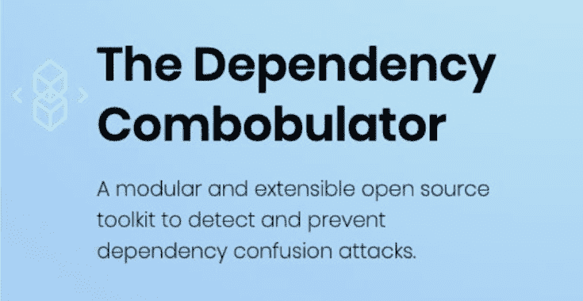

# Combobulator:检测和防止依赖混淆泄漏和潜在攻击的框架

> 原文：<https://kalilinuxtutorials.com/combobulator/>

Combobulator 是一个开源、模块化和可扩展的框架，用于检测和防止依赖混淆泄漏和潜在攻击。这有助于采用一种整体方法来确保安全的应用程序版本，可以针对不同的来源(例如 GitHub 包、JFrog Artifactory)和许多包管理方案(例如 ndm、maven)进行评估。

### 目标受众

该框架可以被安全审计员、测试员使用，甚至以自动化的方式嵌入到企业的应用安全程序和发布周期中。

### 主要特点

*   可插入–在 SDLC 的提交级别、构建、发布步骤中插入。
*   可扩展——轻松添加您自己选择的包管理方案或代码源
*   通用启发式引擎——抽象包数据模型提供了不可知的启发式方法
*   支持广泛的技术
*   灵活——决策树可以根据工具包提供的见解或判断来确定

### 容易扩展的

该项目将 practicionar 的能力扩展到适合她自己特定需求的工具包。因此，它被设计成能够将其扩展到其他来源、公共注册中心、包管理方案，并扩展抽象模型和附带的启发式引擎。

## 安装

Dependency Combobulator 已经准备好使用了——只需`**git clone**`或者从 https://github.com/apiiro/combobulator 下载软件包

确保通过运行以下命令安装所需的依赖项:

`**pip install -r requirements.txt**`

## 参数(–帮助)

**-h，–help 显示此帮助消息并退出
-t {npm，NuGet，maven}，–Type { npm，NuGet，maven}
包管理器类型，即:NPM，NuGet，maven
-l LIST_FROM_FILE，–Load _ LIST _ LIST _ FROM _ FILE
从文件加载依赖项列表
-d FROM_SRC，–directory FROM _ SRC
从本地源库提取依赖项**
**-从
-c CSV，–CSV CSV 将包属性导出到 CSV 文件
-gh GITHUB_TOKEN，–GITHUB GITHUB _ TOKEN
GITHUB 访问令牌(覆盖。环境文件设置)
-a {比较，比较，启发式，heur}，–分析{比较，比较，启发式，heur}
所需的分析级别–比较(比较)，启发式
(heur)(默认:比较)**

支持的包类型(-t，–t):NPM、maven

支持的源依赖评估:

*   从包含依赖项标识符的文件中逐行。(-l，–load _ list)
*   通过分析适当的回购软件物料清单(例如 package.json、pom.xml) (-d，–目录)
*   命名单个标识符(-p，–package)

分析级别是可定制的，因为您可以在几秒钟内构建自己的首选分析配置文件。Dependency Combobulator 提供了几个现成的分析级别，由-a，–analysis 选择

支持的输出格式:

*   屏幕标准输出(默认)
*   CSV 导出到指定文件-(-CSV)

[**Download**](https://github.com/apiiro/combobulator)