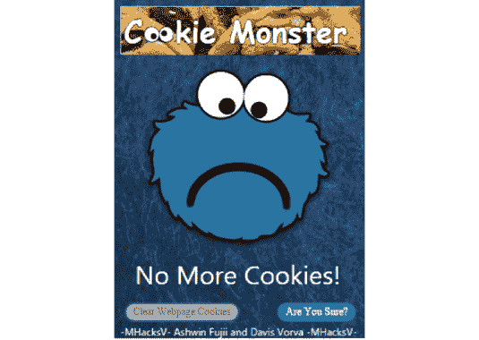

# Sharp Cookie Monster:从 Chrome 中提取 Cookie

> 原文：<https://kalilinuxtutorials.com/sharp-cookie-monster/>

**犀利的饼干怪兽**是@defaultnamehere 的饼干犯罪模块的犀利端口——完全归功于他们出色的工作！

这个 C#项目将为所有站点转储 cookies，甚至是那些带有 http Only/secure/session 标志的站点。

# 使用

只需运行二进制文件。

**SharpCookieMonster.exe【https://sitename.com】【chrome-调试-端口】【用户数据目录】**

可选的第一个参数指定 chrome 启动时最初连接的站点(默认为 https://www.google.com)。

可选的第二个参数指定启动 chrome 调试器的端口(默认为 9142)。

最后，可选的第三个参数指定用户数据目录的路径，可以覆盖该路径以访问不同的配置文件等(默认为% appdata local % \ Google \ Chrome \ User Data)。

## 建筑

该二进制文件与兼容。NET 3.5，以便与旧版本的受害者兼容。已安装网络。然而，为了使用 WebSockets 与 Chrome 通信，添加了 WebSocket4Net 包。

如果你想用 PoshC2 的`**sharpcookiemonster**`命令或通过 CobaltStrike 的`**execute-assembl**y`在 C2 上运行，那么使用 ILMerge 将构建好的可执行文件与 WebSocket4Net.dll 库合并。

首先重命名原始二进制文件，然后运行:

**ILMerge.exe/target platform:" v2，C:\ Windows \微软。NET \ Framework \ v 2 . 0 . 50727 "/out:sharpcookiemonster . exe SharpCookieMonsterOriginal.exe WebSocket4Net.dll**

[**Download**](https://github.com/m0rv4i/SharpCookieMonster)