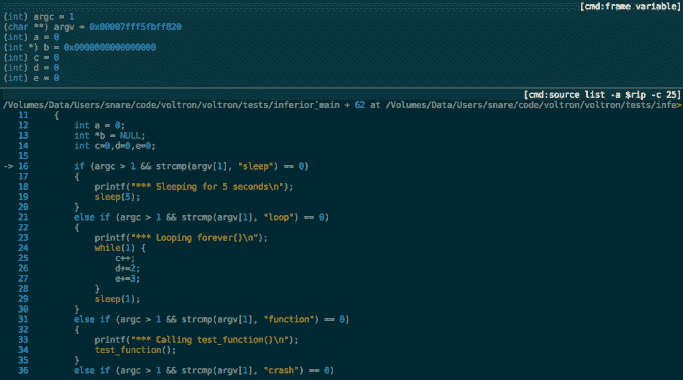

# Voltron:一个黑客用的调试器 UI

> 原文：<https://kalilinuxtutorials.com/voltron/>

.png)

**Voltron** 是一个用 Python 编写的可扩展调试器 UI 工具包。它旨在通过支持从调试器主机检索和显示数据的实用程序视图的附件来改善各种调试器(LLDB、GDB、VDB 和 WinDbg)的用户体验。通过在其他 tty 中运行这些视图，您可以构建一个定制的调试器用户界面来满足您的需求。

Voltron 的目标不是成为每个人的一切。它不是调试器 CLI 的大规模替代。相反，它旨在补充您现有的设置，并允许您尽可能地扩展您的 CLI 调试器。如果您只想在调试器旁边的窗口中查看寄存器内容，您可以这样做。如果你想全力以赴，拥有看起来更像 OllyDbg 的东西，你也可以这样做。

内置视图适用于:

*   登记
*   拆卸
*   堆
*   记忆
*   断点
*   追踪

## 支持

Voltron 支持 LLDB、GDB、VDB 和 WinDbg/CDB(通过 PyKD)，可以在 macOS、Linux 和 Windows 上运行。

WinDbg 支持仍然是相当新的，请打开一个问题，如果你有问题。

支持以下架构:

|  | lldb | 基因组数据库 | vdb | windbg |
| --- | --- | --- | --- | --- |
| x86 | -好的 | -好的 | -好的 | -好的 |
| x86_64 | -好的 | -好的 | -好的 | -好的 |
| 手臂 | -好的 | -好的 | -好的 | 一千 |
| arm64 | -好的 | 一千 | 一千 | 一千 |
| （IBM 和 Apple 公司联合生产的）个人台式机… | 一千 | -好的 | 一千 | 一千 |

## 安装

**注意:**安装脚本仅完全支持 macOS 和 Debian 衍生物。它应该不会在其他 Linux 发行版上失败，但它不会试图安装软件包依赖项。如果你正在使用另一个发行版，看看`**install.sh**`在运行它之前你可能需要安装哪些依赖项。

下载源代码并运行安装脚本:

**$ git 克隆 https://github.com/snare/voltron
$ CD 电子管
$。/install.sh**

默认情况下，安装脚本将安装到用户的`**site-packages**`目录中。如果你想安装进系统`**site-packages**`，使用`**-s**`标志:

**$。/install.sh -s**

您也可以安装到虚拟环境中(仅适用于 LLDB ),如下所示:

**$。/install . sh-v/path/to/venv-b lldb**

## 快速启动

*   如果您的调试器有一个 init 脚本(`**.lldbinit**`用于 LLDB，或者`**.gdbinit**`用于 GDB ),配置它在启动时加载 Voltron，方法是获取`**entry.py**`入口点脚本。完整路径将在 **`voltron`** 包内。比如在 macOS 上可能是*/Library/Python/2.7/site-packages/voltron/entry . py*。如果在您的路径中检测到 GDB 或 LLDB，`**install.sh**`脚本会自动将其添加到您的`**.gdbinit**`或`**.lldbinit**`文件中。LLDB:

**命令脚本 import/path/to/voltron/entry . py**

GDB:

**source/path/to/vol tron/entry . py**

*   启动调试器，必要时手动初始化 Voltron。

在 LLDB 的最新版本中，您不需要手动初始化 Voltron:

**$ lldb target_binary**

*   在旧版本的 LLDB 上，您需要在加载下级后调用`**voltron init**`:

**$ lldb target _ binary
(lldb)voltron init**

GDB:

**$ gdb target_binary**

VDB:

**$。/vdbbin target_binary**

**script/path/to/voltron/entry . py**

WinDbg/CDB 仅支持在 Linux 用户环境下通过 Bash 运行。作者用 Git Bash 和 ConEmu 进行了测试。启动调试器时，可以在一个命令中加载 PyKD 和 Voltron:

' cdb -c '。将 C:\ path \加载到\ pykd.pyd！py–全局 C:\ path \ to \ voltron \ entry . py ' target _ binary

在另一个终端(我使用 iTerm 窗格)中，启动一个 UI 视图。在 LLDB、WinDbg 和 GDB 上，视图将立即更新。在 VDB 上，它们不会更新，直到下级停止(在断点处，在一个步骤之后，等等):

**$ voltron 查看寄存器
$ voltron 查看堆栈
$ voltron 查看 disasm
$ voltron 查看回溯**

设置一个断点，运行你的下级。

**(*db) b 主
(*db)运行**

当调试器命中断点时，视图将被更新以反映寄存器、堆栈、内存等的当前状态。在调试器 CLI 中执行每个命令后，使用调试器的“停止挂钩”机制更新视图。因此，每次您单步执行或继续执行并遇到断点时，视图都会更新。

[**Download**](https://github.com/snare/voltron)