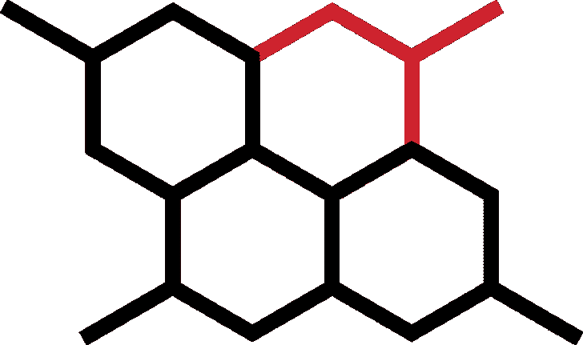

# Chain-Reactor:一个用于编写可执行文件的开源框架

> 原文：<https://kalilinuxtutorials.com/chain-reactor/>

.png)

**Chain Reactor** 是一个开源工具，用于在 Linux 机器上测试检测和响应覆盖率。该工具生成模拟流程创建和网络连接等操作序列的可执行文件。链式反应堆假定之前没有工程经验；该工具使用 JSON，因此定制其行为就像编辑文件一样简单。

## 安装 musl

链式反应器需要 musl，这是 C 标准库的一个实现。要在类似 Debian 的操作系统上安装 musl，请从命令行运行以下命令:

sudo 安装音乐工具

要从 RPM 软件包管理器安装 musl:

**sudo yum 安装音乐工具**

要从源代码构建 musl:

**git 克隆 git://git . musl-libc . org/musl
CD musl&&。/configure&&sudo make install**

## 安装链式反应器

要安装 Chain Reactor，请从命令行运行以下命令:

**git 克隆 https://github.com/redcanaryco/chain-reactor.git
CD 链式反应&T4 制造**

## 运行简单的反应

通过创建和执行一个简单的反应来测试您的构建。打开文本编辑器，将以下文件另存为 **`reaction.json` :**

**{
" name ":" simple _ reaction "，
" atoms ":[
" HIDDEN-PROCESS-EXEC "
]
}**

反应是由称为“原子”的物体构成的。这个文件定义了一个反应——`**simple_reaction**`——由一个叫做`**HIDDEN-PROCESS-EXEC**`的原子组成。

接下来，我们需要定义`**HIDDEN-PROCESS-EXEC**`。将以下文件另存为`**atoms.json**`:

**[
{
" name ":" HIDDEN-PROCESS-EXEC "，
"execve" : [ "mkdir "，"-p "，"/tmp/。隐藏"]，
"复制":[ "/proc/self/exe "，"/tmp/。隐藏/。chain_reactor_hidden" ]，
"execveat" : [ "/tmp/。隐藏/。chain_reactor_hidden "，" exit" ]，
"remove" : [ "/tmp/。隐藏"]
}
]**

原子是由称为“夸克”的作用构成的。`**atoms.json**`文件将`**HIDDEN-PROCESS-EXEC**`定义为四个夸克的序列:

*   使用`**execve**`系统调用创建一个隐藏目录。
*   将当前链式反应器进程复制到隐藏目录。
*   使用`**execveat**`系统调用来执行隐藏的链式反应堆二进制文件，并在不做任何其他事情的情况下退出。
*   删除隐藏目录。

要构建反应可执行文件，请从命令行运行以下命令:

**python 3 compose _ reaction atoms . JSON reaction . JSON simple-reaction**

您可以像运行任何其他可执行文件一样运行输出文件:

**`+ymmmmmmmmmmmmmmmmmmmmmmmmmmmmmmmmmmmmmmmmmmy+`
:dmmhssssssssssssssssssssssssssssssssmmd/
DMM ++ mmm
mmm:`:+oss+:`:mmm
mmm:`:oyyyyyyyys/`:mmm
mmm:。:oyyyyyyyys:`:mmm mmm: -syyyyyyyyyyo:`:mmm
mmm:-yyyyyyyyyyyy+。:嗯嗯
嗯嗯:。syyyyyyyyyyyyyyy/`:mmm mmm:`oyyyyyyyyyyys。:mmm
mmm::yyyyyyyyyyyyyyyys-:mmm
mmm:`+yyyyyyyyyyyyyyyyy: :mmm mmm:`oyyyyyyyyyyyyyyyy-:mmm
mmm:`/yyyyyyyyyyyyyyyys- :mmm mmm: ./yyyyyyyyyyyyyyys``/mmm mmm:`/yysyyyyyyyyyyyy+。:+oydmmmmm
mmm:o-`...osyyyyyoydmmmmmmdyymmm mmm: :: `-:syhdhyyyyyhyo+:.` :mmm mmm: -o//+shdmmhhmdhyo/syyyo. :mmm mmm: `.-/oyyyddmmmdhyo/-.` `/yyys. :mmm mmm+:/oyhdmmmmmhys+/-.` -syys- :mmm mmmmmmmmdhs+:-`。sy+-`:mmm dmmd+:-`. ss .`+mmm :dmmhssssssssssssssssssssssssssssssssssyssssshmmd/` +hmmmmmmmmmmmmmmmmmmmmmmmmmmmmmmmmmmmmmmmmmmmmmmmmmmmm+`
链式反应“简单 _ 反应”1001 1001
atom:HIDDEN-PROCESS-EXEC
quark:EXEC ve(" mkdir-p/tmp/。hidden")
夸克:copy src = "/proc/self/exe " dst = "/tmp/。隐藏/。chain _ reactor _ hidden "
quark:exec veat("/tmp/。隐藏/。chain_reactor_hidden exit")
夸克:remove("/tmp/。隐藏")
连锁反应完成**

[**Download**](https://github.com/redcanaryco/chain-reactor/wiki/Getting-started)