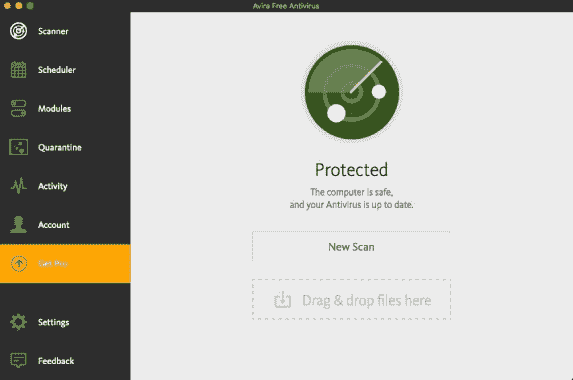

# 博科:macOS 的应用劫持扫描器

> 原文：<https://kalilinuxtutorials.com/boko/>

**Boko.py** 是一款用于 macOS 的应用程序扫描器，它可以搜索并识别应用程序可执行文件的潜在 dylib 劫持和脆弱的 dylib 漏洞，以及应用程序可能使用的具有潜在后门的脚本。该工具还调出感兴趣的文件并列出它们，而不是手动浏览文件系统进行分析。有了主动发现功能，如果一个可执行文件容易受到 dylib 劫持，就不再需要猜测了！

创建这个工具的原因是因为我想对 Dylib 劫持扫描器发现的数据有更多的控制。大多数公开可用的扫描器一旦发现第一个易受攻击的 dylib，就会停止扫描，而不会扩展其余的 rpaths。因为有时第一个结果在一个 SIP 保护区域内的一个不存在的文件中被展开，所以我想得到那些展开的路径的剩余部分。因此，会出现误报，因此该工具会为每个项目分配一个确定性字段。

| **确定性** | **描述** |
| --- | --- |
| 一定的 | 该漏洞是 100%可利用的 |
| 高的 | 如果该漏洞与主可执行文件相关，并且 rpath 在加载顺序中排在第二位，则该漏洞很有可能被利用 |
| 潜在的 | 这被分配给 dylibs 和后门脚本，值得研究，但可能无法利用 |
| 低的 | 由于延迟装货订单，这种情况被利用的可能性很小，但知识就是力量 |

这个工具的主干基于 Patrick Wardle (@synack)的 dylib jacking 中的 scan.py。

## 使用

**boko . py[-h](-r |-I |-P/path/to/app)(-A |-P |-b)[-oS output file |-oC output file |-oA output file][-s][-v]**

#### 因素

| **自变量** | **描述** |
| --- | --- |
| 救命啊 | 显示此帮助消息并退出 |
| -r，–跑步 | 检查当前运行的进程 |
| -我-已安装 | 检查所有安装的应用程序 |
| -p /file.app | 检查特定的应用程序，即/Application/Safari.app |
| -一个-活动的 | 执行发现的可执行二进制文件，以主动识别可劫持的 dylibs |
| -P，–被动 | 仅通过查看文件头执行检查(默认) |
| 第二，两者都有 | 执行两种漏洞测试方法 |
| -操作系统输出文件 | 将标准输出输出到. log 文件 |
| -oC outputfile | 将结果输出到. csv 文件 |
| -oA outputfile | 将结果输出到. csv 文件和标准日志 |
| -s，–sip disabled | 如果系统上禁用了 SIP，请使用它来搜索通常为只读的路径 |
| -v，–详细 | 在脚本运行时，以详细模式输出所有结果，如果没有这种模式，控制台上只会显示确定无疑的漏洞 |

建议**仅**使用带有`**-p**`标志的活动模式(`**-A**`)并选择特定程序。此外，最好将 **`-v`** 与`**-oS**`或 **`-oA`，**一起使用，除非你只是在寻找确定性漏洞。

**警告提示:**非常不鼓励将`**-i**`和( **`-A`或—`b`**)标志一起运行该工具。这个组合将每次打开系统上的每个可执行文件 3 秒钟。我对你的系统崩溃或变慢不承担任何责任，因为你运行了它。此外，如果您的系统上有休眠的恶意软件，这将执行它。如果你安装了 Xcode，我也建议不要扫描整个`**/Applications**`目录，因为这需要很长时间。

#### 要求

*   python3
*   `**python -m pip install psutil**`

#### 工艺流程

##### 被动模式

###### 跑步

*   识别系统中所有正在运行的进程
*   获取正在运行的可执行文件的完整路径
*   读取可执行文件并识别 macho 头文件
*   确定加载的 dylib 相对路径，并检查该位置是否存在文件
*   为正在运行的应用程序输出可劫持的 dylib 和弱 dylib

###### 已安装/应用

*   扫描应用程序的完整目录中的所有文件
*   识别应用程序目录中的可执行文件、脚本和其他感兴趣的文件
*   读取可执行文件并识别 macho 文件头或文件是否是脚本
*   确定加载的 dylib 相对路径，并检查该位置是否存在文件
*   输出可劫持的 dylib、弱 dylib、可后门的脚本和有趣的文件(仅详细)

##### 主动模式

###### 跑步

*   识别系统中所有正在运行的进程
*   获取正在运行的可执行文件的完整路径
*   读取可执行文件并识别 macho 头文件
*   执行可执行二进制文件 3 秒钟，并分析尝试加载的 rpaths
*   为正在运行的应用程序输出可劫持的 dylib 和弱 dylib

###### 应用

*   扫描应用程序的完整目录中的所有文件
*   识别应用程序目录中的可执行文件、脚本和其他感兴趣的文件
*   读取可执行文件并识别 macho 文件头或文件是否是脚本
*   执行可执行二进制文件 3 秒钟，并分析尝试加载的 rpaths
*   输出可劫持的 dylib、弱 dylib、可后门的脚本和有趣的文件(仅详细)

[**Download**](https://github.com/bashexplode/boko)