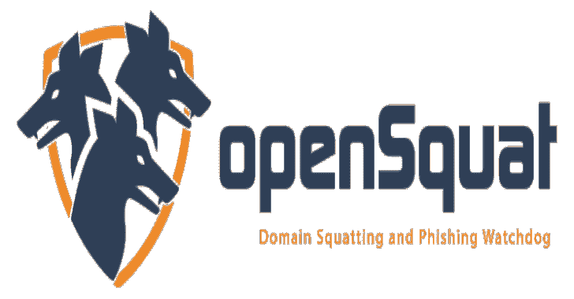

# OpenSquat:检测钓鱼域名和域名抢注。

> 原文：<https://kalilinuxtutorials.com/opensquat/>

.png)

**open squad**是一款开源智能(OSINT)安全工具，用于识别对特定公司或领域的**域名抢注**威胁，例如:

*   网络钓鱼活动
*   域名抢注
*   错别字抢注
*   比特占用
*   IDN 同形异义攻击
*   双岗域
*   其他与品牌/域名相关的诈骗

它支持一些关键功能，例如:

*   自动更新新注册的域名(每天一次)
*   计算单词相似度的 Levenshtein 距离
*   获取活跃的和已知的网络钓鱼域(网络钓鱼数据库项目)
*   IDN 同形异义词攻击检测
*   与 VirusTotal 集成
*   与 Quad9 DNS 服务集成
*   使用不同级别的置信度阈值进行微调
*   将输出保存为不同的格式(txt、JSON 和 CSV)
*   可以与其他威胁情报工具和 DNS 漏洞集成

**如何安装**

git 克隆 https://github.com/atenreiro/opensquat
pip install-r requirements . txt

“pip 安装”只是为了确保在新的升级中没有添加新的库。

## 用法举例

使用您定制的关键字编辑“keywords.txt ”,进行搜索。

# **带默认选项的惰性运行
python open squad . py
#查看所有选项
python open squad . py-h
#搜索网络钓鱼活动中使用的通用术语(可能导致误报)
python open squad . py-k generic . txt
#带 DNS 验证(quad 9)
python open squad . py–DNS
#子域搜索
python open squad . py–子域
#检查开放端口 80/40 的域
python open squad . py–phishing phish _ results . txt
#将输出另存为 JSON
python open squad . py-o example . JSON-t JSON
#将输出另存为 CSV
python open squad . py-o example . CSV-t CSV
#执行证书透明(ct)搜索
python open squad . py–CT
# Period search–上个月(默认:日)的注册数
python open squad . py 较低的值会带来更多的误报
#(0:非常高，1:高(默认)，2:中，3:低，4:非常低
python open squad . py-C2
#所有验证选项
python open squad . py–phishing phishing _ domains . txt–DNS–CT–子域名–port check**

[**Download**](https://github.com/atenreiro/opensquat)