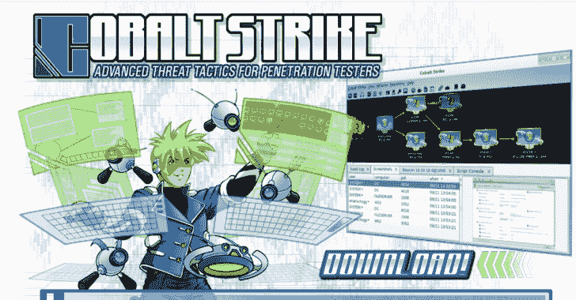

# StayKit:钴罢工工具包的持久性

> 原文：<https://kalilinuxtutorials.com/staykit/>

StayKit 是通过利用带有 Sharp Stay 的 execute_assembly 函数对 Cobalt Strike 持久性的扩展。NET 程序集。攻击者脚本通过读取特定执行类型的模板文件来处理有效负载的创建。

重要提示:要使用该脚本，用户只需加载`**StayKit.cna**`攻击者脚本。此外，还需要对锐柱组件进行编译，并将其放入`**StayKit.cna**`所在的目录中。最后，如果为有效载荷选择一个模板，有些可能需要使用 Mono 的动态编译。

持久性菜单将被添加到信标中。由于每种技术的本质不同，所以只有 GUI 菜单，没有信标命令。

可用选项:

*   提升的注册表项
*   用户注册注册表键
*   UserInitMprLogonScriptKey
*   ElevatedUserInitKey
*   计划任务
*   ListScheduledTasks
*   预定任务
*   SchTaskCOMHijack
*   创建服务
*   列表运行服务
*   WMIEventSub
*   GetScheduledTaskCOMHandler
*   连接文件夹
*   startup 目录
*   新链接
*   后门链接
*   列表任务名称

#### 依赖关系

*   单声道(MCS)用于编译。NET 程序集(用于动态有效负载创建)

[**Download**](https://github.com/0xthirteen/StayKit)