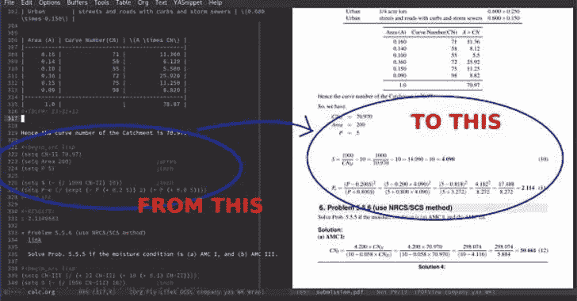

# Litefuzz:一个多平台的 Fuzzer，用于探测用户的二进制文件和服务器

> 原文：<https://kalilinuxtutorials.com/litefuzz-a-multi-platform-fuzzer-for-poking-at-userland-binaries-and-servers/>

.png)

Litefuzz 意在服务于一个目的:在所有主要平台上进行模糊和分类，支持 CLI/GUI 应用程序、网络客户端和服务器，以便找到与安全相关的漏洞。它简化了过程，使得跨平台在许多不同的目标中发现安全缺陷变得容易，同时只需要进行一些诚实的权衡。

它不是为了速度、可伸缩性或赢得学术界的任何奖项而构建的。它从不同的角度应用简单的技术来产生结果。对于基于控制台的文件模糊化，您可能应该只使用 AFL。它具有卓越的性能、插装能力(以及更快的非插装 execs)、可伸缩性，并且可以凭空生成奇怪的 jpegs。对于网络模糊化来说，如果你有 PCAPs 可以重玩的话，兵变模糊化也能很好的工作，而且 frizzer 看起来也很有前途。但是如果你想试试这个，它可以用一个工具模糊跨平台的目标。

。/并给你的目标…一个精简的模糊。

sudo 安装 latex2rtf
。/lite FUZZ . py-l-c " latex 2 rtf FUZZ "-I input/tex-o crashes/latex 2 rtf-n 1000-z
–= = = = = = = = = = = = = = = = = = = = =–
–= = = = = = = = = = = = = = = = = ^
–= = = = = = = = = = = = = = = = = = =–
【STATS】
run id:3516
cmdline:latex 2 rtf FUZZ
crash dir:crashes/late

这是一个简单的局部目标，AFL++完全能够处理它，只是作为一个例子快速给出。Litefuzz 被设计成在网络和 GUI 模糊化方面做更多的事情，一旦你深入了解就会看到这一点。

## 为什么

是的，另一个模糊不清的东西，一个跟不上当前趋势和惯例的东西。为了满足某些需求，需要进行权衡。这些要求是默认情况下在多个平台上工作的模糊器，模糊本地和网络目标，并且非常容易使用。我不想说服任何人，但让我们提供一些背景。一些目标需要很大的努力才能将 AFL 这样的模糊器集成到构建链中。这不是一个问题，因为这种模糊器不需要仪器，牺牲了仪器获得的精确覆盖范围，便于携带。AFL 也不支持开箱即用的网络模糊，虽然有基于它的项目支持，但它们远非简单易用，通常需要更多的代码修改和控制才能工作(Libfuzzer 的情况类似)。它不做并行模糊处理，也不支持持久模式所能提供的速度提升，所以它不能扩展到接近具有这种能力的模糊器。再说一次，这不是最先进的模糊器。但是它不需要源代码，不需要适当的编译或者特定的操作系统特性。它甚至可以模糊一些网络客户端图形用户界面和交互式应用程序。它在很多方面都不依赖于陆地，许多特性如变异函数和最小化都是从头开始写的。

它被设计为“只工作”，并且已经投入了大量精力来自动设置和安装它需要的少数依赖项。这个 fuzzer 是为一个目的而编写的，在许多不同的目标场景和环境中提供价值，最重要的是，所有 fuzzer 最终应该根据什么来判断:找到 bug 的能力。而且**它确实找到了**的 bug。它不假设有目标源代码，所以它可以很好地覆盖封闭源代码软件。它可以作为自动化的一部分运行，只需很少的修改，但适合漏洞研究人员有趣地使用。然而，将它视为一个研发项目，而不是一个成熟的产品，会更有帮助。此外，它没有复杂的设置，只是稍微脱离了机箱，或者需要更多的工作才能在现代操作系统上运行。它已经在 Ubuntu Linux 20.04、Mac OS 11 和 Windows 10 上进行了测试，并附带了功能齐全的脚本，可以为您做任何事情，以便设置一个现成的模糊环境。

一旦设置脚本完成，只需要几分钟就可以开始模糊一大堆不同的目标。

## 它是如何工作的

Litefuzz 支持三种不同的模式:本地、客户端和服务器。本地意味着以本地二进制文件为目标，在 Linux/Mac 上，在崩溃时通过具有自动 GDB 和 LLDB 分类支持的子进程启动，在 Windows 上通过 WinAppDbg 启动。崩溃被写入本地崩溃目录，并按故障类型排序，如读/写 AVs 或 SIGABRT/SIGSEGV 以及文件散列。所有独特的崩溃在模糊化时都会被分类，这些数据以及目标输出(如果可用)也会被捕获并作为工件放在同一目录中。也可以用 **`--replay`** 回放崩溃并提供崩溃文件。在`**local**`客户端模式中，输入目录应该包含一个服务器问候、响应或其他客户端在连接到服务器时所期望的数据。到目前为止，只有一个“镜头”实现了网络模糊，没有复杂的会话支持。客户端通过命令行启动，调试与文件模糊化时相同。一个监听器被设置来支持这个场景，是的，这是一个缓慢而勉强的体力劳动，但它是有效的。如果检测到一个崩溃，它将在 gdb 中重放以获得分类详细信息。在`**remote**`客户端模式下，除了没有本地调试/崩溃分类之外，这是一样的。在*本地*服务器模式中，它类似于本地客户端模式，对于`**remote**`服务器模式，它只是连接到指定的目标，并发送用户指定的变异样本客户端数据作为输入，但只提供简单的“我们还能连接吗，如果不能，那么它可能在最后一次连接时崩溃”分类。

有几个从零开始编写的变异函数，它们主要通过随机选择由`**-i**`标志指定的输入来进行随机变异。对于文件模糊，只需选择本地模式，并将其传递给目标命令行，模糊表示应用程序期望文件名解析的位置，例如 **`tcpdump -r FUZZ`** 以及“好文件”的输入目录进行变异。对于网络客户端模糊化，类似于本地模糊化，但是也通过 **`-a`提供连接细节。**如果你想模糊服务器，做服务器模式，提供一个`**protocol://address:port**`，就像客户端一样。

它的模糊化速度与目标消耗数据并退出的速度一样快，例如大多数 CLI 应用程序的情况，或者在本地执行或网络连接超时之前确定它需要的时间，这可能要慢得多。这里没有花哨的 exec 或内核技巧。当然，如果您编写一个解析输入并快速退出的工具，覆盖目标的特定部分，也会有所帮助。但是在这一点上，如果你能如此接近目标，你可能最好使用持久模式或其他模糊器提供的类似功能。

简而言之…

### 它的作用

*   在 linux、windows 和 mac 上运行，支持 py2/py3
*   模糊从文件/标准输入中读取的 CLI/GUI 二进制文件
*   模糊网络客户端和服务器，开源或专有，可用于本地或远程调试
*   崩溃的区分、最小化、重放、分类和自动分类
*   杂项东西，如 TLS 支持，golang 二进制模糊和一些额外的 Mac
*   使用各种内置的 mutators+pyramadamsa(Linux)对输入进行变异

### 它不做什么

*   本地仪器
*   利用并发作业进行扩展
*   复杂会话模糊化
*   远程客户端和服务器监控(仅基本检查，如连接)

## 支持

主要在 **Ubuntu Linux 20.04** (21.04 轻度测试)、 **Windows 10** 和 **Mac OS 11** (12 轻度测试)。fuzzer 和 setup 脚本也可以在稍旧或较新版本的操作系统上运行，但是大多数研究、测试和开发都是在这些环境中进行的。Python3 得到了支持，并努力使代码与 Python2 兼容，同时也是通过 WinAppDbg 在 Windows 上进行 fuzzing 所必需的。平台测试主要发生在基于英特尔的硬件上，但事情似乎也主要在苹果的 M1 平台上工作(值得注意的例外是在 Linux 上，GDB 的可利用插件可能不支持，Pyradamsa 也不支持)。setup/中也有安装脚本，用于自动执行大多数或所有任务和依赖安装。它通常可以模糊每个平台上的本机二进制文件，这些文件通常是用 C/C++编译的，但是它也可以捕获 Golang 二进制文件的崩溃(实验性的)。

### python 版本

Linux 和 Mac 支持 Python3，而 Windows 需要 Python2。

为什么为 Linux 和 Mac 选择 Py3？Pyautogui，Pyradamsa(仅限 Linux)，Mac 上更好的套接字支持。

为什么选择 Py2 for Windows？Winappdbg 需要 Py2。

### linux

GDB 用于调试，可用于故障分类。如果是 OSS，你可以用杀毒软件来构建和检测目标，否则我们可以在运行时加载一些内存调试器。

这个安装以及 python 依赖项和其他有用的东西已经通过 setup/linux.sh 实现了自动化。推荐的操作系统是 Ubuntu 20.04，因为大多数测试都是在那里进行的。

### mac

代替 gdb，我们使用 lldb 在 OS X 上调试，因为它包含在 XCode 命令行工具中。作为管理员或开发人员组中的一员，您应该可以使用 lldb，但是这种行为在不同的环境和版本中可能会有所不同，如果所有其他操作都失败了，您可能需要使用 sudo 特权来运行它。

您需要手动关闭 SIP(在恢复中，通过 cmd+R 或使用 vmware fusion hacks)。否则，在 Tim Apple 的操作系统上进行模糊处理时，自动分类将会失败。

几乎所有的设置都是通过 setup/mac.sh 脚本自动完成的，所以您只需运行它就可以快速开始了。

### windows

WinAppDbg 用于在 Windows 上调试，但有一点小小的警告，即不支持 stdin fuzzing。

像其他操作系统的自动安装一样，chocolatey 有助于在 windows 上自动安装软件包。以管理员身份运行 litefuzz 根目录中的 setup/windows.bat 来自动安装。它将安装调试工具和其他依赖项，以使事情顺利运行。

### 目标

这是一个已经过测试并得到普遍支持的目标类型的列表。

*   解析文件格式或标准输入的本地 CLI/GUI 应用程序
    *   调试支持
*   解析服务器响应的本地 CLI/GUI 网络客户端
    *   对 CLI 的调试支持
    *   对 GUI 的有限调试支持
*   解析客户端请求的本地 CLI 网络服务器
    *   调试支持(警告:必须能够作为独立的可执行文件运行，否则可以被视为*远程*
*   解析客户端请求的本地 GUI 网络服务器
    *   理论上支持，未经测试
*   解析服务器响应的远程 CLI/GUI 网络客户端
    *   不支持调试
*   解析客户端请求的远程 CLI/GUI 网络服务器
    *   不支持调试
    *   在 Mac 上使用`**attach**`或`**reportcrash**`功能时出现异常

同样，fuzzer 可以在 Linux，Mac 和 Windows 上运行并支持本地应用程序，客户端和服务器，当然也可以模糊独立于目标平台的远程内容。

### 分诊

*   解析文件格式或标准输入的本地 CLI/GUI 应用程序
    *   运行应用程序，捕捉信号，通过使用 crasher 在调试器中再次运行来重新生成
*   解析服务器响应的本地 CLI/GUI 网络客户端
    *   运行应用程序，捕捉信号，通过使用 crasher 在调试器中再次运行来重新生成
*   解析客户端请求的本地 GUI/CLI 网络服务器
    *   在调试器中运行应用程序，捕捉信号，通过使用 crasher 在调试器中再次运行它来重新生成
*   解析服务器响应的远程 CLI/GUI 网络客户端
    *   不可见，从远程端收集崩溃
    *   可以手动编写支持脚本来帮助分类
*   解析客户端请求的远程 CLI/GUI 网络服务器
    *   不可见，从远程端收集崩溃
    *   可以手动编写支持脚本来帮助分类
    *   Mac 上的例外是`**attach**`和`**reportcrash**`选项，它们可用于启用一些分类功能

## 开始使用

大多数跨平台的设置都是通过安装目录中的脚本自动完成的。只需从 litefuzz 根运行这些程序，它将为您节省大量时间，并帮助实现一些自动化部署所需的功能。使用虚拟机来设置一个干净的操作系统和模糊的环境是很有用的，因为它的快照功能会派上用场。

详见 INSTALL.md。

### 测试

#### 单元测试

有一些简单的单元和功能测试来覆盖 Litefuzz，但这并不意味着是完整的。

**py2>pytest
py3>python 3-m pytest**

这将在主目录中为`**test_litefuzz.py**`运行 pytest，并在测试运行完成后提供通过/失败结果。

#### 崩溃的应用测试

在`**test**`文件夹中可以找到一些在不同平台上测试崩溃和分类能力的错误应用程序的例子。

*   (a)空指针取消引用
*   被零除
*   (c)堆溢出
*   (d-GUI)GUI 中的格式字符串错误
*   (e)客户端中的缓冲区溢出
*   (f)服务器缓冲区溢出

它们是在安装过程中自动构建的，您可以在命令行、调试器中运行它们，或者使用它们作为模糊目标进行测试。如果在 Windows 命令行上运行，检查`**Event Viewer -> Windows Logs -> Application**`以查看崩溃。

## 选项

有大量不同的选项和特性来利用各种目标场景。下面是一个简短的解释和一些例子来帮助理解如何使用它们。

### 崩溃目录

`**-o**`允许您指定一个非默认的崩溃目录，即本地路径中的崩溃目录。你可以用它来管理不同应用程序同时运行的崩溃文件夹。

### 绝缘模式

将目标应用程序与正常的模糊化过程隔离开来，例如反复发送数据包和检查崩溃。相反，这种模式是为交互式客户端应用程序设计的，比如 Postman，你可以在应用程序中编写脚本来重复客户端模糊连接。目标在调试器中运行，fuzzer 暂停以让用户有时间单击几个按钮或设置目标的配置使其自动运行，用户恢复，现在您正在模糊交互式网络客户端。

`**litefuzz -lk -c "/snap/postman/140/usr/share/Postman/_Postman" -i input/http_responses -a tcp://localhost:8080 -u -n 100000 -z**`

隔离模式+刷新可用于交互式客户端，例如，在调试器中运行 FileZilla，但在每次新的迭代中一直按 F5 键使其重新连接到服务器。此外，模糊化的本地 CLI/GUI 服务器只在调试器中启动和运行一次，以使该过程更加高效。

`**--key**`还允许你在 fuzzing 交互目标的同时发送密钥，比如 fuzzing FileZilla 通过用 F5 发送“刷新连接”解析 FTP 服务器响应。

`**litefuzz -lk -c "filezilla" -a tcp://localhost:2121 -i input/ftp/filezilla -u -pp --key "F5" -n 100 -z glibc**`

注意:隔离模式只在 Linux 上测试过，在 Windows 上不受支持。

### 超时

`**-x secs**`允许您指定超时。在实践中，这更像是 CLI 目标的“迭代之间大约多长时间”和 GUI 的实际超时。

### 变异体

`**--mutator N**`指定用于模糊化的变异器。如果未提供该选项，则为每次模糊化迭代从可用变异函数列表中随机选择一个选项。这些变异器是从头开始写的(当然 Radamsa 除外)。虽然它们已经过广泛的测试，并在数百万次迭代中表现良好，但它们有时可能会有细微的错误，但通常这不会影响功能。

**FLIP _ MUTATOR = 1
HIGHLOW _ MUTATOR = 2
INSERT _ MUTATOR = 3
REMOVE _ MUTATOR = 4
CARVE _ MUTATOR = 5
OVERWRITE _ MUTATOR = 6
Rada MSA _ MUTATOR = 7**

### 报告崩溃

`**--reportcrash**`是 mac 专用的。它不使用默认的 triage 系统，而是指示 fuzzer 监视 ReportCrash 目录中目标进程的崩溃日志。必须在 OS X 上启用 ReportCrash(默认启用，但通常禁用正常模糊)。当我们无法在调试器中运行目标来生成和筛选我们自己的崩溃日志时，这个特性非常有用，但是我们可以在操作系统上利用这个核心功能来获得可见性。

注意:考虑这个特性是实验性的，因为我们依赖于一些我们不能在核心 MacOS 系统中直接控制的移动部件和组件。ReportCrash 可能最终会在模糊一段时间后停止正常工作和响应，即使在尝试卸载和重新加载后也是如此，因此可以尝试重新启动机器或重置快照以使其恢复良好状态。

**sudo launch CTL unload-w/System/Library/launch agents/com . apple . report crash . plist
sudo launch CTL load-w/System/Library/launch agents/com . apple . report crash . plist**

### 中止

按 ctrl+c 暂停模糊化过程。如果要恢复，选择`**y**`或`**n**`停止。这个特性在不同平台上都能正常工作，但是在模糊 GUI 应用程序时可能不太可靠。

### 重用崩溃来寻找变体

`**-e**`启用重复使用模式。这意味着，如果在 fuzzing 运行期间发现任何崩溃，它们将被用作第二轮 fuzzing 的输入，这可以帮助抖出更多的错误。结合`**-z**`寻找`**-ez**`bug！达杜。

下面的例子是用 100000 次迭代模糊化 antiword，然后用相同的迭代次数和选项开始另一次运行，以重用崩溃作为输入，尝试并找出更多的 bug。

`**litefuzz -l -c "antiword FUZZ" -i docs -n 100000 -ez**`

(或者可以手动将崩溃复制到输入目录，以直接控制重用运行的交互)

`**litefuzz -l -c "antiword FUZZ" -i docs-crashes -n 500000 -z**`

注意:此模式仅支持本地应用。

### 内存调试助手

`**-z**`在 Linux 上启用 Electric Fence(或者 glib malloc 调试作为后备)，在 Mac 上启用 Guard Malloc，在 Windows 上启用 PageHeap。另外，`**-zz**`可以在为应用程序启用 PageHeap 后将其禁用。如果你想在不启动 fuzzer 的情况下打开/关闭它，只需省去`**-i**`标志。在 Windows 安装过程中，会安装 gsudo，它可用于在命令行上运行提升的命令，例如打开目标的 PageHeap。

`**sudo litefuzz -l -c "notepad FUZZ" -i texts/files -z**`

`sud**o litefuzz -l -c "notepad FUZZ" -zz**`

在 Linux 上，可以选择特定的助手。例如，除了仅使用 glib malloc 作为后备之外，还可以选择它。

`**litefuzz -l -c "geany FUZZ" -i texts/codes -z glibc**`

默认的 Electric Fence malloc 调试器很棒，但它并不适用于所有目标。您可以用 EF 测试目标，如果它崩溃了，请选择 glibc 助手。

### 检查实时目标输出

如果在 Linux 或 Mac 上模糊本地应用程序，您可以`**cat /tmp/litefuzz/RUN_ID/fuzz.out**`检查来自目标的最新标准输出。开始起毛时，统计信息区会显示`**RUN_ID**`。在发生崩溃的情况下，stdout 也作为`**.out**`文件被捕获到崩溃目录中。除了调试器输出到`**/tmp/litefuzz/RUN_ID/out**`的隔离或本地服务器模式之外，全局 stdout/stderr 也到`**/tmp/litefuzz/out**`用于所有模糊目标的调试目的。Winappdbg 本身不支持捕获目标的标准输出(AFAIK ),所以这个工件在 Windows 上不可用。

### 客户端和服务器模式

如果服务器可以简单地通过执行二进制文件(有或没有一些标志和配置)在本地运行，你可以用`**-c**`来传递它的命令行，它将在每次迭代中用一个新的执行来启动、模糊和终止。这里的想法是用速度来换取避免那些恼人的错误的能力，这些错误只有在目标的记忆处于“特定状态”后才会触发，这可能会导致误报。本地模糊网络客户端也是如此。它甚至支持 TLS 连接，动态地为您生成证书(允许用户在模糊化需要它的服务器时提供客户端证书，证书模糊化本身也是这里的另一个想法)。当模糊化远程客户端和服务器时，Litefuzz 不提供调试支持，所以在远程端的设置取决于用户。对于服务器，我们只需检查服务器是否停止响应，并将之前的负载记为崩溃者。这对于 TCP 连接来说很好，但是对于 UDP 服务来说我们就没有这种奢侈了，所以监控远程服务器只能靠 ReportCrash 特性(在 Mac 上可用)、在调试器中运行目标(通过本地服务器模式或手动)或者手工定制支持脚本。此外，一些服务器可能会在崩溃后自动重启或以其他方式恢复，但在日志或文件系统上的其他工件中可能会有这种迹象，可以通过为特定目标编写的支持脚本来解析。

### 本地网络示例

`**litefuzz -lk -c "wget http://localhost:8080" -a tcp://localhost:8080 -i input/http -z**`

`**litefuzz -lk -c "curl -k https://localhost:8080" -a tcp://localhost:8080 -i input/http -z**`

`**litefuzz -lk -c "curl -k https://localhost:8080" -a tcp://localhost:8080 -i input/http -o crashes/curl --tls -n 100000 -z**`

(打开 Wireshark 并捕获来自 a d 的响应，右键单击简单网络管理协议->导出数据包字节-> resp.bin)

`**litefuzz -lk -c "snmpwalk -v 2c -c public localhost:1616 1.3.6.1.2.1.1.1" -a udp://localhost:1616 -i input/snmp/resp.bin -n 1 -d -x 3**`

`**litefuzz -ls -c "./sc_serv shoutcast.conf" -a localhost:8000 -i input/shouts -z**`

`**litefuzz -ls -c "snmpd" -i input/snmp -a udp://localhost:161 -z**`

**快速笔记**

*   UDP 套接字在 Mac + Py2 上可能表现得有点奇怪，所以只有 Mac + Py3 经过测试并得到支持
*   Windows 上的本地网络客户端模糊化可能会有问题，此时应将其视为试验性的

### 远程网络示例

模糊远程客户端和服务器有点更具挑战性:我们没有本地调试，而是依靠捕捉网络上双方交互的中断来捕捉崩溃。此外，由于我们假设对另一端发生的事情一无所知，所以当客户端或服务器停止响应时，fuzzing 就会结束，并且需要在客户端或服务器恢复到正常(未粉碎)状态后手动重启，除非用户在远程端设置了脚本来管理这个过程。同样，UDP 使这进一步复杂化。即使发送一个测试包来查看 UDP 端口上是否有监听服务，也不能保证得到回复。因此，远程模糊网络客户端和服务器是可能的，但在可见性上有所取舍。

#### 客户

`while :; do echo "user test\rpass test\rls\rbye\r" | ftp localhost 2121; sleep 1; done`

`litefuzz -k -i input/ftp/test -a tcp://localhost:2121 -pp -n 100`

客户端模式在这里更加挑剔，因为很难判断客户端是否真的崩溃了，所以它没有重新连接，或者发送/接收舞蹈只是关闭了，因为不同的客户端可以按照他们喜欢的方式处理连接。还要注意，这只是一个例子，远程客户端模糊本质上是棘手的，应该被认为是实验性的。

#### 服务器

在本地或远程模糊服务器的利弊可以帮助您在两种选择都可用的情况下决定如何接近目标。基本上，在调试器中模糊服务器会比较慢，但您可以通过自动分类获得崩溃日志，而在远程模式下模糊服务器(甚至将其指向本地主机)平均会快得多，但您会失去高可见性、基于调试器的分类功能，但它会让您有时间在每次崩溃后手动重启服务器，以便在服务器退出之前继续运行(仅 TCP 服务器，该功能不支持基于 UDP 的服务器)。

**Shoutcast**

`./sc_serv ...`

`litefuzz -s -a localhost:8000 -i input/shouts -n 10000`

**名称**

`sshesame`

`litefuzz -s -a tcp://target:2022 -i input/ssh-server -p -n 1000000 -x 0.05`

**FTP**

`litefuzz -s -a tcp://target:21 -i input/ftp/req.txt -pp -n 1000`

**DNS**

`coredns -dns.port 10000`

`litefuzz -ls -c "coredns -dns.port 10000" -a udp://localhost:10000 -i dns-req/1.bin -o crashes/coredns -n 10000`

或者

`litefuzz -s -a udp://localhost:10000 -i dns-req/1.bin -o crashes/coredns -n 10000`

##### TLS

`litefuzz -s -a tcp://hostname:8080 -i input/http --tls -n 10000`

**@ 48/10000 (1 次崩溃，0 次重复，剩余时间约为 7:13:18)
[！]检查目标，休眠 60 秒，然后尝试继续模糊……**

注意:模糊化迭代之间的默认远程服务器模式延迟可以使模糊化会话可靠地运行，但是非常慢；这是安全的默认设置，但是如果目标可以非常快速地解析数据包，可以使用`-x`来设置会话之间的快速超时(如上所示),非官方昵称为“2fast2furious”模式

有关基于会话的协议(如 FTP 或 SSH)的更多信息，请参见*多*模式。

#### 多种数据交换模式

`-p`代表多二进制数据模式，允许用户提供顺序输入，例如，包含文件名为“1”、“2”、“3”等的 input/ssh 目录，用于模糊会话中的每个数据包。这意味着可以模糊基于二进制的协议实现，比如 SSH 客户端。

`ls input/ssh` `1 2 3 4`

`xxd input/ssh/2 | head`

**00000000:0000 041 c 0 至 14 56 ff 1297 DCF 4 672d 5 C9…【v】-什么 g--什么
00000010:d0 ab a 781 dfcb 0000 00 e 6 6375 7276 6532……。曲线 2
00000020:3535 3139 2d 73 68661 3235 362 c 6375 7276 559-sha 256，曲线
00000030:6532 3535 3139 2d 73 68661 3235 3640 C6 c 69 e 25519-sha 256 @ Li
00000040:6273**

每个数据包都被放入一个数组，随机索引被变异和重放以模糊目标。

`litefuzz -lk -c "ssh -T test@localhost -p 2222" -a tcp://localhost:2222 -i input/ssh -o crashes/ssh -p -n 250000 -z glibc`

并且您可以检查最新迭代的目标输出。

**cat/tmp/lite fuzz/out
kex _ input _ ke xinit:丢弃建议:字符串太大
ssh_dispatch_run_fatal:连接到 127.0.0.1 端口 2222:字符串太大
…以及其他类似
ssh_dispatch_run_fatal:连接到 127.0.0.1 端口 2222:未知或不支持的密钥类型
ssh _ ask pass:exec(/usr/bin/ssh-ask
坏包长度 1869636974。
ssh_dispatch_run_fatal:连接到 127.0.0.1 端口 2222:消息验证码不正确**

要求 fuzzer 检查输入是否换行，如果检测到，则将其视为多个请求/响应。这对于简单的网络协议模糊化非常有用，主要是基于字符串的协议实现，例如 ftp 客户端。

**cat input/FTP/test
220 ProFTPD Server(Debian)[::ffff:localhost]**
**331 用户所需密码
230 用户用户登录
215 UNIX 类型:L8
221 再见**

fuzzer 将每一行分解成自己的 FTP 响应，试图模糊客户端对会话的处理。但是，无法保证客户端会“表现”或以不允许会话正常完成的方式行动，因此在运行 Wireshark 时对会话测试案例进行一些试错和微调有助于理解目标之间交互的差异。

`litefuzz -lk -c "ftp localhost 2121" -a tcp://localhost:2121 -i input/ftp -o crashes/ftp -n 100000 -pp -z`

这也可以与 *-u* 结合，用于隔离像 FileZilla 这样的 GUI 网络目标。

`litefuzz -lk -c "filezilla" -a tcp://localhost:2121 -i input/ftp.resp -n 100000 -u -pp -z glibc`

### 附加到进程

如果目标在连接上产生一个新的进程，用户可以指定一个进程的名称(或 pid ),以便在与服务器建立连接后附加到该进程。这在 launchd 监听端口并只在客户端连接后才启动处理过程的情况下非常方便。这个特性模糊了本地和远程模糊化之间的界限，因为从技术上讲，模糊化器处于远程模式，但是我们将目标地址指定为 localhost，并要求它附加到一个进程。

`./litefuzz.py -s -a tcp://localhost:8080 -i input/shareserv -p --attach ShareServ -x 1 -n 100000`

注意:目前这个特性只支持 Mac (LLDB)和网络模糊，尽管如果实现了，它应该也能很好地工作在 Linux (GDB)上。

### 撞车神器

当在模糊化过程中遇到崩溃时，它会在调试器中重放，以生成调试工件和存储信息。信息因平台而异，但一般来说，文本文件是由回溯、注册信息、`!exploitable`类型的东西(如果有的话)和其他基本信息生成的。

**内存转储**可以通过传递`--memdump`在 Windows 上启用，或者通过`--nomemdump`禁用，类似于分别通过`-z`和`-zz`控制 malloc 调试器的方式。如果启用，转储也将被加载到控制台调试器(cdbg)中，并且`!analyze -v`崩溃分析输出被捕获到一个附加的内存转储崩溃分析日志中。Winappdbg 已经有了！我们在最初的崩溃分析中得到的可利用类型分析，所以我们就是这么做的！这里分析一下。

`litefuzz -l -c "C:\Program Files (x86)\Adobe\Acrobat Reader DC\Reader\AcroRd32.exe" --memdump`

或者禁用应用程序的内存转储

`litefuzz -l -c "C:\Program Files (x86)\Adobe\Acrobat Reader DC\Reader\AcroRd32.exe" --nomemdump`

除了自动崩溃分类之外，还会生成二进制/字符串差异(如果合适)和目标标准输出(依赖于平台/目标),当然还有再现文件。

对于局部模糊化，工件通常包括 diffs、stdout(仅限 linux/mac)、repro 文件以及崩溃日志和信息文件。

**$ ls 崩溃/latex
大概 _ 可利用 _ SIGSEGV _ xxxx 5556 XXX _ yyyya 39 F3 FD 719 e 170234435 a 1185 ee 9 e 596 c 54 e 79092 c 72 ef 241 EB 7 a 41 cyyyy . diff
大概 _ 可利用 _ SIGSEGV _ xxxx 5556x XXX _ yyya 39 F3 FD 719 e 17023435 a 1185 ee 9 e 596 c 54 e 79099**

在 Windows 上，如果启用了内存转储，将会生成一个转储文件，并且会将额外的分类信息写入额外的崩溃分析日志。

**C:\ lite fuzz \ crashes>dir
app . exe . 14299 _ yyya 39 F3 FD 719 e 170234435 a 1185 ee9 e 596 C 54 e 79092 C 72 ef 241 EB 7 a 41 C yyyy . DMP
app . exe . 14299 _ yyya 39 F3 FD 719 e 17023435 a 1185 ee9 e 596 C 54 e 79092 C 722**

对于远程模糊化，工件可能因所选选项而异，但通常包括差异、再现文件和/或再现文件目录(如果输入是具有多个数据包的会话)、之前的模糊化迭代再现(防止在远程模糊化面临挑战的情况下丢失错误)以及崩溃日志或简要信息文件。

**ls 崩溃/serverd
REMOTE _ SERVER _ testbox . 1 _ NNNN _ xxxx 9 C3 f 3660 AAA 76 f 70515 f 120298 f 581 ADF a9 ca A8 dcaba 0f 25 a2 BC 0 b 78 yyy
REMOTE _ SERVER _ testbox . 1 _ NNNN _ PREV _ xxxx 9 C3 f 3660 AAA 76 f 70515 f 120298 f 581 ADF a9 ca A8 dcaba 0f 25 a2 BC 0 b 78 yyyy【中**

### golang

显然，当 Golang 二进制文件崩溃时，它们实际上可能不会与传统的 SIGSEGV 一起崩溃，即使它们在恐慌信息中是这么说的(Linux 测试)。相反，它们可能会崩溃并返回代码 2。所以我想这就是我们要做的🙂我确信对于这种工作方式和边缘情况有更好的解释，但是可以使用`--golang`在 Linux 上尝试捕捉 golang 二进制文件中的崩溃。

`litefuzz -l -c "evernote2md FUZZ" -i input/enex -o crashes/evernote2md --golang -n 100000`

### 责备

崩溃文件与 diffs 和崩溃信息一起保存在崩溃/目录中(或者由 *-o* 标志指定)。

使用适当的目标命令行/地址设置传递一个再现文件(或目录)将尝试在本地或远程再现崩溃。

**本地示例**

`litefuzz -l -c "latex2rtf FUZZ" -r crashes/latex2rtf/test.tex -z`

**本地网络示例**

`./litefuzz -ls -c "./sc_serv shoutcast.conf" -a tcp://localhost:8000 -r crashes/crash.raw`

**远程网络示例**

`litefuzz -s -a tcp://host:8000 -r crashes/crash.raw`

**远程网络示例(多个数据包)**

`litefuzz -s -a tcp://localhost:22 -r repro/dir/here`

### 删除文件

一些目标要求将静态输出文件位置作为命令行的一部分，如果该文件已经存在，可能会抛出错误。*–RM file*是一个在模糊化时解决这个问题的选项，在每次模糊化迭代后，它将删除作为目标如何运行的一部分而生成的文件。

`litefuzz -l -c "hdiutil makehybrid -o /tmp/test.iso -joliet -iso FUZZ" -i input/dmg --rmfile /tmp/test.iso -n 500000 -ez`

### 最小化

最小化崩溃文件是一项有趣的活动。您甚至可以通过比较一个复制版本和一个最小化版本来推断目标是如何解析数据的。

使用目标命令行或地址设置传递一个再现文件将试图生成一个最小化的再现版本，该版本仍会使目标崩溃，但更小且没有可能不必要的字节。在这个最小化的旅程中，它甚至可能会发现新的崩溃。仅支持本地模式，但这仍然包括本地客户端和服务器模式，因此只要我们可以在本地调试它们，您就可以将网络崩溃降至最低。

例如，这个请求是原始的再现文件。

**GET /admin.cgi？pass = change me&mode = debug&option = do not crash HTTP/1.1
Host:localhost:8000
Connection:keep-alive
Authorization:Basic ywrtaw 46 y2 hhbmdlbwu =
Referer:HTTP://localhost:8000/admin . CGI？模式=调试**

现在来看看它的最小化版本。

**GET /admin.cgi？mode = debug&option = a
Authorization:s ywrtaw 46 y2 hhbmdlbwu
Referer:admin . CGI**

人们可以猜测目标在寻找什么，甚至是崩溃的根本原因。

1.  请求是最重要的部分
2.  选项=可能是许多不同的东西
3.  主机和连接头不是必需的
4.  授权头解析只是寻找第二个令牌，并不关心它是否显式地显示了基本的 auth
5.  Referer 是必需的，但只是 admin.cgi，而不是主机或 URL

还有别的吗？这里有一个好处:如果授权凭证正确，就不需要传递有效的密码，反之亦然。由于最小化是线性的，从文件的开头开始，一直到文件的结尾，我们只生成一个验证这种方式的 repro，同时仍然发现实际上有两个选项！

`-mm`启用 supermin 模式。这比较慢，但是它会一次又一次地尝试最小化，直到不再有不必要的字节需要删除。

为了好玩，我们可以修改 repro 并通过`supermin`运行它，以获得最大化的最小化版本。

**GET /admin.cgi？pass = change me&mode = debug&option = a
Referer:admin . CGI**

### 命令

`--cmd`允许用户指定每次迭代后运行的命令。这可用于清理某些否则会占用系统资源的操作。

`litefuzz -l -c "/System/Library/CoreServices/DiskImageMounter.app/Contents/MacOS/DiskImageMounter FUZZ" -i input/dmg --cmd "umount /Volumes/test.dir" --click -x 5 -n 100000 -ez`

## 例子

### 本地应用

#### 快看

**lite FUZZ-l-c " latex 2 rtf FUZZ "-I input/tex-o crashes/latex 2 rtf-x 1-n 100
–= = = = = = = = = = = = = = = = = = = = =–
–= = = = = = = = = = = = = = = = =–
–= = = = = = = = = = = = = = = = = = =–
【统计】
run id:3516
cmdline:latex 2 rtf FUZZ
crash dir:crashes/latex 2**

**命令行**

**用法:litefuzz . py[-h][-l][-k][-s][-c CMDLINE][-I 迭代][-x MAXTIME][–MUTATOR MUTATOR][-a 地址][-o crash dir][-t TEMPDIR][-f fuzz file]
[-m MINFILE][-r SUPERMIN][-e][-p][-PP][-u][–no fuzz][–KEY KEY] –客户端目标网络客户端
-s，–服务器目标网络服务器
-c CMDLINE，–CMDLINE CMDLINE
目标命令行
-i 输入，–INPUTS 输入
输入目录或文件
-n 次迭代，–迭代
模糊迭代次数(默认值:1)
-x MAXTIME，–MAXTIME MAXTIME
运行超时(默认值:1)
–赋值器赋值器，–赋值器 –ADDRESS ADDRESS
IP:port 格式的服务器地址
-o CRASHDIR，–crash dir crash dir
指定输出崩溃的目录(默认:崩溃)
-t TEMPDIR，–TEMPDIR TEMPDIR
指定输出运行时模糊化工件的目录(默认:OS tmp + run dir)
-f FUZZFILE，–fuzz file fuzz file
指定放置模糊化文件的路径和文件名(默认:OS tmp + run dir + fuzz_random。 –MINFILE MINFILE
指定一个崩溃文件以生成它的最小化版本(额外好处:也可能发现变种错误)
-mm SUPERMIN，–SUPERMIN SUPERMIN
循环最小化，直到无法删除更多字节为止
-r 重新配置，–重新配置重新配置
指定一个崩溃文件或目录以在目标
-e 上重放，–重用启用第二轮模糊化，其中发现的任何崩溃都被重新用作输入
-p， –multi bin 使用多个请求或响应作为模糊化简单二进制网络会话的输入
-pp，–multi str 使用输入内的多个请求或响应来模糊化简单的基于字符串的网络会话
-u，–insulate 仅在调试器(如交互式客户端)内执行一次目标
–no fuzz，–no fuzz 按原样发送输入而不发生变化(对调试有用)
–KEY KEY，–KEY KEY 每次迭代为交互式目标发送特定的密钥(如 F5 用于刷新)
–click， –单击单击鼠标(例如将光标放在目标按钮上以预先单击)
–tls，–TLS 启用 TLS 进行网络模糊处理
–golang，–Golang 启用 Golang 二进制文件的模糊处理
–ATTACH ATTACH，–ATTACH ATTACH
附加到本地服务器进程名(仅适用于 MAC)
–CMD CMD，–CMD CMD 在每次模糊处理迭代后执行此命令(例如 umount/Volumes/test . dir)
–RM file RMFILE， –RM file RM file
在每次模糊迭代后删除此文件(例如，目标不会覆盖输出文件)
–reportcrash report crash，–report crash report crash
使用 report crash 来帮助捕获指定进程名称的崩溃(仅限 MAC)
–memdump，–memdump 启用内存转储(win32)
–nomemdump，–nomemdump
禁用内存转储(win32)
-z [MALLOC]，–MALLOC[MALLOC]
启用**

[**Download**](https://github.com/sec-tools/litefuzz#golang)