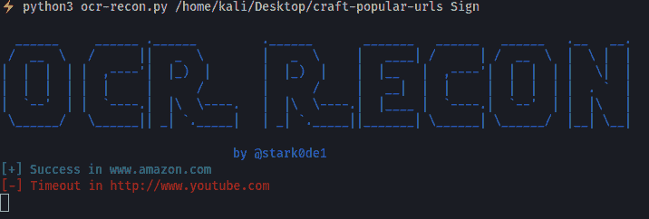

# Ocr-Recon:使用 Tesseract 的 Ocr 功能在 URL 列表中查找特定字符串的工具

> 原文：<https://kalilinuxtutorials.com/ocr-recon/>

使用 tesseract 的 Ocr(光学字符识别)功能，Ocr-Recon 对于在 URL 列表中查找特定字符串非常有用。

## 使用

用法:python3 ocr-recon.py 带有要搜索的 URL 字符串的列表

[**Download**](https://github.com/stark0de/ocr-recon)