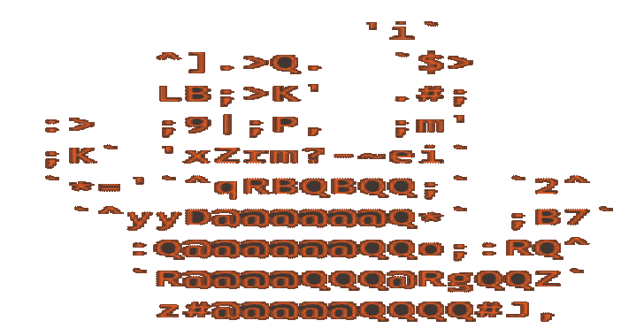

# Chaya:高级图像隐写术

> 原文：<https://kalilinuxtutorials.com/chaya/>

.png)

**Chaya** 通过隐写术、加密和压缩保护您的隐私。它使用 *AES-256-GCM* 密码术有效地加密您的有效载荷，使用 *LSB-LPS* 隐写术将它们嵌入图像，并使用 *FLIF* 进行压缩，通过执行无损压缩来逃避检测。

查亚是为了你的隐私。Chaya 得到了研究的支持(我将在 xerohack.com 上发布公开版白皮书)，并被证明是迄今为止与其他 FOSS 图像隐写工具相比最有效的图像隐写工具。

为什么查亚比其他的都好？

*   使用大多数公开可用的反隐写工具，如 stegexpose 等，检测率为 0%
*   100%的数据保留率，容量与 LBS-LPS 的标准 LSB 技术几乎相同
*   透明的加密技术达到了 python 所能提供的水平

除非 python 库和 python 本身存在漏洞，否则使用标准的超级计算机是无法破解的..LSB-LPS 对较大的图形图像进行暴力破解会花费很长的时间，因为你必须毫无错误地攻击每个 X，Y 坐标组合。让一个 ML 这样做也是毫无用处的，只能用于自然语言处理，例如:哪条消息是可读的，以找到坐标。之后，你必须破解加密。此外，NLP ML 无法找到坐标，因为暴力结果无论如何都是密文。如果由于某种原因，攻击者知道开始解密过程的坐标，他们将不得不破解 AES-GCM-256。GCM 更好，因为它提供了完整性和保密性，这就是为什么它是更好的 AES 模式)。

1948 年《联合国人权宣言》第 12 条-“任何人的私生活、家庭、住宅或通信不得加以任意干涉，他的荣誉和名誉不得加以攻击。人人有权享受法律保护，免受这种干涉或攻击。”

**1966 年《公民权利和政治权利国际公约》第 1 条—**“任何人的私生活、家庭、住宅或通信不得加以任意或非法干涉，他的荣誉或名誉不得加以非法攻击。人人有权享受法律保护，免受这种干涉或攻击。”

**特性**

*   支持 AES-256-GCM 加密
*   支持标准 LSB 隐写术
*   支持 LSB-LPS 隐写术
*   支持 FLIF 无损压缩
*   将数据日志加密为 json
*   为您的实验提供分析支持
*   支持 json 到 csv 的转换
*   高度详细的密码数据日志
*   工作空间清洁器
*   用于初始设置的简易安装程序
*   附带简易更新程序

## 装置

### 单行设置

使用以下命令加快设置速度:

**基于 Ubuntu 发行版的命令**

s**Udo apt install python 3-pip&&sudo apt install git&&git clone–depth = 1 https://github.com/xerohackcom/Chaya.git&&CD Chaya&&pip 3 install-r requirements . txt&&sudo apt update&&sudo apt-add-repository PPA:Linux enhance/libpng 12&&sudo apt update&&sudo apt install-y libpng 12-0【1**

基于 Debian 发行版的命令

**sudo apt install python 3-pip&&sudo apt install git&&git clone–depth = 1 https://github.com/xerohackcom/Chaya.git&&CD Chaya&&pip 3 install-r requirements . txt&&sudo apt update&&sudo apt install-essential dev scripts&&CD ~/&sudo touch/etc/apt/sources . list . d/libpng 12 . list&**

### 使用 Installer.py

您可以使用 installer.py 脚本安装依赖项。在终端中运行以下命令:

**sudo 安装 python 3-pip&sudo 安装 git&git clone–depth = 1 https://github.com/xerohackcom/Chaya.git&CD Chaya**

基于 Ubuntu 的发行版

**python 3 installer . py–Ubuntu**

基于 Debian 的发行版

**python 3 installer . py–debian**

## 使用

### 帮助菜单

**python 3 chaya . py–帮助**

### 自动操作

*   首先将一些图像(png 格式)添加到/autoexp/image_raw/
*   从所有 autoexp 子文件夹中删除 txt 文件以避免错误！
*   运行以下命令

**python3 chaya.py -enc**

### 输出数据

*   Enc +隐写图像-->/autoexp/image _ Steg/
*   enc+Steg+Comp images-->/autoexp/image _ Steg _ Comp/
*   密码数据-> /appdata/cipher_data.json
*   分析数据->/appdata/analysis _ results _ enc . JSON

[**Download**](https://github.com/xerohackcom/chaya)