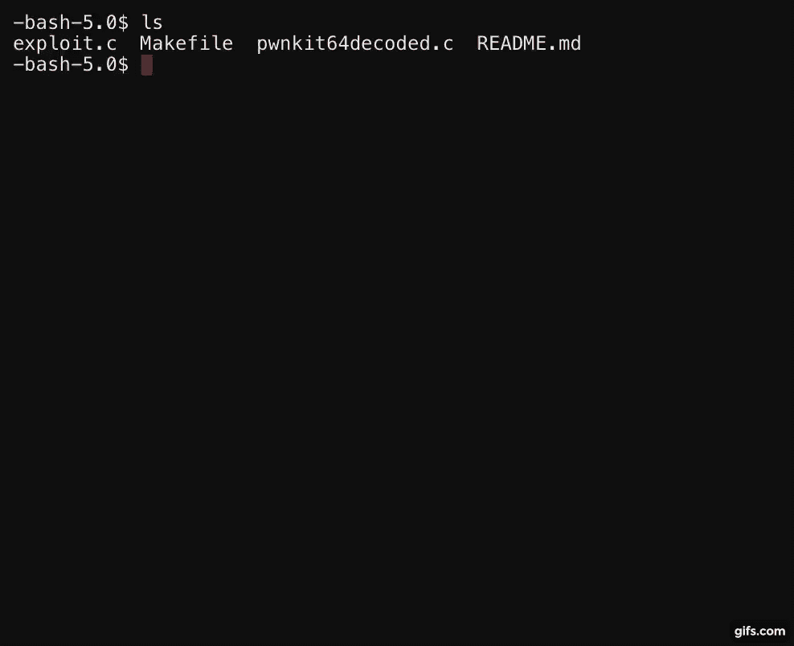

# PwnKit-Exploit:概念验证(PoC) CVE-2021-4034

> 原文：<https://kalilinuxtutorials.com/pwnkit-exploit/>

.png)

**PwnKit-Exploit** ，polkit 的 pkexec 实用程序上发现一个本地权限提升漏洞。pkexec 应用程序是一个 setuid 工具，旨在允许非特权用户根据预定义的策略以特权用户的身份运行命令。

**概念验证**

**debian @ debian:~/pwn kit-Exploit $ make
cc-Wall Exploit . c-o Exploit
debian @ debian:~/pwn kit-Exploit $ whoami
debian
debian @ debian:~/pwn kit-Exploit $。/exploit
执行漏洞利用
之前的当前用户 hacker@victim$whoami: debian
漏洞利用由@luijait 编写(0x6c75696a616974)
[+]如果漏洞利用成功完成，享受您的 root
root @ debian:/home/debian/pwn kit-Exploit # whoami
root
root @ debian:/home/debian/pwn kit-Exploit #**

### 固定

| 命令 | 使用 |
| --- | --- |
| `**sudo chmod 0755 pkexec**` | 修复 CVE 2021-4034 |

**安装&使用**

`**git clone https://github.com/luijait/PwnKit-Exploit**`

`**cd PwnKit-Exploit**`

`**make**`

`**./exploit**`

`**whoami**`

| 命令 | 效用 |
| --- | --- |
| `**make clean**` | 清理构建以测试已修改的代码 |

### 解释

总部位于 blog.qualys.com

pkexec 的 main()函数的开头处理命令行参数(第 534-568 行)，并在 path 环境变量(第 610-640 行)的目录中搜索要执行的程序(如果其路径不是绝对路径):

**435 main (int argc，char * argv[])
436 {
534 for(n = 1；n<(guint)argc；n++)
535 {
568 }
610 path = g _ strdup(argv[n])；
629 if (path[0]！= '/')
630 {
632s = g _ find _ program _ in _ path(path)；
639 argv[n]= path = s；
640 }**

不幸的是，如果命令行参数 argc 的数量为 0，这意味着如果我们传递给 execve()的参数列表 argv 为空，即{NULL}，那么 argv[0]为 NULL。这是参数列表的终止符。因此:

在行 534，整数 n 被永久设置为 1；在第 610 行，从 argv[1]中越界读取指针路径；在第 639 行，指针 s 被写到 argv[1]的边界之外。但是到底从这个越界 argv[1]中读取和写入了什么呢？

要回答这个问题，我们必须简单地离题一下。当我们执行()一个新程序时，内核将我们的参数、环境字符串和指针(argv 和 envp)复制到新程序堆栈的末尾；例如:

| argv[0] | argv[1] | … | argv[argc] | 包络[0] | 包络[1] | … | 包络[包络] |
| --- | --- | --- | --- | --- | --- | --- | --- |
| V V V V V V |  |  |  |  |  |  |  |

**“程序”“-选项“空”值“路径=名称”空**

显然，因为 argv 和 envp 指针在内存中是连续的，如果 argc 是 0，那么越界的 argv[1]实际上是 envp[0]，即指向我们的第一个环境变量“value”的指针。因此:

在第 610 行，从 argv[1](即 envp[0])中越界读取要执行的程序的路径，并指向“值”；在第 632 行，这个路径“值”被传递给 g_find_program_in_path()(因为“值”在第 629 行没有以斜杠开头)；然后，g_find_program_in_path()在我们的 path 环境变量的目录中搜索一个名为“value”的可执行文件；如果找到这样的可执行文件，它的完整路径被返回给 pkexec 的 main()函数(在第 632 行)；最后，在第 639 行，这个完整路径被写到 argv[1](即 envp[0])的边界之外，从而覆盖了我们的第一个环境变量。所以，更确切地说:

如果我们的 PATH 环境变量是“PATH=name”，并且如果目录“name”存在(在当前工作目录中)并且包含一个名为“value”的可执行文件，那么一个指向字符串“name/value”的指针就被写到 envp[0]的界外；运筹学

如果我们的路径是“路径=名称=”，如果目录“name=”存在并包含一个名为“value”的可执行文件，然后是一个指向字符串“name=”的指针。/value”超出了 envp[0]的范围。换句话说，这种越界写入允许我们在 pkexec 的环境中重新引入一个“不安全”的环境变量(例如 LD_PRELOAD)。在 main()函数被调用之前，这些“不安全”的变量通常会被 ld.so 从 SUID 程序的环境中移除。我们将在下一节中利用这个强大的原语。

最后提示:polkit 也支持非 Linux 操作系统，比如 Solaris 和*BSD，但是我们还没有调查它们的可利用性。然而，我们注意到 OpenBSD 是不可利用的，因为如果 argc 为 0，它的内核拒绝 execve()程序。

[**Download**](https://github.com/luijait/PwnKit-Exploit)