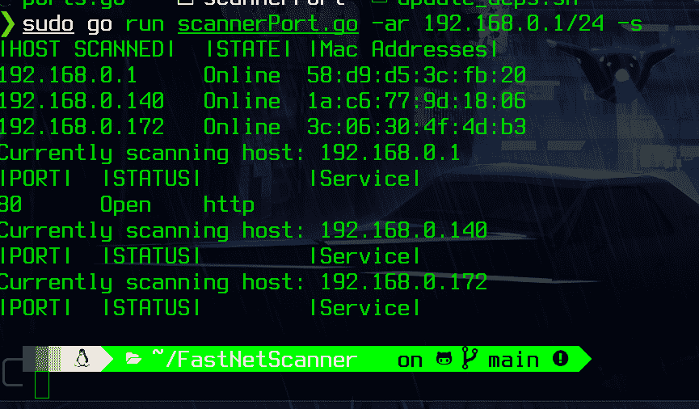

# GONET-Scanner : Golang 网络扫描器，带有 Arp 发现和自己的解析器

> 原文：<https://kalilinuxtutorials.com/gonet-scanner/>

.png)

GONET-Scanner 工具拥有自己的 ARP 扫描器和解析工具。

**截图**

**安装**

**chmod +x install.sh
。/install . sh[作为根用户]**

**用途**

**【参数】
-ar CIDR: ARP 发现
-ar CIDR -s:扫描发现的所有主机中的端口
-ap:扫描到 65535 端口
-pr MINPORT MAXPORT:定义要扫描的端口范围
-1000:扫描前 1000 个端口(如 nmap)
-t:设置超时(毫秒)
【示例】
运行 scannerport.go-AP:ALL ports TCP Scan
运行 scannerport . go 默认扫描 0-1024 端口
运行 scanner port . go-ar 192 . 168 . 0 . 1/24:ARP Ping 扫描所有本地子网
运行 scannerport.go -pr
运行 scanner port . go-ar 192 . 168 . 1 . 1/24-s
运行 scanner port。
示例:运行 scanner port . go google.com-1000(将解析 google.com+将扫描前 1000 个端口)
示例:运行 scanner port . go 192 . 168 . 0 . 1-pr 100 3000(将扫描这些范围内的每个端口，您必须放置第一个次要端口)**

**将端口添加到横幅抓取中**

转到文件`**ports.go**`

**func Ports()map[int]string {
//基于众所周知的端口
Ports:= map[int]string {
1:" echo "、
9: "WOL "、
20: "ftp 数据"、
21: "ftp 控制"、
22: "ssh "、
23: "telnet "、
25: "smtp "、
43: "whois "、
49: "TACACS
220:“IMAP 3”，
123:“NTP”，
135:“RPC”，
443:“https”，
445:“微软-ds，Samba”，
465:“SMTP over TLS”，
514:“Syslog”，
520:“RIP”，
521:“RIPng”，
540:“UUCP”，** 

只需添加端口号和服务名称示例:添加 git

**9418:“去吧”**

[**Download**](https://github.com/luijait/GONET-Scanner)