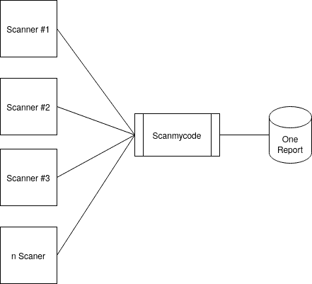
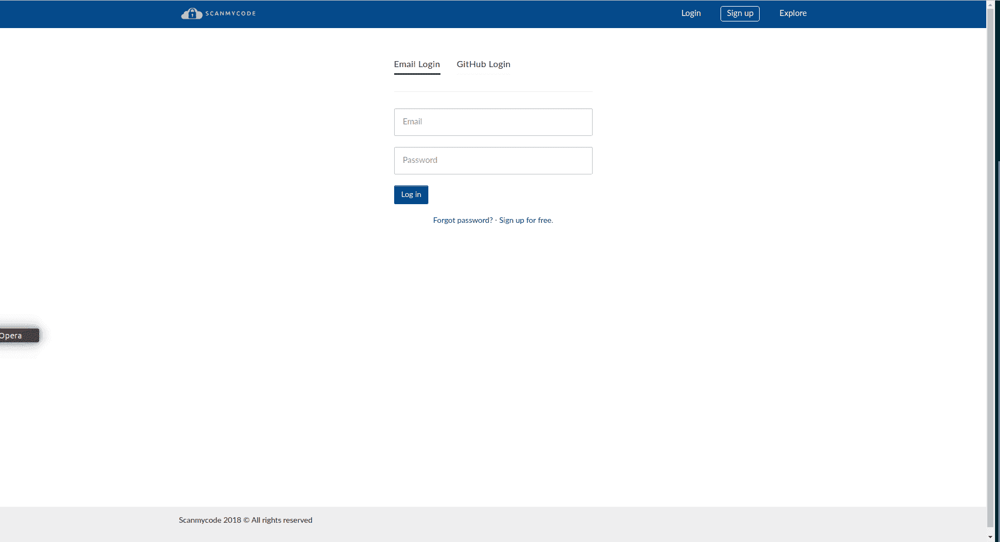

# Scanmycode-Ce:代码扫描/SAST/静态分析/使用许多工具/扫描仪的林挺

> 原文：<https://kalilinuxtutorials.com/scanmycode-ce/>

**Scanmycode-Ce** 是一款代码扫描/SAST/静态分析/林挺解决方案，使用多种工具/扫描器编写一份报告。您还可以向其添加任何工具。目前，它支持许多语言和技术栈。类似 SonarQube，但又不一样。

*Fig. 1 Scanmycode concept diagram*

# TLDR

来安装它。安装`**docker**`和`**docker-compose**`，然后:

2 个选项

*   最快(使用 DockerHub 构建的图像)。如果不确定，用这个。

**git 克隆 https://github . com/marcingy/scan my company-ce . git
CD scan my company-ce/docking ub
。/start.sh**

*   较慢(构建所有内容)

**git 克隆 https://github . com/marcingy/scan my company-ce . git
CD scan my company-ce/docker
。/start.sh**

在浏览器中执行以下操作:

`**http://localhost:5000**`

在本地注册(并在需要时登录)

# 在后台

Progpilot、PMD、Bandit、Brakeman、Gosec、confused、semgrep、trufflehog3、jshint、log4shell(通过自定义 semgrep 规则)和其他。有些被修改了。

# 录制的演示

社区版没有 GitHub 支持和其他插件。但是休息也一样。

### Scanmycode 和 SonarQube 有什么不同？

两者都使用静态分析来查找 bug 和缺陷，但是有一些不同。

*   Scanmycode 可以用任何产生 JSON 输出的工具(任何二进制，任何技术/语言/产品)来扩展。这就是最大的区别。
*   Scanmycode 是开源的，SonarQube 也提供开源版本，但它缺少一些功能(例如，开源版本中没有 12 种支持的语言，而更强大的数据流功能只在付费版本中可用)
*   Scanmycode 只支持扫描已更改的文件(差异分析)，SonarQube 不支持
*   Scanmycode 也使用 semgrep 作为工具之一(没有 semgrep 社区规则，只有 Scanmycode 的自定义规则)

以下是 semgrep 的(也是 Scanmycode 相对于 SonarQube 的优势):

“用自定义规则扩展 Semgrep 很简单，因为 Semgrep 规则看起来像您正在编写的源代码。使用 SonarQube 编写定制规则仅限于少数几种语言，并且需要熟悉 Java 和抽象语法树(ASTs)。”

“Semgrep 专注于速度和易用性，使得每条规则的分析速度高达 20K-100K loc/sec。SonarQube 作者报告说，生产中的规则集大约为 0.4K loc/秒。

来源:semgrep 网站

# 欢迎使用 Scanmycode CE(社区版)！

Scanmycode 基于 QuantifedCode。QuantifiedCode 是一个代码分析和自动化平台。它帮助您跟踪软件项目中的问题和度量，并且可以很容易地扩展以支持新类型的分析。该应用程序由几个部分组成:

*   一个前端，实现为 React.js 应用程序
*   后端，实现为 Flask 应用程序，公开前端使用的 REST API
*   一个后台工作器，使用 Celery 实现，执行代码分析

目前支持:PHP、Java、Scala、Python、Ruby、Javascript、GO、秘密扫描、依赖混淆、木马源码、开源和专有检查(总 ca。1000 张支票)

优势:

*   许多工具，一个报告(统一)
*   解散，合作调查结果。标记误报
*   启用/禁用检查器中的每个单独检查
*   加州。现在进行 1000 次检查(棉绒、静态代码分析/代码扫描)
*   可以添加任何输出 JSON 的工具
*   快速(重新检查时仅检查新代码)
*   Git 支持(HTTPS/TLS 和 SSH)。对于私有存储库，仅 SSH。
*   所有 REST API 可调用(CI/CD 可集成)
*   用于代码扫描的瑞士军刀工具/SIEM
*   100%代码透明，完全控制您的代码

# 装置

我们为安装 Scanmycode 提供了几个选项。哪一个适合您取决于您的使用案例。

*   如果您想修改或更改 Scanmycode，最好使用**手动安装**
*   基于 Docker 的安装可能是尝试 Scanmycode 最简单的方式，不需要做太多工作
*   如果你想在一个专业的基础设施中运行 Scanmycode(可能有多个服务器),基于 Ansible 的安装是最合适的方式

以下部分将只讨论手动安装过程，对于其他选项，请检查其相应的存储库。

## 手动安装

该装置由三部分组成:

*   安装运行 Scanmycode 所需的依赖项
*   下载所需的源代码
*   设置配置

### 安装依赖项

Scanmycode 需要以下外部依赖项:

*   消息代理(后台任务消息队列需要)。我们推荐 RabbitMQ 或者 Redis。
*   数据库(核心应用程序所必需的)。我们推荐 PostgreSQL，但是 SQLite 也受支持。其他数据库系统也可以工作(例如 MySQL)，但是目前还没有官方支持。如果您需要在不受支持的数据库上运行 Scanmycode，请与我们联系，我们很乐意为您提供一些指导。

### 下载 Scanmycode CE 源代码

现在安装了依赖项，我们可以继续下载 Scanmycode:

`**git clone https://github.com/marcinguy/scanmycode-ce.git**`

### 安装所需的 Python 包

Scanmycode CE 通过 Python 包管理器(pip)管理依赖关系。

### 编辑设置

Scanmycode 通过 YAML 设置文件进行配置。当启动应用程序时，它从几个文件中增量加载设置，递归地更新设置对象。首先，它将从**T0 载入默认设置。**然后，它将检查是否定义了一个`**QC_SETTINGS**`环境变量并指向一个有效的文件，如果是，它将从该文件加载设置(可能会覆盖默认设置)。如果没有，它会在当前工作目录中寻找一个`**settings.yml**`文件，并从那里加载设置。此外，它将检查是否定义了一个`**QC_SECRETS**`环境变量并指向一个有效的文件，并从那里加载设置(这对于应该与其他设置分开的敏感设置很有用[例如，不要将它们签入版本控制])。

在存储库的根目录下有一个示例文件`**settings.yml**`,您可以从中开始。

### 运行设置

编辑设置后，通过运行设置命令

**#从资源库的根目录运行
python manage.py setup**

setup assistant 将反复引导您完成设置，完成后您应该有一个 Scanmycode 的工作实例了！

### 运行网络应用

要运行 web 应用程序，只需运行

`**python manage.py runserver**`

### 运行后台工作程序

要运行后台工作程序，只需运行

`**python manage.py runworker**`

[**Download**](https://github.com/marcinguy/scanmycode-ce)