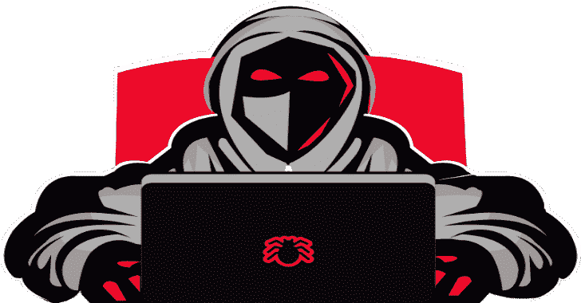

# Nivistealer:窃取受害者图像、精确位置、设备信息等等

> 原文：<https://kalilinuxtutorials.com/nivistealer/>

Nivistealer 是一款窃取受害者图像、精确位置、设备信息等信息的工具。

## 特征

*   窃取受害者 Ip
*   窃取设备信息
*   窃取网络和电池信息
*   使用设备 Gps 窃取准确位置
*   从前置摄像头偷取照片
*   从受害者剪贴板窃取文本(最近添加)
*   将日志发送到 discord 还会将它们保存在本地的 txt 文件中
*   适用于 android、windows、linux 和 mac os
*   使用 iframe 加载实时网站，使网络钓鱼攻击更加可靠

* * *

## 如何使用？

**方法 0**

*   点击上面的按钮或点击此处运行于`**repl.it**`
*   在 repl.it 上登录/注册
*   在它克隆了 repo 之后，用您的 repl url 编辑这一行
*   现在点击运行

**方法 1**

*   克隆或下载此回购
*   在任何提供 ssl 的虚拟主机站点上创建一个帐户。我建议一个名为`**000webhost.com**`的免费虚拟主机网站
*   现在上传`**index.html,sunni.php,post.php**`到你的虚拟主机网站
*   现在打开 index.html，用你的`d**iscord webhook url**`替换它
*   嘣！！！。现在将钓鱼链接发送给受害者。日志将被发送到您的 discord webhook，并保存到`**sensitiveinfo.txt**`文件中

**方法二**

*   克隆存储库并导航至`**python_flask**`目录
*   打开你的终端，输入`**pip3 install colorama**` `**pip3 install flask**`
*   现在用你的网址编辑这行
*   现在打出`**python nivistealer.py**`轰！！！
*   图像和日志文件将保存在您的本地目录中

## 捐赠

*   比特币

**BC 1q 37 nqagapyt 7 nnu 38 P4 pqu 4 HQ 2 xgmumwklzn 24 l**

*   以太币

**0x F3 ebc 9 ba 1 BCD 30 C3 ef bad 298 a 73663691 F4 db 803**

[**Download**](https://github.com/swagkarna/Nivistealer)