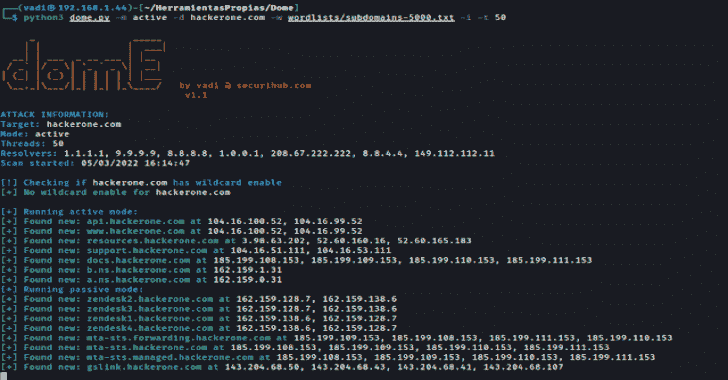

# Dome:快速可靠的 Python 脚本，可以进行主动和/或被动扫描来获取子域

> 原文：<https://kalilinuxtutorials.com/dome/>

.png)

**Dome** 是一个快速可靠的 python 脚本，它进行主动和/或被动扫描以获取子域并搜索开放端口。这个工具推荐给侦查阶段的 bug 赏金猎人和 pentester 使用。

暴露的表面积越大，岩石破碎的速度越快

如果您想使用更多的 OSINT 引擎，用所需的 api 令牌填充 **config.api** 文件

### 被动模式

使用 OSINT 技术从目标获得子域。该模式不会与目标建立任何连接，因此**无法检测到**。这种模式的基本用途是:

**python dome.py -m passive -d 域**

### 有源方式

执行暴力攻击，以获得活着的子域。暴力有两种类型:

*   **纯暴力**:检查从 a.domain.com 到 zzz.domain.com 的子域(26 + 26^2 + 26^3 = 18278 子域)这个暴力可以用`**-nb, --no-bruteforce**`禁用
*   **基于单词表的**:使用用户通过标志`**-w, --wordlist**`提供的自定义单词表。如果没有指定单词表，则不会执行该模式

这种模式也会进行被动模式攻击，但在这种情况下，会测试连接以确保子域仍然存在。要在主动扫描模式下禁用被动扫描，使用`**--no-passive**`标志

这种模式的基本用途是:

**python dome . py-m active-d domain-w word list . txt**

添加 **`-p`** 选项或内置端口选项(参见用法菜单)来执行端口扫描

**python dome . py-m active-d domain-w word list . txt-p 80，443，8080**

## 装置

可以用 Python 2 或 3 运行 Dome。**推荐 python 3**

安装依赖项并运行程序

**git 克隆 https://github.com/v4d1/Dome.git
CD Dome
pip install-r requirements . txt
python Dome . py–help**

## 特征

*   好用。只需安装 requirements.txt 并运行
*   主动和被动扫描(阅读上文)
*   比其他子域枚举工具更快
*   7 种不同的解析器/名称服务器，包括 google、cloudfare(最快)、Quad9 和 cisco DNS(使用–resolvers filename . txt 来使用自定义的解析器列表，每行一个)
*   多达 21 种不同的 OSINT 信号源
*   通过 OSINT 获得的子域将被测试以了解它们是否是活动的(仅在活动模式下)
*   支持需要 API 令牌的网站
*   检测 api 键何时不再工作(其他工具只是抛出一个错误并停止工作)
*   通配符检测和绕过
*   Top100、Top1000 和 Top Web 端口的自定义端口扫描和内置参数
*   彩色和无色输出便于阅读
*   Windows 和 Python 2/3 支持(建议使用 Python 3)
*   通过参数高度可定制
*   同时扫描多个域
*   使用线程进行快速暴力扫描的可能性
*   导出不同格式的输出，如 txt，json，html

## o 搜索引擎

Dome 使用这些网页来获取子域

不带 API:

*   艾伦沃特
*   黑客目标
*   RapidDNS
*   威胁矿工
*   urlscan.io
*   threatcrowd.org
*   web.archive.org
*   crt.sh
*   缓冲区。运行
*   塞尔特波特
*   阿努比斯数据库
*   Hunt.io
*   声纳
*   网站档案
*   DNSrepo

使用 API:

*   VirusTotal
*   肖丹
*   Spyse
*   安全轨道
*   被动的
*   二元边缘

## 使用

| 争论 | 描述 | 参数示例 |
| --- | --- | --- |
| -m，–模式 | 扫描模式。有效选项:主动或被动 | 活跃的 |
| -d，–域 | 用于枚举子域的域名(用逗号分隔) | hackerone.com，facebook.com |
| -w, –wordlist | 包含用于强制的子域前缀的单词列表 | 子域名-5000.txt |
| -我-叶 | 当发现一个子域时，显示它的 ip |  |
| –否-被动 | 不要使用 OSINT 技术来获取有效的子域 |  |
| -nb-不要-bruefrce | 不要制造三个字母以内的纯暴力 |  |
| -p，–端口 | 扫描针对特定 tcp 端口找到的子域 | 80,443,8080 |
| –前 100 个端口 | 扫描子域的前 100 个端口(与-p 选项不兼容) |  |
| –前 1000 个端口 | 扫描子域的前 1000 个端口(与-p 选项不兼容) |  |
| –顶部网络端口 | 扫描子域的顶部 web 端口(与-p 选项不兼容) |  |
| -s-无声 | 静音模式。终端无输出 |  |
| –无色 | 不要打印彩色输出 |  |
| -t，–螺纹 | 要使用的线程数量(默认值:25) | Twenty |
| -o，–输出 | 将结果保存到 txt、json 和 html 文件 |  |
| –最大响应大小 | HTTP 响应的最大长度(默认值:5000000 (5MB)) | One million |
| –r，–解析器 | 包含要使用的 DNS 解析器的文本文件。每行一个 | resolvers.txt |
| 救命啊 | 帮助命令 |  |
| –版本 | 显示圆顶版本并退出 |  |
| -v，–详细 | 在执行过程中显示更多信息 |  |

## 例子

执行主动和被动扫描，显示每个子域的 ip 地址，并使用 top-web-ports 进行端口扫描。数据也将被写入/results 文件夹:

**python dome . py-m active-d domain-w word list . txt-I–top-we B- ports-o**

在静默模式下执行被动扫描，并将输出写入文件。

**python dome . py-m passive-d domain–silent–output**

执行主动扫描，不进行被动和端口扫描

**python dome . py-m active-d domain-w word list . txt–no-passive**

单词表只有暴力

**python dome . py-m active-d domain-w word list . txt–no-brute force**

主动和被动扫描，仅在端口 22、80、3306 中执行端口扫描

**python dome . py-m active-d domain-w word list . txt-p 22，80，3306**

[**Download**](https://github.com/v4d1/Dome)