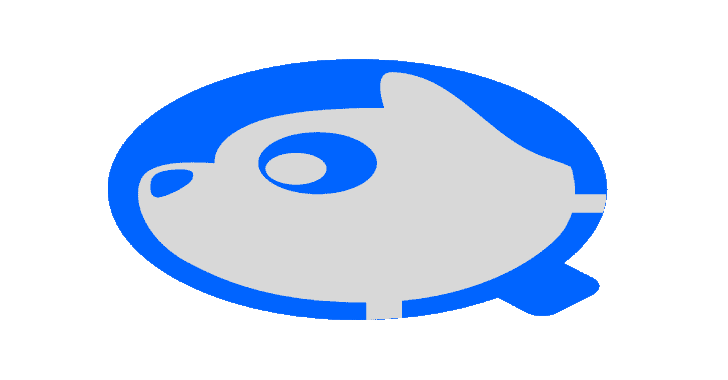
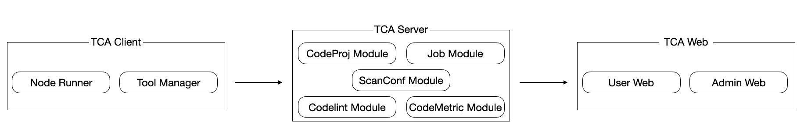
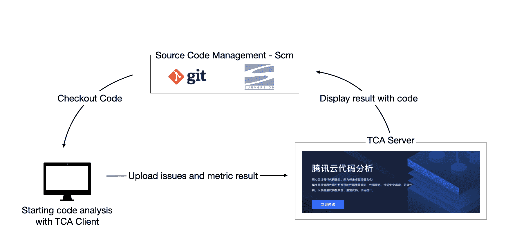

# 代码分析:静态代码分析

> 原文：<https://kalilinuxtutorials.com/code-analysis/>

**腾讯云代码分析**(简称 TCA，早期公司内部代号 CodeDog)是一个代码分析和问题跟踪的综合平台。TCA 由三部分组成，服务器、web 和客户端。它集成了许多自主开发的工具，还支持各种编程语言的代码分析工具的动态集成。

代码分析是一种技术，利用词法分析、语法分析、控制流分析、数据流分析对代码进行综合分析，从而验证代码是否满足规范性、安全性、可靠性、可维护性等指标的要求。

使用 TCA 可以帮助团队发现代码中的规范、结构、安全漏洞和其他问题，持续监控项目代码的质量并发出警报。同时，TCA 开放 API 支持与上下游系统的连接，整合代码分析能力，保证代码质量，更有利于传承优秀的团队代码文化。

## 关键特征

1.  **语言支持**:支持 Java/c++/Objective-C/c#/JavaScript/Python/Go/PHP 等，涵盖常用编程语言。
2.  **代码检查**:发现代码质量缺陷、代码规范问题、代码安全漏洞、无效代码等。目前已经集成了很多自研的知名开源分析工具。分层架构可以支持团队的快速自助管理工具。
3.  **代码度量**:支持从代码圈复杂度、代码重复率、代码统计量三个维度对代码进行综合度量。
4.  **DevOps 集成**:客户端可以通过命令行启动。标准 API 支持连接到上游和下游系统，以及各种 DevOps 系统。

[**Download**](https://github.com/Tencent/CodeAnalysis)