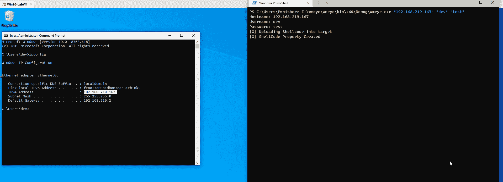

# WMEye:一种后期利用工具，使用 WMI 事件过滤器和 MSBuild 执行横向移动

> 原文：<https://kalilinuxtutorials.com/wmeye/>

WMEye 是一个实验性的工具，是在探索 Windows WMI 时开发的。该工具是为使用 WMI 和远程 MSBuild 执行执行横向移动而开发的。它将编码/加密的外壳代码上传到远程目标 WMI 类属性，创建一个事件过滤器，当被触发时，使用一个称为日志文件事件使用者的特殊 WMI 类写入基于 MSBuild 的有效负载，并最终远程执行有效负载。

# 用例

使用 WMI 的无文件横向移动，可与 Cobalt Strike 的执行组件一起使用

注意:这仍处于试验阶段，不会在真正的战斗中使用。

# 预览

# 当前工作

*   创建远程 WMI 类
*   将外壳代码作为属性值写入上面创建的假 WMI 类
*   创建 powershell.exe 进程创建时触发的 WMI 事件过滤器
*   在事件触发时，它使用 LogFileEventConsumer(一种用于写入日志文件的 WMI 使用者类型)将 MSBuild 有效负载上传到远程系统
*   最后调用`**Win32_Process Create**`远程调用 MSbuild

MSBuild 有效负载从 WMI 类属性获取编码的外壳代码，解码并执行它。

# 即将推出的功能

*   用更好的东西替换 WIN32_Process 创建调用方法
*   为外壳代码和 XML 文件字节添加 GZIP 压缩
*   添加 NTLM PTH 支持
*   添加清理函数，用于在 logfileeventconsumer 完成写入 MSBuild 负载后移除事件筛选器

# 这个项目有什么独特之处？

*   将编码/加密的外壳代码上传到创建的假类的远程机器 WMI 属性中(也许可以将外壳代码写入现有类的属性中)
*   使用 LogFileEventConsumer 上载 MSBuild 文件，而不是依赖于使用 win32_process Create 生成 Powershell.exe

[**Download**](https://github.com/pwn1sher/WMEye)