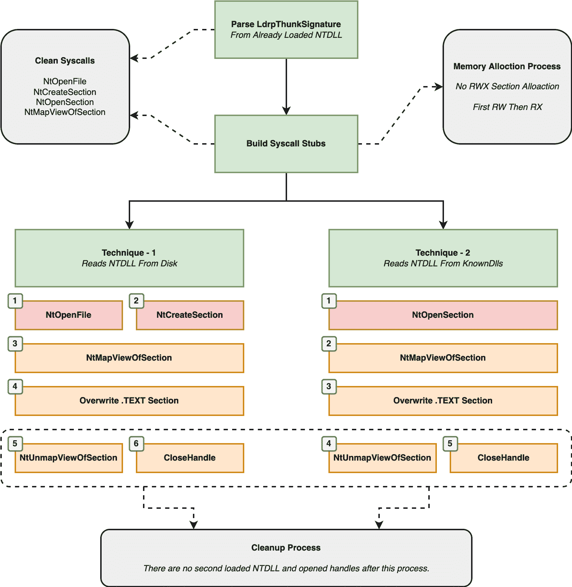

# RefleXXion:一个用来帮助绕过 AV/EPP/EDR 等使用的用户态钩子的工具

> 原文：<https://kalilinuxtutorials.com/reflexxion/>

.png)

reflex ion 是一个工具，用来帮助绕过 AV/EPP/EDR 等使用的用户态钩子。为了绕过用户模式挂钩，它首先收集在 LdrpThunkSignature 数组中找到的 NtOpenFile、NtCreateSection、NtOpenSection 和 NtMapViewOfSection 的系统调用号。之后，用户可以选择两种技术来绕过用户模式挂钩。

技术-1，从`**C:\Windows\System32\ntdll.dll**`读取 NTDLL 文件。解析后。内存中已经加载的 NTDLL 的 TEXT 部分(执行挂钩的地方)被替换为。clean NTDLL 的文本部分。

在技术 2 中，NTDLL 从 KnownDlls，`**\KnownDlls\ntdll.dll**`中读取一段。(因为 DLL 文件缓存在 KnownDlls as 节中。)解析后。内存中已经加载的 NTDLL 的 TEXT 部分(执行挂钩的地方)被替换为。clean NTDLL 的文本部分。

该方法和所有技术的详细流程如下:

## 如何使用

您可以使用 Visual Studio 打开并编译该项目。整个项目支持 x64 架构的调试和发布模式。

reflex ion-EXE 解决方案生成用于 PoC 目的的 EXE。如果你想一步一步了解项目是如何运作的，会让你的工作更轻松。主功能包含技术 1 和技术 2 功能定义。注释其中一个并编译。不要同时使用两种功能。

reflex ion-DLL 解决方案生成 DLL，您将该 DLL 注入到您希望绕过 NTDLL 的用户模式挂钩的进程中。在`**main.cpp**`文件的开头，有使用哪种技术的定义。你可以选择其中的一个进行编译。不要同时设置所有的值，只设置一种你想要的技术。下面给出了配置示例。

**//技术配置段
定义 FROM_DISK 1 //如果设置为 1，将使用技术-1。了解更多信息；https://github.com/hlldz/RefleXXion
定义 FROM_KNOWNDLLS 0 //如果你把它设置为 1，技术-2 将被使用。了解更多信息；https://github.com/hlldz/RefleXXion**

## 操作使用说明和操作安全问题

*   RefleXXion 目前仅支持 x64 架构。
*   RefleXXion 只解钩 NTDLL 函数，你可能需要解钩其他 dll(kernel 32 . dll，advapi32.dll 等。)也是。为此，您可以轻松地编辑项目中的必要位置。
*   当覆盖时，RefleXXion 仅使用 RWX 存储区。文本部分过程开始。对于这个过程，没有创建新的内存区域，现有的内存区域(已经加载的 NTDLL 的文本部分)被 rwx，然后被转换为 RX。

**乌兰老人保护；
ntstatus = ntprotected virtualmemory(ntcurrent process()，& lpBaseAddress，& uSize，PAGE_EXECUTE_READWRITE，&old protection；
memcpy()
ntstatus = ntprotected virtualmemory(ntcurrent process()，& lpBaseAddress，& uSize，&old protection；**

*   另外，RefleXXion 通过干净安装的 NTDLL 调用 NtProtectVirtualMemory API。它为此使用 CustomGetProcAddress 函数，因为即使干净的 NTDLL 被加载到内存中，它也不在加载顺序模块列表中。所以像这样的解决方案(https://stack overflow . com/questions/6734095/how-to-get-module-handle-from-func-ptr-in-win32)是行不通的。这就是自定义 GetProcAddress 函数存在并被使用的原因。
*   您可以将 RefleXXion DLL 从磁盘加载到目标进程。对于敏感的工作，比如红队行动，你可能不喜欢这样的跑步。因此，您可以使用 sRDI 项目将 RefleXXion DLL 转换为 shell 代码，或者将 reflex ion 代码集成到您自己的加载程序或项目中。
*   即使 NTDLL(作为文件或作为节)被重新加载到注入的进程，它也不会保持加载状态。为自己的进程关闭所有打开的句柄(文件和节句柄)。

[**Download**](https://github.com/hlldz/RefleXXion)