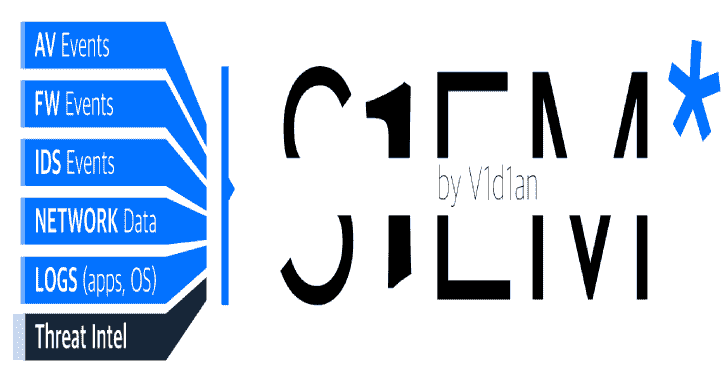

# S1EM:这个项目是一个包含 SIRP 和威胁英特尔的 SIEM，集所有功能于一身

> 原文：<https://kalilinuxtutorials.com/s1em/>

.png)

**S1EM** 解决方案基于这样一个原则:免费汇集各自领域的最佳产品，并使其快速互操作。

S1EM 是集 SIRP 和威胁情报、完整数据包捕获于一体的 SIEM。

解决方案内部:

*   集群弹性搜索
*   Kibana
*   Filebeat
*   Logstash
*   公制尺寸标注
*   心跳
*   审计节拍
*   N8n
*   蜘蛛脚
*   系统日志-ng
*   弹性警报
*   TheHive
*   皮质
*   MISP
*   OpenCTI
*   阿尔基夫
*   苏里卡塔
*   嘘！嘘
*   StoQ
*   Mwdb
*   Traefik
*   Clamav
*   科明德
*   了望塔
*   荷马

**注意** : Cortex v3.1 使用 ELK 连接器和 OpenCTI v4 连接器

## 安装指南

# 先决条件

解决方案与 Linux、docker 和 docker-compose 一起工作。对于 auditbeat，版本 5 中必须有内核。

在 Linux 上，在“/etc/sysctl.conf”中必须有这样一行:

**vm.max_map_count=262144**

# 身体的

你一定有:

*   64 Go Ram
*   固态硬盘中超过 100 块硬盘(对固态硬盘非常重要)
*   8 个 cpu
*   1 个管理网络
*   1 个监控网络

# 安装

以 root 用户身份登录到您的系统

**git 克隆 https://github.com/V1D1AN/S1EM.git
CD S1EM**

之后，运行命令:

**bash 01_deploy.sh**

在 Linux 上，将此条目添加到/etc/hosts 文件中，以访问此解决方案(使用安装期间输入的主机名更改 s1em.cyber.local)。

**vi /etc/hosts
XXX。XXX.XXX.XXX s1em.cyber.local**

在 Windows 上，将此条目添加到 hosts 文件中以访问此解决方案(使用安装期间输入的主机名更改 s1em.cyber.local)。

**记事本 C:\ Windows \ System32 \ drivers \ etc \ hosts
XXX。XXX.XXX.XXX s1em.cyber.local**

[**Download**](https://github.com/V1D1AN/S1EM)