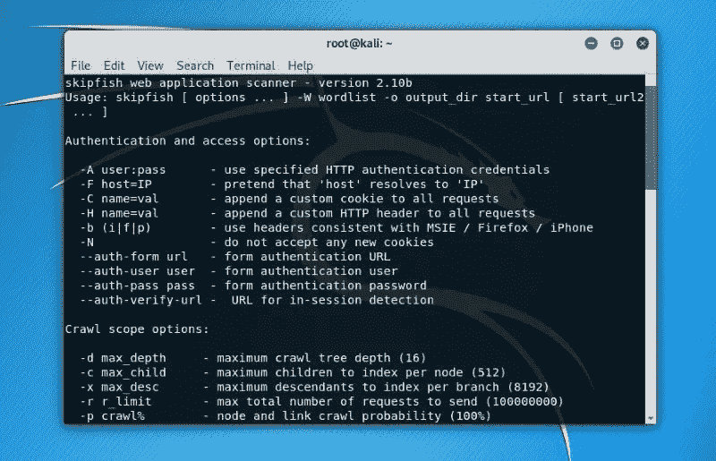
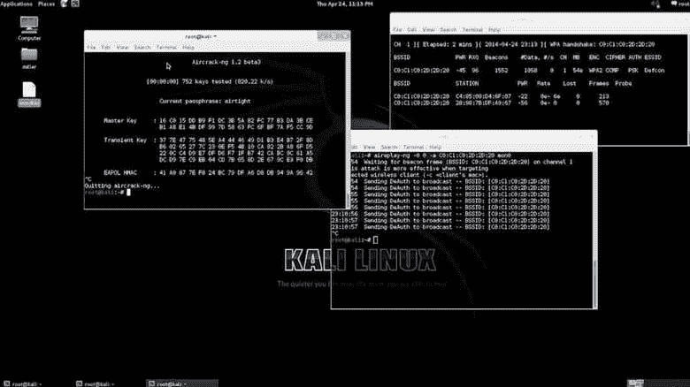

# kali Linux——渗透测试的最佳工具？

> 原文：<https://kalilinuxtutorials.com/kali-linux-the-best-tool-for-penetration-testing/>

被称为 [Kali Linux](https://en.wikipedia.org/wiki/Kali_Linux) 的渗透工具是一个基于 Debian 的 Linux 发行版，创建时考虑到了安全测试和审计。它是世界上最流行的安全发行版之一，它包括几十种工具，允许你对你的目标进行各种攻击。在这篇博文中，我们将讨论[什么是](https://www.getastra.com/blog/security-audit/penetration-testing)渗透测试，为什么 Kali Linux 是这项活动的好工具，以及如何使用它来测试您自己的系统。我们还将提供一些有效使用 Kali Linux 的技巧，并提及其他一些工具。

## 什么是渗透测试？

渗透测试，通常被称为“pentesting”或“security testing”，是一种模拟来自恶意个人的攻击以评估计算机系统或网络安全性的技术。这可以手动或自动完成，通常涉及试图利用漏洞来访问敏感数据或系统。渗透测试可用于测试内部和外部系统，它们通常被用作大型安全评估的一部分。

Debian 是用于渗透测试和安全审计的 Linux 发行版。它包括几十种工具，允许你对你的目标进行各种攻击。在这篇博客文章中，我们将讨论什么是渗透测试，为什么 Kali Linux 是这个活动的一个很好的工具，以及如何使用它来测试您自己的系统。我们将向您展示如何有效地使用这个 Linux 发行版，以及同一类别中的其他工具。

## **为什么 Kali Linux 是一个很好的渗透测试工具？**

Kali Linux 是世界上最流行的安全发行版之一，它包括几十种工具，允许您对目标进行各种攻击。此外，Kali Linux 定期更新新的特性和工具，使其成为任何渗透测试人员的必备工具。

Kali Linux 是渗透测试的好工具的一些原因包括:

–它有大量预装的安全工具，可以轻松开始渗透测试。

–Kali Linux 会定期更新新功能和工具。

很好用。它是完全免费的，可以在各种平台上使用。

## 如何使用 Kali Linux 进行渗透测试:分步指南

在开始使用 Kali Linux 进行渗透测试之前，有一些事情需要考虑。特别是，你需要选择你的目标，收集关于他们的信息，然后选择合适的工具。让我们在下面更深入地看看这些阶段。

**选择你的目标**

任何渗透测试的第一步是选择你的目标。这可以手动或自动完成，但重要的是要确保在继续操作之前获得系统所有者的许可。此外，您需要选择容易受到您计划使用的攻击类型攻击的目标。

**收集信息**

下一步是获取关于你的目标的信息。这可能包括网络图、系统架构图和已安装软件列表等内容。您还应该尽可能多地了解在系统中工作的个人，包括他们的职位和职责。

**选择工具**

在你收集了关于你的目标的信息之后，是时候为这项工作选择合适的工具了。Kali Linux 包括几十个可用于渗透测试的工具，因此为手头的任务选择正确的工具非常重要。你应该意识到你可能做出的各种攻击。

**执行攻击**

一旦你选择了你的目标，收集了关于他们的信息，并选择了适当的工具，是时候开始攻击了。这可以通过多种方式实现，但通常涉及试图利用漏洞来获取对敏感数据或系统的访问权限。Kali Linux 包含了许多工具，可以简化这个过程，所以一定要好好利用它们。

## **有效使用 Kali Linux 的技巧**

下面是一些有效使用 Kali Linux 的技巧:

–熟悉您可以执行的不同类型的攻击。

–为工作选择合适的工具。

–使用前，请阅读每个工具的文档。

–让您的 Kali Linux 安装保持最新。

## **本类别中的其他工具**

除了 Kali Linux，还有许多其他工具可以用于渗透测试。其中包括:

*   [Metasploit](https://en.wikipedia.org/wiki/Metasploit_Project)
*   阿斯特拉的 Pentest
*   [Nmap](https://gbhackers.com/information-gatheri-using-nmap/)
*   [Wireshark](https://ethicalhackersacademy.com/products/complete-wireshark-bundle)
*   [打嗝组曲](https://portswigger.net/)

## **用 Kali Linux 进行渗透测试意味着什么？**

使用 Kali Linux 进行渗透测试意味着使用 Kali Linux 的工具和功能来测试系统和网络的安全性。这可以手动或自动完成，但重要的是要确保在继续操作之前获得系统所有者的许可。此外，您需要选择容易受到您计划使用的攻击类型攻击的目标。

Kali Linux 是世界上最流行的安全发行版之一，它包括几十种工具，允许您对目标进行各种攻击。此外，Kali Linux 定期更新新的特性和工具，使其成为任何渗透测试人员的必备工具。

## **结论**

Kali Linux 是世界上最流行的安全发行版之一，它包括几十种工具，允许您对目标进行各种攻击。此外，Kali Linux 定期更新新的特性和工具，使其成为任何渗透测试人员的必备工具。如果您想使用 Kali Linux 进行渗透测试，请确保熟悉您可以执行的不同类型的攻击，并选择合适的工具。