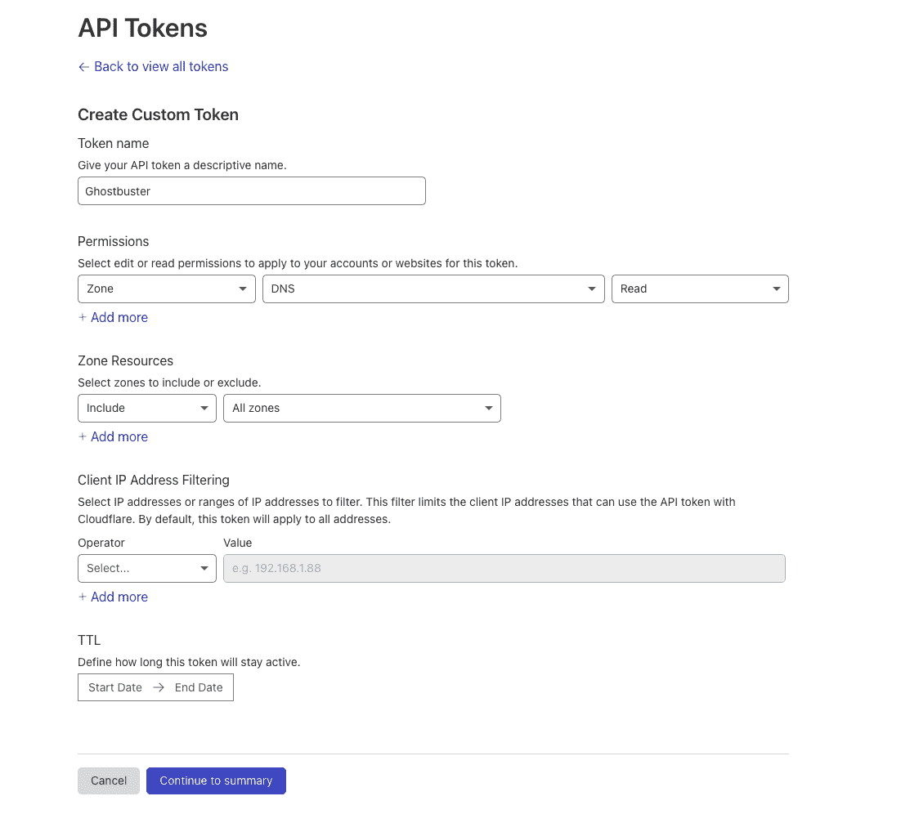

# 捉鬼敢死队:通过对您的资源进行分析来消除悬挂的弹性 IP

> 原文：<https://kalilinuxtutorials.com/ghostbuster/>

[](https://blogger.googleusercontent.com/img/b/R29vZ2xl/AVvXsEjPkwZ_7cRLy5e0XZb720UjImn7egU-RuscVPMiIeIeyIIReyeRqbS5xz0pZ8wguaU2NzX2px3CGsfSuR8GsEJpljhZb25fbSoCf_GhLYW6-N6TMAXZOzMYmquuh2bXCDlcw3CUuKW9c3P-N6EPFrwbJQz2jC0H98bNnZo0MGvunQriTXZ4Hql8MIFa/s728/ghostbuster%20(1).png)

**Ghostbuster** 获取您所有 AWS 帐户中的所有 DNS 记录(Route53)，并可以选择通过 CSV 输入或通过 Cloudflare 接收记录。

收集完这些记录后，Ghostbuster 会遍历您的所有 AWS 弹性 IP 和网络接口公共 IP，并收集这些数据。

通过对 DNS 记录(来自 route53、file input 或 cloudflare)的全面了解，以及对贵组织拥有的 AWS IPs 的全面了解，此工具可以检测指向悬空弹性 IP(您不再拥有的 IP)的子域。

## 问题

当您将基础设施部署到 AWS 时，您可能会启动 EC2 实例，这些实例具有与之相关联的 IP。当您创建指向这些 IP 的 DNS 记录，但在 EC2 实例被赋予新 IP 或被销毁后忘记删除 DNS 记录时，您很容易受到子域接管攻击。

已经对弹性 IP 接管进行了大量的研究，攻击者可以不断地声称弹性 IP，直到他们获得与他们所针对的公司的子域相关联的 IP。

虽然 AWS 经常禁止试图执行这种攻击模式的帐户，但 AWS 尚未发布长期修复措施。

悬空弹性 IP 子域接管攻击的影响比典型的子域接管更严重，在典型的子域接管中，您只能控制所提供的内容。通过悬空弹性 IP 接管，攻击者有可能执行以下操作:

*   声明子域的 SSL 证书
*   监听所有端口上的流量(可能会发现仍在发送到子域的敏感信息)
*   运行能够窃取 HTTPOnly cookies 的服务器端脚本，当 cookie 的作用域为`***.domain.com**`时，通常会导致一键式帐户接管攻击

## 项目特点

*   动态遍历在`**.aws/config**`中配置的每个 AWS 配置文件
*   从 AWS Route53 提取记录
*   从 Cloudflare 提取记录(可选)
*   从 CSV 输入中提取记录(可选)
*   遍历所有区域、单个区域或逗号分隔的区域列表
*   获取与您的所有 AWS 帐户关联的所有弹性 IP
*   获取与您的所有 AWS 帐户关联的所有公共 IP
*   交叉检查 DNS 记录和贵组织拥有的 IP，以检测潜在的接管
*   Slack Webhook 支持发送接管通知

**重要**

为了使这个工具有效，它必须对您的 AWS 环境有一个完整的了解。如果它没有一个完整的图像，它将导致假阳性结果。

## 安装捉鬼敢死队

安装捉鬼敢死队就像运行一样简单:`**pip install ghostbuster**`。然后通过`**ghostbuster**`命令可以访问 CLI 工具。

这需要一个 Python 3.x 环境。

## 使用捉鬼敢死队

**捉鬼敢死队扫描 aws–help
用法:捉鬼敢死队扫描 aws【选项】
扫描你的 AWS 账户内悬空的弹性 IP。
选项:
–配置文件文本指定运行捉鬼敢死队
的特定 AWS 配置文件。
–skipascii 在启动
捉鬼敢死队时跳过打印 ascii 码。
–slackwebhook 文本指定一个 Slack webhook URL 来发送关于潜在收购的通知
。
–记录路径手动指定要检查的 DNS 记录。
捉鬼敢死队在检查
检索到的 DNS 记录后，会检查这些 IP。关于
示例，请参见 records.csv。
–cloudflaretoken TEXT 从 Cloudflare 中提取 DNS 记录，提供一个 CF API
令牌。
–所有区域在所有区域运行。
–排除文本逗号分隔的要排除的配置文件名列表。
–区域文本逗号分隔的运行区域列表。
–帮助显示此消息并退出。**

**示例命令**

运行 Ghostbuster，访问 Cloudflare DNS 记录，向 Slack webhook 发送通知，遍历在`**.aws/config or .aws/credentials**`中为所有 AWS 区域配置的每个 AWS 配置文件

**https://hooks.slack.com/services/KEY❯捉鬼敢死队扫描 AWS–cloudflaretoken API key–slackwebhook**

使用手动输入的子域 A 记录列表运行 Ghostbuster(参见本报告中的`**records.csv**`示例文件):

**❯捉鬼敢死队扫描 AWS–records . CSV**

您可以使用设置为逗号分隔区域列表的`**--regions**`指定特定区域，即`**us-east-1,us-west-1**`。

## 示例输出

**❯捉鬼敢死队扫描 AWS–cloudflaretoken whougoncall
从 Cloudflare 获取所有区域名称。
从 Cloudflare 获取所有区域的 DNS A 记录。
至今获得 33 条 DNS A 记录。
获取 AWS 配置文件的 Route53 托管区域:默认。
获取 AWS 配置文件的 Route53 托管区域:帐户五。
获取 AWS 配置文件的 Route53 托管区域:帐户四。
获取 AWS 配置文件的 Route53 托管区域:帐户-四-部署。
获取 AWS 配置文件的 Route53 托管区域:帐户-两个-部署。
获取 AWS 配置文件的 Route53 托管区域:account-one-deploy。
获取 AWS 配置文件的 Route53 托管区域:帐户-三-部署。
获取 AWS 配置文件的 Route53 托管区域:帐户六。
获取 AWS 配置文件的 Route53 托管区域:帐户-七。
获取 AWS 配置文件的 Route53 托管区域:帐户一。
至今获得 124 条 DNS A 记录。
获取地区 EIP:us-east-1，配置文件:默认
获取地区网络接口 IP:us-east-1，配置文件:默认
获取地区 EIP:us-east-1，配置文件:account-five
获取地区网络接口 IP:us-east-1，配置文件:account-five
获取地区 EIP:us-east-1，配置文件:account-four
获取地区网络接口 IP:us-east-1，配置文件:account 配置文件:account-four-deploy
获取地区 EIP:us-east-1，配置文件:account-two-deploy
获取地区 EIP:us-east-1，配置文件:account-two-deploy
获取地区 EIP:us-east-1，配置文件:account-one-deploy
获取地区 EIP:us-east-1，配置文件:account-three-deploy 简档:account-six
获取地区 EIP:us-east-1，简档:account-seven
获取地区网络接口 IP:us-east-1，简档:account-seven
获取地区 EIP:us-east-1，简档:account-one
获取地区网络接口 IP:us-east-1，简档:account-one
从 AWS 获取 415 个唯一弹性 IP。
可能接管:{ ' name ':' take over . asset note cloud . com '，' records': ['52.54.24.193']}**

## 设置您的 AWS 帐户

第一步是在 AWS 帐户中创建密钥或角色，授予读取 Route53 记录和描述弹性地址和 EC2 网络接口所需的权限。

*   要在 AWS 中创建新的 IAM 用户，请访问以下 URL:https://console.aws.amazon.com/iam/home#/users$new?步骤=细节
*   仅选择`**Access key - Programmatic access**`，点击**T1。**
*   点击`**Attach existing policies directly**`，然后点击`**Create policy**`。
*   点击`**JSON**`，然后粘贴以下策略:

**{
"版本": " 2012-10-17 "，
"声明":[
{
"Sid ":"捉鬼敢死队策略"，
"效果":"允许"，
"动作":[
"ec2:DescribeAddresses "，
" ec2:DescribeNetworkInterfaces "，
" route 53:ListResourceRecordSets "，
" route 53:listhostedzonesby "**

*   点击`**Next: Tags**`，然后点击`**Next: Review**`。
*   将策略的名称设置为`**GhostbusterPolicy**`。
*   点击`**Create Policy**`。
*   去 https://console.aws.amazon.com/iam/home#/users$new?step = permissions & access key & userNames = ghost buster & permission type = policies
*   选择`**GhostbusterPolicy**`。
*   点击`**Next: Tags**`，然后点击 **`Next: Review`。**
*   点击`**Create user**`并在`**.aws/credentials**`文件中设置 AWS 凭证。

对您拥有的每个 AWS 帐户重复上述步骤。

无论您如何设置您的 AWS 配置(多个密钥，或跨帐户承担角色配置文件)，此工具都可以使用。这由 boto3 管理，boto 3 是用于与 AWS 接口的库。

配置示例如下所示:

`**.aws/credentials**`:

**【默认】
AWS _ access _ key _ id = AKIAIII…
AWS _ secret _ access _ key = faaaaa…**

`**.aws/config**`:

**【默认】
output = table
region = us-east-1
【个人资料账户-一】
role _ arn = arn:AWS:iam::9111111111113:role/ec2 route 53 access
source _ profile = default
region = us-east-1
【个人资料账户-二】
role _ arn = arn:AWS:iam::91111111111113**

```
source_profile = default
```

或者，您也可以配置`**.aws/credentials**`文件，使其包含一个配置文件列表和具有作用域访问的相关键，而不是假设的角色。

使用 AWS 环境中的所有帐户设置 AWS 配置后，您可以使用以下命令运行该工具:

## 设置 Cloudflare(可选)

如果您希望 Ghostbuster 获取您在 Cloudflare 中设置的所有 A 记录，您将必须设置一个可以读取区域的 API 令牌。

https://dash.cloudflare.com/profile/api-tokens

设置 Cloudflare API 令牌，如下图所示:



一旦获得了这个 API 令牌，就在某个地方记下它(密码管理器)。为了和捉鬼敢死队一起使用，通过`**cloudflaretoken**`参数传入它。

[**Download**](https://github.com/assetnote/ghostbuster)