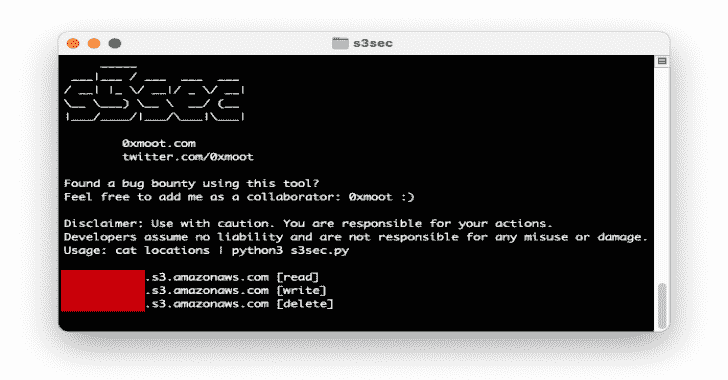

# S3Sec:检查 AWS S3 实例的读/写/删除访问权限

> 原文：<https://kalilinuxtutorials.com/s3sec/>

.png)

为了对 bug bounty 程序进行渗透测试，开发了 s3Sec 工具来快速测试用于公共读取、写入和删除访问的 S3 存储桶列表。

## 装置

将 git repo 克隆到您的机器上:

**git 克隆 https://github.com/0xmoot/s3sec**

## 使用

检查单个 S3 实例:

**echo " test-instance . S3 . Amazon AWS . com " | python 3 s3sec . py**

或者:

**回显“测试实例”| python3 s3sec.py**

检查 S3 实例列表:

**猫的位置| python3 s3sec.py**

## 设置 AWS CLI 和凭据(可选)

为了充分利用该工具，您应该安装 AWS CLI 并设置用户凭据。

通过 AWS CLI，一系列更深入的测试(包括未签名的读取、写入文件和删除文件)被激活:

#### 在 Kali Linux 上安装 AWS CLI

要安装 AWS CLI，您只需使用以下命令进行安装:

**pip3 安装 awscli**

#### 获取 AWS 凭据(访问密钥 ID 和 AWS 秘密访问密钥)

*   从亚马逊的官方网站 https://aws.amazon.com/free/?注册亚马逊的 AWSall-free-tier . sort-by = item . additional field . sort rank & all-free-tier . sort-order = ASC
*   登录您的 AWS 帐户，然后单击我的安全凭证。
*   单击访问密钥(访问密钥 id 和秘密访问密钥)获取您的 AWS CLI 登录凭据。
*   然后点击显示访问密钥选项来获得您的访问密钥 ID 和秘密访问密钥，或者您也可以下载它。

#### 在 Kali Linux 上配置 AWS CLI

*   启动终端并输入以下命令，然后输入在前面步骤中创建的 AWS 访问密钥 ID 和 AWS 秘密访问密钥。

**aws 配置**

使用以下默认设置:

**AWS 访问密钥 Id: < >
AWS 秘密访问密钥:< >
默认地区名称:ap-south-1
默认输出格式:json**

[**Download**](https://github.com/0xmoot/s3sec)