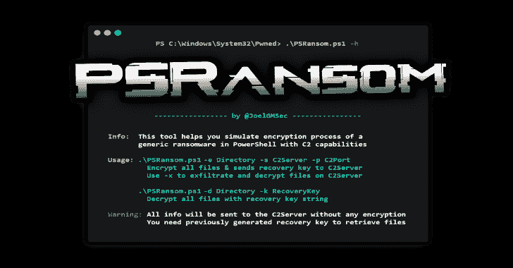

# PSRansom:带有 C2 服务器的 PowerShell 勒索软件模拟器

> 原文：<https://kalilinuxtutorials.com/psransom/>

.png)

PSRansom 是一个具有 C2 服务器功能的 PowerShell 勒索软件模拟器。该工具可帮助您在安装了 PowerShell 的任何系统上模拟一般勒索软件的加密过程。由于集成的 C2 服务器，您可以通过 HTTP 过滤文件和接收客户信息。

两个元件之间的所有通信都被加密或编码，以便不被流量检查机制检测到，尽管在任何时候都没有使用 HTTPS。

# 要求

*   PowerShell 4.0 或更高版本

# 下载

建议克隆完整的存储库或下载 zip 文件。您可以通过运行以下命令来实现这一点:

**git 克隆 https://github.com/JoelGMSec/PSRansom**

**用途**

**。\ PS ransom-h
_*_
|*\/*| | _ \ _ _ _*_ _ | |*_ |*)/*' | '*\/|/_ | ' _ \ | ' _ \/*)| _<(| | | | _ \()| | | | | |/*| _， *|*| |*| |*/_/|*| |*| | | |
——————by @ joelmsec————
简介:该工具帮助您在具有 C2 功能的 PowerShell 中模拟一个
通用勒索软件的加密过程
用法:。 \ PS ransom . PS1-e Directory-s C2 server-p C2 port
加密所有文件&向 C2Server
发送恢复密钥使用-x 来解密 C2Server
上的文件。\ PS ransom . PS1-d Directory-k recovery key
使用恢复密钥字符串
解密所有文件警告:所有信息将被发送到 C2Server，不进行任何加密
您需要先前生成的恢复密钥来检索文件**

[**Download**](https://github.com/JoelGMSec/PSRansom)