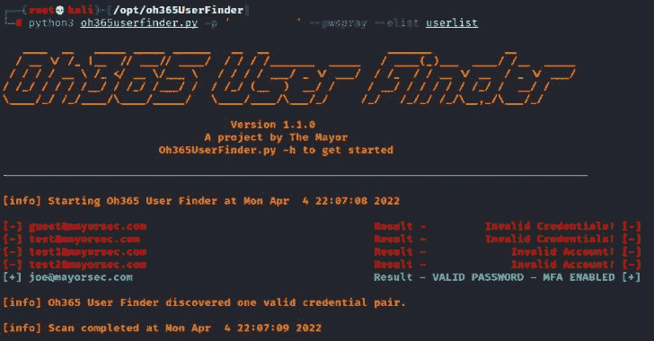

# Oh365UserFinder : Python3 O365 用户枚举工具

> 原文：<https://kalilinuxtutorials.com/oh365userfinder/>

**Oh365UserFinder** 用于识别有效的 o365 账户和域名，没有账户锁定的风险。该工具解析响应以识别“如果存在结果”标志是否为空，并在用户有效时做出适当的响应。该工具将尝试根据响应识别误报，并自动创建一个等待期以重置限制值，或者警告用户增加尝试之间的超时时间。

Oh365UserFinder 还可以使用-d 或-domain 标志轻松识别 o365 中是否存在域。这样就省去了从 notes 中复制 url 并将其输入到目标域的 URL 栏中的麻烦。

在 1.1.0 版本中，现在可以进行密码喷涂。如果启用了 MFA，该工具应该在报告有效帐户时识别它。请记住，帐户锁定是可能的，如果太多不正确的尝试。如果您有任何疑问，请务必咨询您的客户以确定锁定策略。

## 用法

安装 Oh365UserFinder

`**git clone https://github.com/dievus/Oh365UserFinder.git**`

将目录切换到 Oh365UserFinder 并运行:

`**pip3 install -r requirements.txt**`

这将运行安装脚本，向您的系统添加必要的依赖项。

`**python3 oh365UserFinder.py -h**`

##### 这将输出帮助菜单，其中包含以下标志:

**-e，–email–针对单个电子邮件帐户运行 Oh365UserFinder 所需的\n
-r，–read–读取包含电子邮件的文本文件(例如-r emails.txt)\n
-t，–time out–设置两次尝试之间的暂停时间，以秒为单位(例如-t 60)\n
-w，–write–将有效的电子邮件写入文本文档(例如-w validemails.txt)\n
-c，–csv–将有效的电子邮件写入 CSV 文件(例如-c validemails.csv)\n
-d，–domain–检查列出的域是否有效(例如-d mayorsec . com)\ n
–verbose–详细输出测试\n
-ps，–pw spray–Password 喷洒帐户列表\n
-p，–Password–要测试的密码\n
-el，–elist–Ema**要测试的 ils

### 示例命令

##### 在 O365 中验证域名

`**python3 oh365Finder.py -d mayorsec.com**`

##### 验证一封电子邮件

`**python3 oh365UserFinder.py -e test@test.com**`

##### 验证电子邮件列表并写入文件

`**python3 oh365UserFinder.py -r testemails.txt -w valid.txt**`

##### 验证电子邮件列表、写入文件和请求之间的超时

`**python3 oh365UserFinder.py -r emails.txt -w validemails.txt** -t 30`

##### 验证电子邮件列表并写信给 CSV

`**python3 oh365UserFinder.py -r emails.txt -c validemails.csv -t 30**`

##### 密码喷邮件列表

`**python3 oh365UserFinder.py -r -p <password> --pwspray --elist <listname>**`

[**Download**](https://github.com/dievus/Oh365UserFinder)